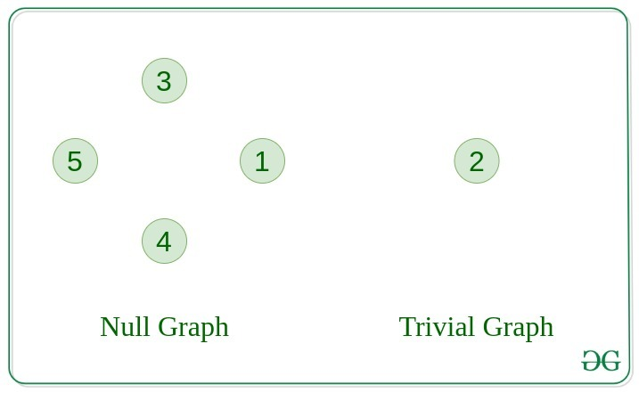
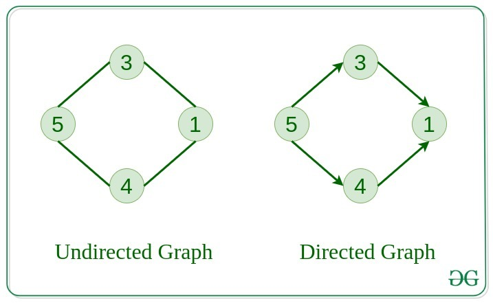
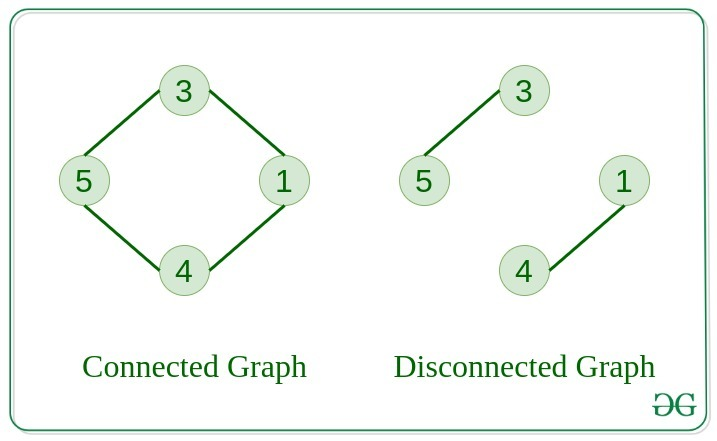
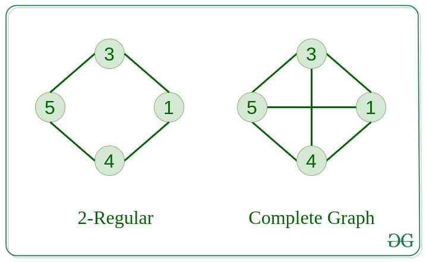
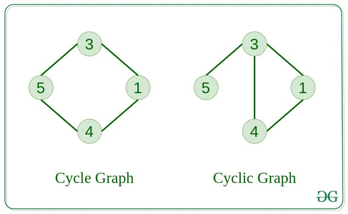
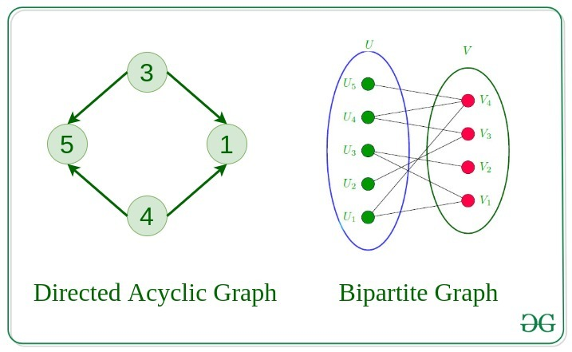

## GRAPH

- Graph is mainly same as Tree. Only difference is Graph can have a cycle unlike Tree
- The starting node for Graph is root

## Graph types

- Null graph: No edges in the graph
- Trivial Graph: single vertex, smallest graph
- Undirected graph: edges have no direction, Nodes/vertex are unordered pairs in the definition of every edge
- Directed graph: edges have direction, Nodes are ordered pair in the definition of edges
- Connected graph: one node can be visited from any other node in the graph, means there is no disconnection b/w any two nodes
- Disconnected graph: there can be disconnection bw any two nodes in the graph;
- Regular graph: If in a graph degree of every vertex is K, it's called K regular graph (TBD)
- Complete graph: For each node there is a edge to all other nodes
- Cycle graph: The graph is a cycle in itself, every vertex has degree as 2
- Cyclic graph: A graph containing at least one cycle is a cyclic graph
- Acyclic graph: A graph where there is no cycle
- Bipartite graph: if there are two sets of nodes, each set doesn't connect within itselves
- Weighted graph: pta ni kya h

## Graph represetation

### Adj Matrix (2D array) O(n^2) complexity
       V1 V2 V3 V4
    V1 0   
    V2
    V3
    V4
    - Adj matrix representation is o(1) while inserting or deleting an edge but initialisation is o(n^2)

Scarse graph/Null graph - no of edges less (If no of edges are less, lot of places will be 0, which will be a disadvantage)
Dense graph - no of edges more

### Adj List 

    V1 -> V2, V3
    V2 -> V1, V3
    - insert of a edge is o(1) deletion of a edge is o(n) 
    - initialisation is o(n)
No disadvantage if there is a connection there wil be a node available

# In degree out degree of a node

In degree is the number of incoming edges to a node of a graph.
In a tree DS, indegree of any node is 1 becuse there is only one edge incoming to any node in a tree.
But in Graph, there can be n edges inoming to a node. Then in degree of the node is n. 

Similarly, the number of edges outgoing from a node in a graph is called outdegree. In a BST, outdegree is <=2 

# Dynamic Graph

- how many vertex
- how many edges
- enter the edge where the connection exist
    - 1-2 (directed / undirected)
    - 2-1
