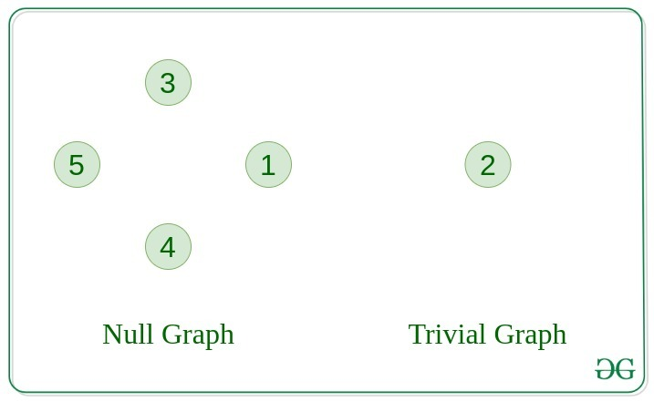
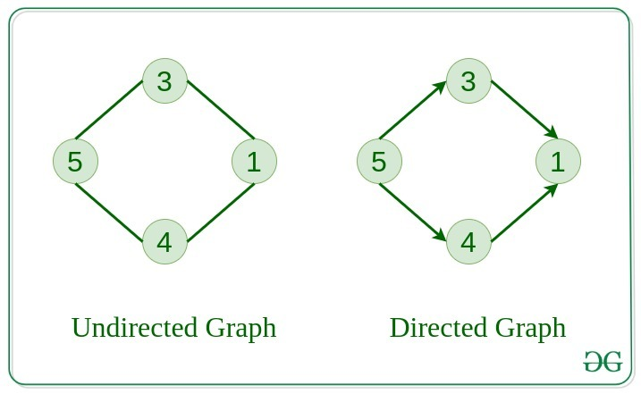
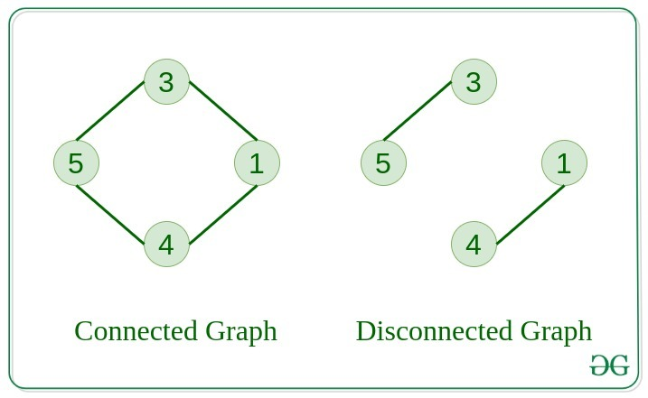
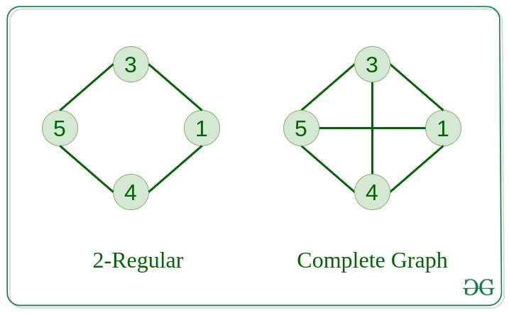
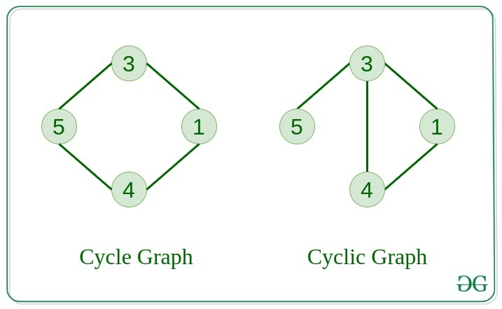
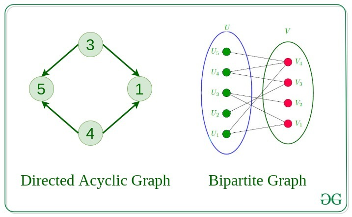

## GRAPH

- Graph is mainly same as Tree. Only difference is Graph can have a cycle unlike Tree
- The starting node for Graph is root

--------------------------------------------------------------------------------------------------------------------------------

### Graph common terms

- Node/ Vertex: the nodes
- Edges: the connecetion between nodes
- Path: A path is a traversal of multiple node where no node are repated
- Degree (In Undirected graph): total no of edges attached to a node. Total degree of a undirected graph = 2 * E (Total edges)
- In degree and Out degree (In Directed graph) : Total incoming and out going edges from and to a node
- Weight: Edges may have weights. If weight is not specified, it may be unit weight (1)

--------------------------------------------------------------------------------------------------------------------------------

### In degree out degree of a node

In degree is the number of incoming edges to a node of a graph.
In a tree DS, indegree of any node is 1 becuse there is only one edge incoming to any node in a tree.
But in Graph, there can be n edges inoming to a node. Then in degree of the node is n. 

Similarly, the number of edges outgoing from a node in a graph is called outdegree. In a BST, outdegree is <=2 

--------------------------------------------------------------------------------------------------------------------------------

### Dynamic Graph

- how many vertex
- how many edges
- enter the edge where the connection exist
    - 1-2 (directed / undirected)
    - 2-1
--------------------------------------------------------------------------------------------------------------------------------

### Graph types

- Null graph: No edges in the graph
- Trivial Graph: single vertex, smallest graph
- Undirected graph: edges have no direction, Nodes/vertex are unordered pairs in the definition of every edge
- Directed graph: edges have direction, Nodes are ordered pair in the definition of edges
- Connected graph: one node can be visited from any other node in the graph, means there is no disconnection b/w any two nodes
- Disconnected graph: there can be disconnection bw any two nodes in the graph;
- Regular graph: If in a graph degree of every vertex is K, it's called K regular graph (TBD)
- Complete graph: For each node there is a edge to all other nodes
- Cycle graph: The graph is a cycle in itself, every vertex has degree as 2
- Cyclic graph: A graph containing at least one cycle is a cyclic graph
- Acyclic graph: A graph where there is no cycle
- Bipartite graph: if there are two sets of nodes, each set doesn't connect within itselves
- Weighted graph: Graph with weights in all edges
- DAG: Direct Acyclic graph . For a DAG, there will always be atleast one node with indegree = 0









--------------------------------------------------------------------------------------------------------------------------------

### No of graphs with N nodes

- n nodes can form edges with n-1 other nodes except itself, right?
- so total edge possible is n * (n-1)
- if we remove the duplicate countings, then no of connections possible is n * (n -1) / 2
- each connection can have a edge or not have a edge, right? each for all possibilities, either connection or no connection that becomes a graph
- so total number of graph would be `Math.pow(2, ( n * (n -1) / 2))`

```javascript
 count(n)
    {
        return Math.pow(2, (n * (n - 1) / 2))
    }
```

--------------------------------------------------------------------------------------------------------------------------------

### Adj Matrix (2D array) O(n^2) complexity

       V1 V2 V3 V4
    V1 0   
    V2
    V3
    V4
    - Adj matrix representation is o(1) while inserting or deleting an edge but initialisation is o(n^2)

Scarse graph/Null graph - no of edges less (If no of edges are less, lot of places will be 0, which will be a disadvantage)
Dense graph - no of edges more

TC: O(V) SC: O(V*V)

```javascript
    printGraph(V, edges) {
      let arr = Array.from({length: V}, () => Array.from({length: V}).fill(0));
      for(let i =0; i<edges.length; i++) {
         let [u, v] = edges[i];
         arr[u][v] = 1;
         arr[v][u] = 1;
      }
      return arr
    }
```

--------------------------------------------------------------------------------------------------------------------------------

### Adj List 

    V1 -> V2, V3
    V2 -> V1, V3
    - insert of a edge is o(1) deletion of a edge is o(n) 
    - initialisation is o(n)
No disadvantage if there is a connection there wil be a node available

TC: O(V) SC: O(2*E)

```javascript
    printGraph(V, edges) {
      let arr =  Array.from({length: V}, () => new Array());
      for(let i =0; i<edges.length; i++) {
         let [u, v] = edges[i];
         arr[u].push(v);
         arr[v].push(u);
      }
      return arr
    }
```

--------------------------------------------------------------------------------------------------------------------------------

### Connected Components in Graph

- There may be multiple connected components in a grapjh which are not inter connected. That also is a valid graph
- But We can not traverse all nodes of this kind of graph with any traversal techniques by starting from any node.
- For traversing this kind of graph we need to take a `visitedArr` data structure of Size Node +1 or V+ 1
- We need to run a loop in that visitedArr and check if `!visitedArr[node]` then `traverse(node)` 
- traverse method will have to mark visitedArr[node] as true for the connected nodes with the starting node.

--------------------------------------------------------------------------------------------------------------------------------

### BFS Traversal

- BFS (Breadth first search) is equivalent to level order traversal of a BT
- We need to make sure that the traversed nodes are sorted in the order of level. i.e. Level 1 nodes should be traversed first, then level 2 and so on.
- The order of the nodes traversed in a level does not matter
- To ensure this, we need to take a data structure which pops in the same way it is puhed inside. i.e the first thing which got inserted will be poipped first. So we will take a Queue data structure which operates as FIFO.

How?

- We will be given a starting node from where we will start the traversal
- We will initially take a visited array of V+1 length and fill it with 0 (all are non visited) 
- We will put the starting node in the queue and mark it as 1 in the visited array
- From this point on, we will dequeue from the queue one by one and get the adjacent nodes for the popeed node by the adjacency list notation
- We will put the neighbours in the queue (in any order, does not matter) and mark them as visited also, But only if they are not previously visited
- We will continue this until the queue is empty

```javascript
const bfsOfGraph= (V, adj) => {
  let final = [];
  let queue = new MyQueuee();
  let visitedArr = Array.from({length: V}, () => 0);
  queue.enqueue(0);
  visitedArr[0] = 1;
  while(!queue.empty()) {
      let popped = queue.dequeue();
      let neighbours = adj[popped] || []
      for(let i =0 ; i< neighbours.length; i++) {
          if(!visitedArr[neighbours[i]]) {
              queue.enqueue(neighbours[i]);
              visitedArr[neighbours[i]] = 1
          }
      }
      final.push(popped)
  }
  return final;
}
```
--------------------------------------------------------------------------------------------------------------------------------

### DFS Traversal

- DFS (Depth First Search) is equivalent to inorder or preorder or postorder traversal of trees
- We need to go deep in depth for a node and come back
- The approach which is suited best for this is recursion and backtracking
- So difference between DFS and BFS is DFS is stack based approach (recursion works on top of callstacks) and BFS is queue based approach

How?

- We will take a visitedArr of length V as we did in BFS
- We will be given a node to start with
- We will call the traversal with that node where we will do two things
    - We will mark the node as visited in visitedArr
    - We will push it in the final 
- Post this, we will check it's neighbours from adjacency list and iterate over them
- For those neighbours which are not yet "visited" we will call the same traversal function
- Since we are calling the function recursively, one node will complete traversal of it's child nodes recursively and come back

```javascript
dfsOfGraph(V, adj) {
    let visitedArr = Array.from({length: V}, () => 0);
    let final = [];
    const _traverse = (node) => {
        visitedArr[node] = 1;
        final.push(node);
        let neighbours = adj[node] || [];
        for(let i = 0; i<neighbours.length; i++) {
            if(!visitedArr[neighbours[i]]) {
                _traverse(neighbours[i]);
            }
        }
    }
    _traverse(0)
    return final;
}
```


--------------------------------------------------------------------------------------------------------------------------------

### Topological Sorting

Approach 1: DFS

{0: [1,2,3], 1: [4,5], 2: [], 3: [4]}
If we are given certain adjacency list of a graph like above and we write a linear ordering out of that, where all nodes appear before all adj[node]
then it's called a topological sorting

- It is always possible in a directed acyclic graph (DAG) becuase for a undirected graph there are two way dependency for two nodes and it's impossible to write the linear ordering where 1 comes before 2 and 2 also comes before 1
- It is not possible in a cyclic graph as well.
- The intuition is quite simple, we just need to run a Simple DFS traversal, where after the completion of any nodes DFS we push it in a Stack
- Finally pop from the stack
- Since we use recursion in dfs which is already stack based, we can also take a array and unshift() in it to get the ordering right as well

```javascript
topoSort(V, adj)
{
    let visitedArr = Array.from({length: V}, () => 0);
    let final = [];
    const _traverse = (node) => {
        visitedArr[node] = 1;
        let neighbours = adj[node] || [];
        for(let i = 0; i<neighbours.length; i++) {
            if(!visitedArr[neighbours[i]]) {
                _traverse(neighbours[i]);
            }
        }
        final.unshift(node);
    }
    for(let i = 0; i < V; i++) {
        if(!visitedArr[i]) {
            _traverse(i);
        }
    }
    return final;
}
```

Approach 2: Kahn's Algorithm 

- Kahn's Algorithm is based on BFS traversal
- We need to first figure out the indegree array of the given DAG
- Now we need to initially enqueue all the nodes in queue where indegree is 0
- This means the nodes where there is no edge incoming, obviously they can be printed first, right? means no node has this node in it's adj[node]
- Now we can keep running normal BFS till queue is empty. 
- pop and push it in the final array. 
- Find it's neighbours and decrease their indegree. why? because since the node is popped out, whatever outgoing edge it had to other nodes, are gone, right? so we can decrease the indegree of all those nodes which had a incoming edge from this popped node by 1.

```javascript
topoSort(V, adj) {
    let indegree = Array.from({length: V}, () => 0);
    let queue = new MyQueuee();
    let final = [];
    for(let i = 0;  i<V; i++) {
        let neighbours = adj[i];
        for(let j = 0; j<neighbours.length; j++) {
            indegree[neighbours[j]]++
        }
    }
    for(let i =0; i< V;i++) {
        if(indegree[i] == 0) {
            queue.enqueue(i);
        }
    }
    while(!queue.empty()) {
        let pop = queue.dequeue();
        final.push(pop);
        let neighbours = adj[pop];
        for(let i = 0; i <neighbours.length;i++) {
            indegree[neighbours[i]]--;
            if(indegree[neighbours[i]] == 0) {
                queue.enqueue(neighbours[i]);
            }
        }
    }
    return final
}
```

--------------------------------------------------------------------------------------------------------------------------------

### Shortest path

DFS Approach (Not suitable)

```javascript
const shortestPath = (adj, n, m, src) => {
  let visitedMap = {[src]: true};
  let final = Array.from({length: N}, () => Infinity);
  let adj = Array.from({length: n}, () => new Array());
  visitedMap[src] = 0
  final[src] = 0;
  const _traverse = (_src, _dest, dist) => {
      if(_src == _dest) {
        return dist
      }
      let neighbours = adj[_src];
      let minDist = Infinity;
      for(let i = 0; i < neighbours.length; i++) {
          if(!visitedMap[neighbours[i]]) {
              visitedMap[neighbours[i]] = true;
              minDist= Math.min(minDist,  _traverse(neighbours[i], _dest, dist+1));
              visitedMap[neighbours[i]] = false;
          }
      }
      return minDist;
  }
  for(let i = 0; i < n; i++) {
    visitedMap[src] = true
    let shortestDist = _traverse(src, i, 0);
    final[i] = shortestDist == Infinity ? -1: shortestDist
  }
  return final.map(f => f == Infinity ? -1: f);
}
```

BFS - Better Approach

- we will take a distanceArray of V length all valiue as Infinity
- we will first put the source node in the queue and mark the `distance[src] = 0`
- till queue is empty we will pop and find the popeed node's neighbours from adj matrix
- Now, the updated distance will be dist + 1 right? but we should update it only if the current distance is bigger than it

```javascript
const shortestPath = (edges, n, m, src) => {
  let final = Array.from({length: n}, () => Infinity);
  let adj = Array.from({length: n}, () => new Array())
  let queue = new MyQueuee();
  for(let i = 0; i < edges.length; i++) {
    let [u, v] = edges[i];
    adj[u].push(v);
    adj[v].push(u)
  }
  queue.enqueue([src, 0]);
  final[0] = 0;
  while(!queue.empty()) {
    let [node, dist] = queue.dequeue();
    let neighbours = adj[node];
    for(let i =0; i<neighbours.length; i++) {
      if(dist + 1 < final[neighbours[i]]) {
        final[neighbours[i]] = dist + 1;
        queue.enqueue([neighbours[i], dist + 1]);
      }
    }
  }
  return final
}
```

- Similarly if the edges are weighted instead of unit weight, we can do the same way -

```javascript
const shortestPathBFS = (edges, N) => {
  let src = 0;
  let final = Array.from({length: N}, () => Infinity);
  let adj = Array.from({length: N}, () => new Array());
  for(let i  = 0; i< edges.length; i++) {
    let [u, v, weight] = edges[i];
    adj[u].push({v, weight}); // storing the node and the edge weight both in enqueue
  }
  final[src] = 0;
  let queue = new MyQueuee();
  queue.enqueue([0, 0]);
  while(!queue.empty()) {
    let [node, dist] = queue.dequeue();
    let neighbours = adj[node];
    for(let i =0; i<neighbours.length; i++) {
      let {v, weight} = neighbours[i];
      let newDis = dist + weight;// instead of dist + 1, we are doing dist + weight
      if(final[v] > newDis) {
        final[v] = newDis;
        queue.enqueue([v, newDis]);
      }
    }
  }
  return final.map(f => f == Infinity ? -1: f);
}
```

--------------------------------------------------------------------------------------------------------------------------------

### Djikstra's Algorithm

- To find shortest path between two nodes in a DAG (Direct acyclic graph) with weighted edges we generally use BFS like above
- Djikstra's algorith uses Priority Queue with a min heap implementation. That is the only difference.
- Djikstra's algo doesn't work with negatigve weighted edges or cyclic graphs, as for negative weight will go back and forth and go in a loop while trying to find more lesser dist.
- But Why we shoudl use Priority queue? The above implementation with queue works just fine right?
Reason is - 
```
let's say we got a node 1 for which we got a distance 7 so far from traversal and we enqueued it before. 
But again we got the same node 1 for which we got a distance 3 which is better than 7 right? so we updated the dist Array and enqueued this also.
But since the previous entry [1,7] is enqueued before it will be dequeued before and it will keep enqueuing connected nodes unnecessarily in the queue. Where as we don;t even need to consider [1,7] anymore right?
Now let's say we take a PQ. so we pushed [1,7] first in the queue, after this we pushed [1,4] But since PQ works on minheap it will pop out and process [1,4] first. Later when it will pop out [1,7] it will just be neglected as distance array of it's connected nodes might already have lesser values. 
Hence PQ approach has lesser time complexity than Q approach
```

TC: E Log V where E = No of Edges, V =No of Vertex. Why?

```
while(!queue.empty()) {
     let [node, dist] = queue.dequeue().value;
     for(let i =0; i<neighbours.length; i++) {
        queue.enqueue({value: [v, newDis], priority: newDis});
     }
}
This is what we are doing right?
- `while(!queue.empty())` will run max V times. becuase PQ will dequeue fast and it will not have much unnecessary nodes. Worst case it will run V times
- `queue.dequeue().value;` this is PQ dequeue where we build Min heap - log(Heap size) is the TC. Now Heap size can be V*V as there can be one node connected to V-1 node and second node can connect to V-1 node liek that. In that case one node will dequeue and enqueue V-1 nodes. So heap will have max V*V size. Hence this line TC = log(V*V) = 2 logV
- `for(let i =0; i<neighbours.length; i++)` => again worst case this will run V times. one node can have worst case V - 1 neighbours.
- `enqueue` is O(1)
- So total TC = V * V * logV = E * logV where E = V* V. Why? because if there are V nodes and each node has an edge to V-1 other nodes then total number of edges  = V * V-1 right? so E = V*V

```

Limitations of Djikstra's algo -

- It wont work for negative weights
- It wont work for negative cycle

```javascript
const shortestPathDjikstra = (edges, N) => {
  let src = 0;
  let final = Array.from({length: N}, () => Infinity);
  let adj = Array.from({length: N}, () => new Array());
  for(let i  = 0; i< edges.length; i++) {
    let [u, v, weight] = edges[i];
    adj[u].push({v, weight});
  }
  final[src] = 0;
  let queue = new PriorityQueue(Math.pow(10, 5));
  queue.enqueue({value: [0, 0], priority: 0});
  while(!queue.empty()) {
    let [node, dist] = queue.dequeue().value;
    let neighbours = adj[node];
    for(let i =0; i<neighbours.length; i++) {
      let {v, weight} = neighbours[i];
      let newDis = dist + weight;
      if(final[v] > newDis) {
        final[v] = newDis;
        queue.enqueue({value: [v, newDis], priority: newDis});
      }
    }
  }
  return final.map(f => f == Infinity ? -1: f);
}
```
--------------------------------------------------------------------------------------------------------------------------------

### Bellman ford algo

- Djisktra's algowhich doesn't work for negative cycle and negative weight can be solved by Bellman ford
- We need to run a outerloop of 0 - V-1 where V is number of vertices
- Inner loop will run through all edges which has a [u,v,w] where u is the source node, v is the destination node and w is the weight
- Relax the nodes : `if dist[u] + w < dist[v] then update dist[v] = dist[u] + w` this is something we were doing in djikstra's also
- After running V-1 iteration, we should get all shortest paths for all nodes from source.
- If we run through the edges one more times and If there's any decrease in the distance then there is a negative cycle.

```javascript
bellman_ford(V, edges, S) {
    let dist = Array.from({length: V}, () => Infinity);
    dist[S] = 0;
    // Relax all edges V - 1 times
    for (let i = 0; i < V - 1; i++) {
        for (let j = 0; j < edges.length; j++) {
            let [u, v, w] = edges[j];
            if (dist[u] + w < dist[v]) {
                dist[v] = dist[u] + w;
            }
        }
    }
    // Check for negative weight cycles
    for (let j = 0; j < edges.length; j++) {
        let [u, v, w] = edges[j];
        if (dist[u] + w < dist[v]) {
            return [-1]; // Indicates a negative weight cycle
        }
    }
    return dist.map(h => h== Infinity? Math.pow(10, 8): h);
}
```

--------------------------------------------------------------------------------------------------------------------------------

### Flyod Warshal Algo 

- To find shortest distance in a graph with multiple sources weuse Floyd wrarshal.
- Based on dynamic programming. acts on previously computed value. such that distance[i][j] via a node "via" - dist[i][j] = Min(dist[i][j], dist[i][via] + dist[via][j])
- Unlike previous algos we will use Adj matrix over here

How?

- first iterate the matrix and `mark 0 for i ==j` and `mark all -1 to Infinity`
- Now for each node as via {THIS IS IMPORTANT TO MAKE IT AS OUTER LOOP}, run through the entire matrix and apply the formula `dist[i][j] = Min(dist[i][j], dist[i][via] + dist[via][j])`
- Finally run through the matrix again and change `all Infinity to -1`

```javascript
shortest_distance(matrix)
{
    //Step1
    for(let i = 0; i< matrix.length; i++) {
        for(let j = 0; j < matrix.length; j++) {
                if(matrix[i][j] == -1) {
                    matrix[i][j] = Infinity;
                }
                if(i == j) {
                matrix[i][j] = 0;
                }
        }
    }
    //Step2
    for(let via = 0; via < matrix.length;  via++) {
        for(let i = 0; i< matrix.length; i++) {
            for(let j = 0; j < matrix.length; j++) {
            
                matrix[i][j] = Math.min(matrix[i][j], matrix[i][via] + matrix[via][j]);
            }
        }
    }
    //Step3
    for(let i = 0; i< matrix.length; i++) {
        for(let j = 0; j < matrix.length; j++) {
                if(matrix[i][j]== Infinity) {
                matrix[i][j] = -1;
                }
        }
    }
}
```
--------------------------------------------------------------------------------------------------------------------------------