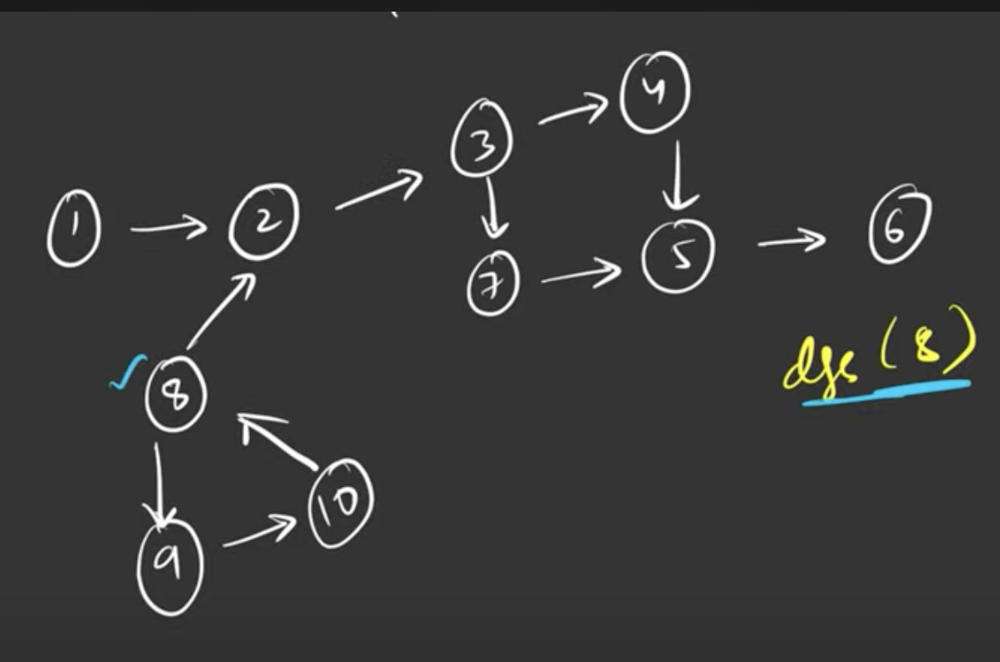

# DSA key notes

### 1. How time complexity works specially with logn
```
when in a loop we keep on dividing the number, like while (n > 0).... n = n / x; then the time complexity is O(logx N)
```
---
###  2. Euclidean algorithm states that GCD(a,b) = GCD(a % b, b) where a > b

```javascript
const findGCD = (num1, num2) => {
  if(num1 == 0) return num2;
  if(num1 > num2) return findGCD(num1 % num2, num2);
  return findGCD(num2 % num1, num1);
}
```

--------------------------------------------------------------------------------------------------------------------------------
### 3. A subsequence is a sub-sequenece which should follow the order of the actual sequence. 

- It can be either contiguous or non contiguous
- This can be achieved by Power set also which is mentioned in 6May.md

```
[3,1,2] => [3] [1] [2] [3,1] [3,2] [1,2] [3,1,2] these are all possible subsequence. 
[3,2] is a non contigious subsequnce
[1,2,3] is not a subsequence becuase it doesn't follow the order.

```
--------------------------------------------------------------------------------------------------------------------------------

### 4. To rotate a array by k we can simply do arr[i] = arr1[(i+k)%arr.length]

```
arr1 = [...arr]
arr[i] = arr1[(i+k)%arr.length]
This is very powerful formula to rotate the array or to check if an array is rotated k times. 
To check if A and B are same array but after k rotation
A[i] = B[(i+k)%A.length]
```
--------------------------------------------------------------------------------------------------------------------------------

### 5. Length of longest subarray with K sum using Prefixmap/Hashing

```javascript
  var lenOfLongSubarr = (arr, k) => {
    let map = {}, maxLen = 0, sum = 0;
    for (var i = 0; i < arr.length; i++) {
      sum = sum + arr[i];
      if(map[sum] == undefined) map[sum] = i;
      if(sum == k) {
        maxLen = Math.max(maxLen, i+1);
      }
      if(map[sum - k] != undefined) {
        maxLen = Math.max(maxLen, i - map[sum - k]);
      }
    }
    console.log(maxLen)
  }
  // same way we can deduce the count of subarray with sum k
  var lenOfLongSubarr = (arr, k) => {
    let map = {}, maxC = 0, sum = 0;
    for (var i = 0; i < arr.length; i++) {
      sum = sum + arr[i];
      if(sum == k) {
         maxC++
      }
      if(map[sum - k] != undefined) {
        maxC = maxC + map[sum - k]
      }
      map[sum] = (map[sum] || 0) + 1;
    }
    console.log(maxLen)
  }
```
--------------------------------------------------------------------------------------------------------------------------------  
  
### 6. Dutch National Flag algo

- This algorithm contains 3 pointers i.e. low, mid, and high, and 3 main rules.  The rules are the following:
- arr[0….low-1] contains 0. [Extreme left part]
- arr[low….mid-1] contains 1.
- arr[high+1….n-1] contains 2. [Extreme right part], n = size of the array
- The middle part i.e. arr[mid….high] is the unsorted segment. 
- The loop will run till mid <= high

```
There can be three different values of mid pointer i.e. arr[mid]
If arr[mid] == 0, => swap(arr[low], arr[mid]) low++; mid++
If arr[mid] == 1 => mid++
If arr[mid] == 2 => swap(arr[mid], arr[high]); high--
```

--------------------------------------------------------------------------------------------------------------------------------

### 7. Moores Voting Algo - Find the element which appears more than n/2 or n/3

Step 1: 

- Initialize 2 variables:
- Count –  for tracking the count of element
- Element – for which element we are counting
- Traverse through the given array.
- If Count is 0 then store the current element of the array as Element.
- If the current element and Element are the same increase the Count by 1.
- If they are different decrease the Count by 1.
- After the traversal, if count > 0 the Element can be the majority element.

Step 2: 
- We also need to verify if it is the majority element by running through the array and count the occurance > n/2

```javascript
var majorityElement = function(nums) {
    let el = null, count = 0
    for(var i  = 0; i <nums.length; i++) {
        if(!count) {
            el = nums[i]; count = 1;
        } else if(nums[i] == el) {
            count++;
        } else {
            count--;
        }
    }
    return el;
}
```

Lets say we need to find all elements which appears more than n/3 or n/k or whatever - 

- We can say for sure that for more than n/k occurances there won't be more than k elements in the array. 
- Means there will be atmost 2 elements which can appear more than 2 times in the array. Chahe to check kar lo 8 length ki array lo. 3 times do hi element aa skta hai. kyu ki teen element 3 times aane se total size 9 ho jayega
- Toh instead of taking one count and one element variable in the above algo, we can take 2 counts and 2 element variables right?
- After getting the POSSIBLE majority elements don't forget to verify that. because both of them might not appear more than n/3 times

```javascript
var majorityElement = function(nums) {
    let el1 = null, el2 = null, count1 = 0, count2 = 0
    for(var i = 0; i < nums.length; i++) {
        if(count1 == 0 && el2 != nums[i]) {
            count1 = 1; el1 = nums[i];
        }
        else if(count2 == 0 && el1 != nums[i]) {
            count2 = 1; el2 = nums[i];
        }
        else if(el1 == nums[i]) count1++;
        else if(el2 == nums[i]) count2++;
        else {
            count1--; count2--;
        }
    }
    let final = [];
    count1 = 0, count2 = 0;
    for(var i = 0; i < nums.length; i++) {
        if(nums[i] == el1) count1++;
        if(nums[i] == el2) count2++;
    }
    if(count1 > Math.floor(nums.length / 3)) {
        final.push(el1)
    }
    if(count2 > Math.floor(nums.length / 3)) {
         final.push(el2)
    }
    return final
}
```
--------------------------------------------------------------------------------------------------------------------------------

### 8. Kadane's Algo

- We will run a loop(say i) to iterate the given array.
- Now, while iterating we will add the elements to the sum variable and consider the maximum one.
- If at any point the sum becomes negative we will set the sum to 0 as we are not going to consider it as a part of our answer.

```javascript
var maxSubArray = function(nums) {
    let max = -Infinity, currSum = 0;
    for(var i= 0; i <nums.length; i++) {
        currSum = currSum + nums[i];
        max = Math.max(max, currSum);
        if(currSum < 0) {
            currSum = 0;
        }
    }
    return max;
};
```
--------------------------------------------------------------------------------------------------------------------------------

### 9. Next Permutation

We need to find out the next permutaion of 2,1,5,4,3,0,0 lets say ans : 2,3,0,0,1,4,5

- Step1: find out the break index from last to first where arr[i-1] < arr[i] ... here it will be 2 where 1 is sitting
- Step2: again run a loop from last to first and for the first element > the element at brwakindex swap them . 
At this point it will be 2 3 5 4 1 0 0. Notice that after 2 3 rest array is sorted in descending order
- Step3: from breakindex + 1 to last index reverse the array. take two pointer 

```javascript
var nextPermutation = function(nums) {
   var breakIndex = -1;
   //Step 1
  for (var i = nums.length - 1; i >= 0; i--) {
    if( nums[i-1] < nums[i]) {
      breakIndex = i-1;
      break;
    }
  }
// Step2
  for (var i = nums.length - 1; i >= 0; i--) {
    if(nums[i] > nums[breakIndex]) {
      let temp = nums[i];
      nums[i] = nums[breakIndex];
      nums[breakIndex] = temp;
      break;
    }
  }
// Step 3
  let left = breakIndex + 1, right = nums.length - 1
  while(left <= right) {
    let temp = nums[left];
    nums[left] = nums[right];
    nums[right] = temp;
    left++;
    right--;
  }
  return nums;
};
```
--------------------------------------------------------------------------------------------------------------------------------

### 10. 2Sum 3Sum 4Sum

- 2Sum is pretty easy. So you need to sort the array first. 
- take two pointers left and right; left = 0, right = n-1
- if a[left] + a[right] == sum -> valid pair
- if a[left] + a[right] < sum -> left++;
- else right--

```javascript
var twoSum = function(nums, target) {
    nums.sort((a, b) => a-b);
    let left = 0, right = nums.length -1;
    while(left < right) {
        var sum =nums[left]+nums[right];
        if(sum > target) {
            right--;
        }
        else if(sum < target) {
            left++;
        }
        if(sum == target) {
            return [left, right]
        }
    }
    return []
};
```

- For 3Sum, the trick is to fix one pivot and then do same two pointer as we did in 2Sum for the remaining array
https://leetcode.com/problems/3sum/submissions/1255996853/

- 4Sum same way.. take two outer loop and Keep Left and right pivots
https://leetcode.com/problems/4sum/submissions/1256020557/

--------------------------------------------------------------------------------------------------------------------------------
### 11. Merge intervals

We are given an interval [[1,3],[2,6],[8,10],[15,18]] We need to convert this to [[1, 6], [8, 10], [15, 18]]
- For these problems we need to either sort it based on it's start times or end times
- Here we sort it based on their start times and we do inplace merge. 
- Whenever iTh index end time > j (i+1)th index start tiem we need to merge them
- While merging we need to take the minimum start time b/w i and j but max end time b/w i and j
- Whenever we have to merge 

```javascript
var merge = function(intervals) {
    intervals.sort((a, b) => a[0] - b[0]);
    let i =0;
    while(i < intervals.length) {
        let j = i + 1;
        if(intervals[j] && (intervals[i][1] >= intervals[j][0])) {
            intervals[i] = [Math.min(intervals[i][0], intervals[j][0]), Math.max(intervals[i][1], intervals[j][1])];
            intervals.splice(j, 1);
        } else {
            i++;
        }
    }
    return intervals;
};
```
--------------------------------------------------------------------------------------------------------------------------------
### 12. Merge two sorted array without extra space

- One way is set i = arr1.length-1 and j = 0 
- make sure to swap arr1[i] and arr2[j] if arr1[i] > arr2[j] so that arr1 holds all lesser values than arr2 values.
- now sort arr1 and arr2 individually and then merge

```javascript
var merge = function (arr1, m , arr2, n ) {
    let i = m -1, j = 0;
    arr1.splice(m);
    while(i >= 0 || j < n -1) {
        if(arr1[i] > arr2[j]) {
            var temp = arr1[i];
            arr1[i] = arr2[j];
            arr2[j] = temp;
        }
        i--;
        j++;
    }
    arr1.sort((a,b) => a-b);
    arr2.sort((a,b) => a-b);
    for(var k = 0; k< arr2.length; k++) {
        arr1.push(arr2[k])
    }
    return arr1
}
```

Approach 2: Gap method which is derived from shell sort

- Calculate gap = Math.ceil(m + n / 2) and place two pointers L and R separated by gap
- keep increemnting L and R and swap if arr1[L] > arr2[R]
- keep decrementing gap = Math.ceil(gap/2) till gap reaches 1

--------------------------------------------------------------------------------------------------------------------------------
### 13. Bit Manipulation Main formulas

- 2 ^ i = 1 << i
- to find setbit at i => num & (1 << i) == 1
- to set bit at i => num = num | (1 << i)
- XOR => n ^ 0 = n ; n ^ n =0
- For any number n = 2 ^ x => n & n-1 = 0
- to count set bits => do n = n & n-1 till n > 0 and simply count++;
- n * ( a1 ^ a2 ^ a3) = (n * a1) ^ (n * a2) ^ (n * a3)
- for Sum of XORs in a array sum = sum + (2 ^ i) * (setcount * unsetcount)
- (a1 & a3) ^ (a1 & a4) ^ (a2 & a3) ^ (a2 & a4 )= (a1 & (a3 ^ a4)) ^ (a2 & (a3 ^ a4))
- the formula to find xor of n natural numbers is - 
```javascript
findXorOfNNaturalNum(n) {
    switch(n%4) {
        case 0:
            return n;
        case 1:
            return 1;
        case 2:
            return n+1;
        case 3: 
            return 0;
    }
}
```
--------------------------------------------------------------------------------------------------------------------------------
### 14. Missing and repeating numbers

- One easy way is to calculate Sum(arr) and Sum(natural 1 to n) and subtract them . We will get x - y where x =repeating number and y=missing
- Then again calculate Sum(Square of all elem of arr) and Sum(Square of natural 1-n) and subtract them, we will get x^2 - y^2
- then we can easily get x+y

```javascript
const findTwoElement= ( arr, n) => 
{
  var xminusy = [], xplusy = [], sum1 = 0, sum2 = 0, squareSum1 = 0, squareSum2 = 0;
  for(var i =1; i <= arr.length ; i++) {
    sum1 = sum1 + arr[i-1];
    sum2 = sum2 + i;
    squareSum1 = squareSum1 + Math.pow(arr[i-1], 2);
    squareSum2 = squareSum2 + Math.pow(i, 2);
  }
  xminusy = sum1 - sum2;
  xplusy = (squareSum1 - squareSum2)/ xminusy;
  var x = (xminusy + xplusy)/2;
  var  y = xplusy - x;
  console.log(x, y)
}
```

XOR method: 
- Step 1: WE need to XOR all elements of the array with all the natural numbers from 1 to NThis way we will get the Xor of repeating and missing number x ^ y
- Step 2: Now we need to find out the first setbit of the Xor element from right. We can do that using 1<<i and incrementing i from 0 to 32
- Step 3: Divide the array elements + natural numbers (1-N) in two buckets left and right. Left bucket should consist all numbers which doesn't have setbit at the index we found at Step 2. And Right bucket should consist all numbers which has setbit at the index we found at Step 2
- Step 4: Xor Left and Right bucket elements separately. We will get the missing and repeating numbers for sure. But we don't know which one is missing and which one is duplicate
- Step 5: Iterate over the array to find out which one is missing and which one is duplicate

--------------------------------------------------------------------------------------------------------------------------------
### 15. Inversion count

Need to find the inversion count of an unsorted array. Inversion count is the array is how far from getting sorted. 
for 2, 4, 1, 3, 5 -> it is 3. [4,1] [2,1] [4,3]

- One way to do is insertion sort but it will be O(n^2)

Other way to do is using merge sort - 
- Do Normal merge sort and while merging two arrays arr1 and arr2 take two pointers i and j  = 0 
- increment i and j such that if arr1[i] > arr2[j] count = count + arr.length - i and j++ else i++
- Means if for a ith elemnt in arr1 if it's more than jth elemtn of arr2 that arr2[j] can be formed a pair with all the elements after i in arr1
- so count of pairs will increase by arr.length - i
- again check for j++ element till any ith element in arr1 beomes less than arr2[j]
- if that happens, increment i++
https://www.geeksforgeeks.org/problems/inversion-of-array-1587115620/1?utm_source=youtube&utm_medium=collab_striver_ytdescription&utm_campaign=inversion-of-array

Same pattern for another problem reverse pairs: https://leetcode.com/problems/reverse-pairs/submissions/1256915172/

--------------------------------------------------------------------------------------------------------------------------------
### 16. Binary search lower and upper bound

Lower bound means to find a numbers arr[i] >= x
- initiate ans = arr.length
- keep changing ans = mid whenever arr[mid] >= x

Upper bound means to find a numbers arr[i] > x
- initiate ans = -1
- keep changing ans = mid whenever arr[mid] <= x

Floor of an sorted array > We need to find maximum arr[i] <= x
- Can we say if the x smaller than the first element  my ans will be -1
- if I get any number a[mid] > x I will just make end = mid - 1 to check smaller number
- But if I get a[mid] <= x I will say probably ans = mid and I will try to find a larger number than arr[mid] by start=mid+ 1
```javascript
findFloor(arr, n, x)
    {
       let start = 0, end = n-1, ans = -1
       while(start <= end) {
           let mid = Math.floor((start + end) /2);
           if(arr[mid] > x) {
               end = mid-1;
           } else {
               ans = mid;
               start = mid+ 1;
           }
       }
       
       return ans;
    }
```
--------------------------------------------------------------------------------------------------------------------------------
### 17. How to search in a rotated sorted array

- find mid and see if left part sorted or right part sorted If arr[start] <= arr[mid] then obv left part sorted and right part is not
- if arr[start] > arr[mid] then obv right part sorted and left part is not
- see if the target is lying in the sorted part or not. if lying elminate the other part

```javascript
var search = function(nums, target) {
  let _start = 0, _end = nums.length -1, final = -1
  const _find = (start, end) => {
      if(start > end) return;
      let mid = Math.floor((start + end)/2);
      if(nums[mid] == target) {
          final = mid;
          return;
      }
      if(nums[mid] >= nums[start]) { // this means left part sorted
        if(nums[start] <= target && target <= nums[mid]) { // see if target is lying within start and mid then elimiate right part
            _find(start, mid-1)
        } else { // else elimiate the left part
            _find(mid+1, end);
        }
      } else { // this means right part sorted
        if(nums[mid] <= target && target <= nums[end]) { // see if target lying in the mid to right part, if yes, elimiate the left part
            _find(mid+1, end);
        } else { // else the right part
           _find(start, mid-1)
        }
      }
      
  }
  _find(_start, _end);
  return final;
};
```

If we need to find out the same in a rotated sorted array with duplicates though, we can't just apply the rule 
- that if arr[mid] == arr[start] the left side is sorted because it may be possible they are duplicated
- ex: 10111 -> 101 is not sorted though arr[start] = arr[mid] = 1
- To handle this, we need to add a condition - to basically shrink the search space from both end
```javascript
if(arr[start] == arr[mid] && arr[mid] == arr[end]) {
  _find(start+1, end-1);
}
```

https://leetcode.com/problems/search-in-rotated-sorted-array-ii/submissions/1257880783/ 

--------------------------------------------------------------------------------------------------------------------------------
### 18. How to find minimum in a rotated sorted array

- If we see arr[start] <= arr[mid] means left part is sorted, arr[start] is minimum, no need to check more in left part. check in right part _find(mid+1, end)
- else right part is sorted, so arr[mid] is the minimum, no need to further check in right part. check in left part _find(start, mid -1);
```javascript
var findMin = function(nums) {
    let _start = 0, _end = nums.length -1, min = Infinity
  const _find = (start, end) => {
      if(start > end) return;
      let mid = Math.floor((start + end)/2);
      if(nums[start] <= nums[mid]) { 
        min = Math.min(min, nums[start])
        _find(mid+1, end);
      } else { 
         min = Math.min(min, nums[mid])
        _find(start, mid-1)
      }
  }
  _find(_start, _end);
  return min;
};
```

- Find number of array rotation same pattern 
https://www.geeksforgeeks.org/problems/rotation4723/1?utm_source=youtube&utm_medium=collab_striver_ytdescription&utm_campaign=rotation

--------------------------------------------------------------------------------------------------------------------------------
### 19. Koko eating banana/ bouquet problem / find the smallest divisor and similar problem

- Consider finding out a sorted searchspace where we need find a element based on a condition
- Next step is find the condition to go left or right. 

https://leetcode.com/problems/koko-eating-bananas/
https://leetcode.com/problems/find-the-smallest-divisor-given-a-threshold/submissions/1258626955/
https://leetcode.com/problems/minimum-number-of-days-to-make-m-bouquets/submissions/1258607211/

--------------------------------------------------------------------------------------------------------------------------------
### 20. Kth Missing number

- To do it in log(n) we do a binary search 
- condition to switch left right would be the mid missing => the missing numbers before mid will be arr[mid] - mid - 1
- if midmissing >= k we check left because if missing numbers are more at mid it is obvious that the missing numbers will be lesser in left side
- else we check right
- we let it run till start > end and start crosses over end and end becomes less than start
- at this point the element at high index + "some more" will give us the Kth missing number
- this some more is nothing but k - missing number at high index
- so our ans is arr[high] + (k - missing number at high)  = arr[high] + k - (arr[high] - high -1) = k + high + 1
- or since low is high+1 at this moment ans = k + low is also true

```javascript
var findKthPositive = function(arr, k) {
    let _start = 0, _end = arr.length -1, missingIndex = -1;
    const _find = (start, end) => {
        missingIndex = start;
        if(start > end) return;
        let mid = Math.floor((start + end) /2);
        let midMissing = arr[mid] - mid -1
        if(midMissing >= k) {
           _find(start, mid-1);
        } else {
           _find(mid +1, end)
        }
    };
    _find(_start, _end);    
    return missingIndex + k
};
```
--------------------------------------------------------------------------------------------------------------------------------
### 21. Aggressive cow

To find "maximum" of "minimum distances b/w cows"

Step 1: Define the search space - "minimum distances b/w cows"
- very important thing about these problems is to decie the search space. Here we need to find the maximum of minimum distances b/w cows
- so our searchspace should hold all the minimum distances between cows?
- So to find the minimum distances basic idea is the consecutive stalls differences should be the minimum always?
- so the start we can take as 1, end can be maximum stall position - minimum stall position because any two consecutive stall position diff will always be less than the diff b/w last and first stall right?
- so, sort the array
- i = 1 to max(array) - min(array)  this denotes the distance b/w cows

Step2: To decide when to move left and when to move right 
- If mid is probable ans, find "maximum" bcz we need maximum ans
- if for any mid value, we can place all the cows we will try to maximise it because we need maximum answer, so mid + 1, end
- else try to reduce -> start, mid- 1
- at last wherever high is, that is the maximum distance the cows can be placed.

Step3: Decide if mid is a probable answer?
- To decide if for a mid value all cows can be placed or not?
- Place at least one cow in the stalls[0] (last) and set count = 1
- Iterate the stalls array and increment count if we get a stall more than or equal to "mid" distance from the last stall where we placed the cow (stalls[0])
- If we get another stall >= mid distance, this becomes my new "last" stall and place another cow.
- At any point if cowCount == totalCows return true
- else return false

```javascript
aggresivecows(n, k, stalls) {
       stalls.sort((a,b) => a-b);
       let min = stalls[0], max = stalls[stalls.length - 1];
       let _start = 1, _end = max - min;
       // Time complexity is O(n)
       const canBeplaced = (dist) => {
           let prev = stalls[0], count = 1;
           for(var i  = 1; i < stalls.length; i++) {
               if(stalls[i] - prev >= dist) {
                   prev = stalls[i];
                   count++;
               }
               if(count == k) {
                   return true;
               }
           }
           return false;
       }
       // time complexity is O(logN)
       const _find = (start, end) => {
           if(start > end) return end;
           let mid  = Math.floor((start + end)/2);
           if(canBeplaced(mid, k)) {
               return _find(mid + 1, end);
           } 
           else {
               return _find(start, mid - 1);
           }
       }
       const minDis = _find(_start, _end);
       return minDis;
    }
```
--------------------------------------------------------------------------------------------------------------------------------
### 22. Book Allocation Problem

To find "minimum" of "maximum pages a student can be given"

Step 1: Define the search space - "maximum pages a student can be given"
- we need to define the searchspace as all possible ans of  "maximum pages a student can be given"
- what is the lower bound of this searchspace? it is max(arr) isn't it? 
- If our constraint is anything less than max(arr), how would the maximum page wala book be given to any student?
- REMEMBER: we can't violate the constraint. And constraint says the value should be the max pages a student can be given.
- So lower bound is max(arr) and upper bound is summation of all elements in array. why? because even if we give all the books to one student, they won't be given more than sum(all_elements_of_array) pages ever.

Step2: When to go right when to go left
- We need to minimise our ans so if we find a probable mid answer we go left (start, mid - 1)
- else we go right (mid + 1, right)

Step3: Logic to find our if mid is a probable ans
- To decide if for a mid value (contraint of max page which can be given to a student) we can give all students all the books or not?
- Give the first book to the first student, count = 1, sum = arr[0]
- Now if we give the next book also to the same student is our constraint breaching? means sum + arr[0] > mid ?
- If not, give it to same student, don't increment count
- If it's breaching, set sum = arr[i] and count++ 
- In the end whatever count we got, if it's less than or equal to total student available, return true; else false

```javascript
const findPages = (arr, m) => {
  if(m > arr.length) return -1
  let maxInArr = -Infinity;
  for(var i = 0; i< arr.length; i++) {
    if(arr[i] > maxInArr) {
      maxInArr = arr[i]
    }
  }
  let min = maxInArr, max = arr.reduce((acc, curr) => acc + curr, 0);
  let _start = min, _end = max, ans = Infinity, final = []
  const canBeGivenToAllStudents = (_pages) => {
      let sum = arr[0], count = 1;
      for(var i  = 1; i < arr.length; i++) {
        sum = sum + arr[i];
        if(sum > _pages) {
          sum = arr[i]
          count++;
        }
      }
      if(count <= m) return true;
      return false;
  }
  const _find = (start, end) => {
      if(start > end) return;
      let pages  = Math.floor((start + end)/2);
      if(canBeGivenToAllStudents(pages)) {
        ans = Math.min(ans, pages);
        _find(start, pages - 1);
      }
      else {
        _find(pages + 1, end);
      }
  }
   _find(_start, _end);
  console.log(ans);
}
```
Similar problems: 
https://leetcode.com/problems/split-array-largest-sum/
https://www.naukri.com/code360/problems/painter-s-partition-problem_1089557?utm_source=striver&utm_medium=website&utm_campaign=a_zcoursetuf&leftPanelTabValue=SUBMISSION

Always remember the three steps for any BS problem

--------------------------------------------------------------------------------------------------------------------------------

### 23. Median of two sorted array

- We can do it using linear search O(n1 + n2) also but optimal way is binary search
- Let's say `arr1: [ 1 3 4 7 10 12] arr2: [2 3 6 15]`

Step1: To draw a symetry between two arrays we need the num. of elements that would be there in the left part 

- if there are total even elements in both arrays, we can surely say that n/2 elements will be in left part and right part both
- if there are odd num of elements let's take n/2 + 1 part in left and n/2 elements on right. e.g. total 5 elements, we can say 3 will be on left and 2 on right?
- If we notice then the symtery line is being drawn at `(arr1.length + arr2.length + 1) /2` position

```
symteryMid = (arr1.length + arr2.length + 1) /2
```

Step2: Figure out the searchspace of binary search

- We will have to figure what are the elements that should be there in the left part of the symtetry line. 
- This left part will consist of elements from both arr1 and arr2, right?
- So we need to figure out how many elements will be there from arr1 and how many from arr2
- So there can be minimum `0` elements from arr1 and maximum `arr1.length` num of elements from arr1
- So can we say our search space is from `0 to arr1.length`?
- `IMP: arr1 should have least number of elements. if not, swap arr1 and arr2`

Step3: Figure out the l1, l2 r1, r2

- Now that we are running a loop from `0 to arr1.length`, for any start1 and end1 we will get a mid1
- mid1 is the number of elements we are picking from arr1
- so `mid2  = (arr1.length + arr2.length + 1) /2  - mid1` where `mid2` is the number of elements we are picking from arr2
- then what is the last index of the arr1 that is present in left part of the symtery line? its obvly `arr[mid1 - 1]` we call this `l1`
- what is the last element of arr2 that is present in left part? it would be `arr[mid2 - 1]` we call this `l2`
- what is first element of arr1 present in right side of the symtery line? it would be `arr[mid1]` bcz we have picked mid1 elemns from arr1 for the left side right? we call it `r1`
- and the first elem from arr2 present in right side is `arr[mid2]` we call it `l2`

```
mid1 = (start1 + end1) / 2
mid2 = symteryMid - mid1;

if(mid1 - 1 >=0) l1 = arr1[mid1 -1];
if(mid2- 1 >=0)  l2 = arr2[mid2 -1];
if(mid1 < arr1.length)  r1 = arr1[mid1];
if(mid2 < arr2.length)  r2 = arr2[mid2];
```

Step3: When to go left and when to go right and when to exit

- In typpical binary search we say `if arr[mid] == element` exit `if arr[mid] > element` shift end to mid else shift start to mid, right?
- here `l1 <= l2` and `r1 <= r2` is always guranteed bcz they are part of same array and sorted, right?
- So just have to check l1 ith r2 and l2 with r1
- So if `l1 <= r2 && l2 <= r1` we exit and we calculate median
- If `l1 > r2` we need to find a smaller number for l1 so we go left in arr1 `find(start1, mid1 - 1);`
- Else we go right - `find(mid1 + 1, end1);`

```
if(l1 <= r2 && l2 <= r1) {
  //calculate median
}
else if(l1 > r2) {
  _find(start1, mid1 -1)
} else {
  _find(mid1 + 1, end1)
}
```

Step4: Finding the median

- Final step is to determne the median if `l1 <= r2 && l2 <= r1`
- if it is a even case there will be l1, l2 and r1, r2 in both sides, right? so median should be `(min(l1, l2) + max(r1, r2))/2`
- if it's a odd case, then  median will be `max(l1, l2)`

```
if ((arr1.length + arr2.length) % 2 === 1) return Math.max(l1, l2);
else return (Math.max(l1, l2) + Math.min(r1, r2)) / 2;
```

```javascript
var findMedianSortedArrays = function(nums1, nums2) {
    if(nums2.length < nums1.length) {
       return findMedianSortedArrays(nums2, nums1);
    }
    const n1 = nums1.length;
    const n2 = nums2.length;
    const totalLength = n1 + n2;
    const symetryMid = Math.floor((n1 + n2 + 1)/ 2);
    const _find = (start, end) => {
        if(start > end) return 0;
        let mid1 = Math.floor((start + end)/ 2);
        let mid2 = symetryMid - mid1;
        let l1 = -Infinity, l2 = -Infinity;
        let r1 = Infinity, r2 = Infinity;

        if(mid1 < n1) r1 = nums1[mid1];
        if(mid2 < n2) r2 = nums2[mid2];
        if(mid1 - 1 >= 0) l1 = nums1[mid1 - 1];
        if(mid2 - 1>= 0) l2 = nums2[mid2 - 1];

        if(l1 <= r2 && l2 <= r1) {
            if(totalLength % 2 == 0) {
                return ((Math.max(l1, l2) + Math.min(r1, r2)) / 2);
            }
            else {
                return Math.max(l1, l2);
            }
        }
        else if(l1 > r2) {
            return _find(start, mid1 -1);
        }
        else {
            return _find(mid1+1, end);
        }
    };
    return _find(0, n1);
};
```
--------------------------------------------------------------------------------------------------------------------------------

### 24. Kth element of two sorted array

- Same pattern as previous problem but instead of drawing the symetrymid at `(n1 + n2 + 1 )/2` we will have to draw at `k` isn't it?
- Also, when `l1 <= r2 && l2 <= r1` we will return `Math.max(l1, l2)` since that would be the max elem of the left part which is also the Kth element of the sorted merged array
- But the catch is here the lower bound and upper bound will not be `(0, n1)`
- Imagine n1 = 6 and k = 2, can we choose 6 elements from arr1 at max? no. we can choose k elements from arr1 at max. So upper bound is `Math.min(n1, k)`
- Now Imagine n2 (size of the right arr) = 5 and K = 8, we have chooe minimum 3 elem from arr1 right? so the lower boudn is `Math.max(0, k- n2)`\

```javascript
kthElement(A,B,n,m,k){ 
        
        if(B.length < A.length) {
            return this.kthElement(B, A, m, n,k);
        }
        let min = Math.max(0, k - m);
        let max = Math.min(k, n);
        const _find = (start, end) => {
            if(start > end) return 0;
            let mid1 = Math.floor((start + end) /2);
            let mid2 = k - mid1;
            let l1 = -Infinity, l2 = -Infinity;
            let r1 = Infinity, r2 = Infinity;
            if(mid1 < n) r1 = A[mid1];
            if(mid2 < m) r2 = B[mid2];
            if(mid1-1 >=0) l1 = A[mid1 - 1];
            if(mid2-1 >=0) l2 = B[mid2 - 1];
            
            if(l1 <= r2 && l2 <= r1) {
                return Math.max(l1, l2);
            }
            else if(l1 > r2) {
                return _find(start, mid1 - 1);
            } else {
                return _find(mid1 + 1, end);
            }
        }
       return _find(min, max);
    }
```
--------------------------------------------------------------------------------------------------------------------------------

### 24. Search in a 2D matrix where row are sorted in increasing order and column are also sorted in increasing order

```
const matrix = [
    [1, 4, 7, 11, 15],
    [2, 5, 8, 12, 19],
    [3, 6, 9, 16, 22],
    [10, 13, 14, 17, 24],
    [18, 21, 23, 26, 30]
];
```

- One way to do is binary search, just traverse every row and do binary search on the columns since we can't traverse the entire range. O(N logM)
- Another way is start from matrix[n-1, 0] or matrix[0, m-1] and traverse the matrix.
- If the current element > target we know we want lesser value, so move row wise
- If the current elemtn < target we need bigger value to move column wise

```javascript
var searchMatrix = function(matrix, target) {
    const n = matrix.length;
    const m = matrix[0].length;
    let i = n-1, j = 0
    while(i >= 0 && j < m) {
        if(matrix[i][j] == target) return true;
        if(matrix[i][j] > target) i--;
        else j++;
    }
    return false;
}
```
--------------------------------------------------------------------------------------------------------------------------------
### 25. Find the median in a 2D matrix where rows are sorted

```
[
[1, 3, 5], 
[2, 6, 9], 
[3, 6, 9]
];
```
Step1: Find the min and max of the matrix

- Iterate the first column to find min, and last column to find max

Step2: Apply binary search between min and max

- Now that we know the search space apply BS betweem min and max
- Now for a element to be median there should be at least `(row * col) / 2` elements to the left of it?
- So our condition to go left or right in BS will be based on that
- If for a element the `number of elements lower or equal to that element` <= `(row * col) / 2` try more so go right. (mid + 1, end)
- else go left (start, mid - 1)
- `Finally when start > end start is my answer`

Step3: Determine how many elements before a certain element in the matrix

- Iterate each row and do BS on the given row for the element
- Say, mid of the row is > the element, we need to check lesser in that row because we want such element which would be <= the element
- So if matrix[row][mid] > element go left
- else go right and store the index
- finally the total number would be total += index + 1 because that many numbers are more than element

```javascript
const median = (matrix, R, C) => {
    let min = Infinity, max = -Infinity, midCount = Math.floor((R * C) / 2)
    for(var row =0; row< R; row++) {
        if(matrix[row][0] < min) {
            min = matrix[row][0];
        }
        if(matrix[row][C-1] > max) {
            max = matrix[row][C-1];
        }
    }
    const _start = min, _end = max;
    let ans = Infinity;
    const countElementsLowerThan = (element) => {
        let total = 0, currentIndex = -1
        const _findUpperBound = (row, start, end) => {
            if(start> end) return currentIndex;
            let mid = Math.floor((start + end) /2);
            if(matrix[row][mid] > element) {
                _findUpperBound(row, start, mid - 1);
            } else {
                currentIndex = mid;
                _findUpperBound(row, mid + 1, end);
            }
        };
        for(var i = 0; i < R; i++) {
            currentIndex = -1
            _findUpperBound(i, 0, C-1);
            total += currentIndex + 1;
        }
        return total;
    };
    const _findMedian = (start, end) => {
        if(start > end) {
            ans = start;
            return;
        }
        let mid = Math.floor((start + end) /2);
        const _sm = countElementsLowerThan(mid);
        if(_sm <= midCount) {
            _findMedian(mid + 1, end);
        } else {
            _findMedian(start, mid-1);
        }
    };
    _findMedian(_start, _end);
    console.log(ans);
}

```
--------------------------------------------------------------------------------------------------------------------------------

### 26. Reverse a LL (recursive)

We know how to reverse a LL in iterative approach

```
const next = pivot.next;
pivot.next = previous;
previous = pivot;
pivot = next;
```
To reverse it in recursive approach :
- we need to call the recursive function with pivot and pivot.next f(_prev, _pivot)
- keep calling it till _pivot becomes null. when _pivot is null set head at _prev and return _prev
- Whatever we return from the recursive function, we need to set the next of that node as current _prev
- But we need to make sure to make _prev.next = null to avoid cycle in list

```javascript
var reverseList = function(head) {
    const _reverse = (previous, pivot) => {
        if(!pivot) {
            head = previous;
            return previous;
        }
        const retNode = _reverse(pivot, pivot.next);
        if(previous) previous.next = null;
        retNode.next = previous;
        return retNode.next;
    }
    _reverse(null, head);
    return head;
}
```
--------------------------------------------------------------------------------------------------------------------------------

### 27. Detect begining of a LL cycle

- Idea is to start a slow and fast pointer
- When they meet, we will reset the slow pointer to head and now slow and fast pointer will move in same pace
- when they meet again is the begining of the cycle

```javascript
var detectCycle = function(head) {
    if(!head || !head.next) return null;
    let slow = head, fast = head;
    while(slow  && fast && slow.next && fast.next) {
        slow = slow.next;
        fast = fast.next.next;
        if(slow == fast) {
            break;
        }
    }
    if(slow != fast) return null;
    slow = head;
    while(slow != fast) {
        slow = slow.next;
        fast = fast.next;
    }
    return slow;
}
```
--------------------------------------------------------------------------------------------------------------------------------

### 28. Find middle of LL (First middle and second middle)

- We will use slow and fast pointer
- When fast pointer reaches end, slow pointer will be on middle. In this case, we initialise slow = fast = head
- But, if LL length is even, slow will be mid + 1 th position
- To find the first middle we initialise slow = head, fast = head.next;

```javascript
const _findMid = (start) => {
    let slow = start, fast = start.next;
    while(fast && fast.next) {
        slow = slow.next;
        fast = fast.next.next;
    }
    return slow;
}
```
--------------------------------------------------------------------------------------------------------------------------------

### 29. Copy list with random pointer

We need to deep copy a LL with a next and a random pointer. challenge is while copying we can't link the random pointers because those nodes might be created as well

Approach1: Hashmap

- Traverse the original LL, keep creating the copy LL nodes and remember the oldnode to new node map in a hashmap
- After the new LL is created, iterate the original LL again and for randoms, just do map(oldnode.random) 

Approach2: O(1) Approach
- instead of hashmap store the new nodes in middle of the old nodes such that newNode = oldNode.next
- Iterate the old LL and assign the random pointers as in for any copyNode (pivot.next) copyNode.random will be pivot.random.next;
- Now link the new nodes to create the new LL by setting the next properly. 

```javascript
var copyRandomList = function(head) {
    let pivot = head; newList = new Node(-1), newNodeP = newList;
    while(pivot) {
        const newNode = new Node(pivot.val, null, null);
        let next = pivot.next;
        pivot.next = newNode;
        newNode.next = next;
        pivot = next;
    }
    pivot = head;
    while(pivot) {
       let _random = pivot.random;
       let copyNode = pivot.next;
       copyNode.random = _random?.next;
       pivot = pivot.next.next;
    }
    pivot = head;
    while(pivot) {
        newNodeP.next = pivot.next;
        pivot.next = pivot.next.next;
        pivot = pivot.next;
        newNodeP = newNodeP.next;
    }
    return newList.next;
}
```
--------------------------------------------------------------------------------------------------------------------------------
### 30. Pow(x, n)

- We can do with simple recursion like n * f(n - 1) but for a long n it will give max call stack exceeded
- So we will take a different approach
- If n is even we can say x ^ n  = (x * x) ^ n/2 right?
- similarly if n is odd can we say x ^ n = x * (x ^ n-1)?
- So if we apply that in recursion we will have to return 1 if n == 0
- if n is even return func(x * x, n/2) 
- If n is off return func(x * n -1);

```javascript
var myPow = function(x, n) {
    let n1 = n < 0 ? -1 * n : n;
    const _calc = (_x, _n) => {
        if(_n == 0) return 1;
        let temp = _calc(_x, Math.floor(_n/2));
        if(_n % 2 != 0) {
           return _x * temp * temp;
        } else {
           return temp * temp
        }
    }
    const jjj = _calc(x, n1);
    return n > 0 ? jjj : 1/jjj
};
```
--------------------------------------------------------------------------------------------------------------------------------
### 31. Count number of subsequence / unique subsequence

- We know how to calculate all the possible subsequence of an array or string using "take/ notake" technique. It takes O(2^n) TC
- but if we need to count the number of subseq do we need to calculate all the subseq? No, we don't

Calculate count of subsequences for an array or string
- We take a dp[] (1- indexed) and initialise `dp = [1]`
- Iterate array/string from 1 to LEN 
- For every element we do `dp[i] = 2 * dp[i-1]`
- finally the total number of subsequence will be `dp[LEN]` or `dp[i-1]` (i will exit from loop as LEN+1)

Now what if we need to find count of distinct subsequnce?
- In addition to the above dp calculation we need to store the index of every element in a map (1-index) like `map[el] = i`
- If we encounter the same element again in the sequence, then we subtract the `dp[i]` with `dp[map[el] -1]` -> `dp[i] -= dp[map[el] -1]`

```javascript
var betterString = function(str1, str2) {
    let map = {}, count1 = 0 , count2 = 0, dp = [1];
    for(var i = 1; i <= str1.length; i++)  {
        dp[i] = 2* dp[i-1];
        if(map[str1.charAt(i-1)]) {
            dp[i] -= dp[map[str1.charAt(i-1)] -1];
        }
        map[str1.charAt(i-1)] = i;
    }
    count1 = dp[i-1] // 7
    map = {}, dp =[1];
    for(var i = 1; i <= str2.length; i++)  {
        dp[i] = 2* dp[i-1];
        if(map[str2.charAt(i-1)]) {
            dp[i] -= dp[map[str2.charAt(i-1)] -1];
        }
        map[str2.charAt(i-1)] = i;
    } 
    count2 = dp[i-1] // 4
   if(count1 >= count2) return str1;
   return str2
};

betterString('gfg', 'ggg');
```
https://www.geeksforgeeks.org/problems/better-string/1?utm_source=youtube&utm_medium=collab_striver_ytdescription&utm_campaign=better-string

--------------------------------------------------------------------------------------------------------------------------------
### 32. Subset with Sum K (Finding existence, Count, Print all subset)

Approach 1: 
- We can use our plain take/notake technique for recursion to find all subset with sum K but it will give TLE bcz O(2^N)

Approach 2: DP


--------------------------------------------------------------------------------------------------------------------------------

### 33. Combination Sum I/ II OR Finding All Unique Subset 

Combination Sum I: to find all combinations (with infinity repeatation of one number) to make target
Input: candidates = [2,3,6,7], target = 7
Output: [[2,2,3],[7]]

- We will use our plain take/notake technique for recursion
- Only difference is, we will take an element but won't go to next element until the accumulated sum exceed target

```javascript
var combinationSum = function(candidates, target) {
    let final = [];
    const _calc = (index, arr, sum) => {
        if(index >= candidates.length) {
            if(sum == target) final.push(arr);
            return;
        }
        _calc(index + 1, arr, sum);
        if(sum + candidates[index] <= target) {
            // calling method with same index and appending same number
            _calc(index ,[...arr, candidates[index]], sum + candidates[index]);
        }
    };
    _calc(0,[], 0);
    return final
};
```

Combination Sum II: to find all "unique" combinations from a duplicate array
Input: [1,1,1,2,2] Output: [[1,1,2], [2,2]]

- We can do this using take no take method and a hashset to check uniqueness but that will take O(2^N * k * logN)
2^ N is for the recursions, k is for putting it in a datastucture (...arr, el) and extra logN because we will be taking a extra set to put the temp arr. This will give TLE for some cases.
- To optimise we need to think of completely different solution

Optimised approach 
- Sort the array
- We need to iterate over the array for any given index and call the recursive method for the non duplicate elements.
- e.g lets say we call the recursive method with index 0, so i will be like 0 to n and it will call the next recursive call for i = 0 and i = 3 
- for i= 0 the call will be with `i+1, [...arr, candidates[0]], sum + candidates[0]` and likewise
- so our for loop will be like if `i > index && candidates[i] != candidates[i-1]` we just `i++` else we call the function again and do `i++`

```javascript
var combinationSum2 = function(candidates, target) {
    let final = [];
    candidates.sort((a, b) => a-b);
    const _calc = (index, arr, sum) => {
        if(sum == target) {
            final.push(arr);
            return;
        }
        let i = index;
        while(i < candidates.length) {
            if(i != index && candidates[i] == candidates[i-1]) {
                i++;
            } else {
                if(sum + candidates[i] <= target) {
                    _calc(i+1, [...arr, candidates[i]], sum + candidates[i]);
                }
                i++;
            }
        }
    }
    _calc(0, [], 0);
    return final;
}
```
Similar problem https://leetcode.com/problems/subsets-ii/submissions/1269250768/
- When we iterate in the for loop it will make sure it doesn't call the recursive method with a duplicate element
- So, Push the arr everytime the recursive method is fired. It will give all unique subsets
--------------------------------------------------------------------------------------------------------------------------------

### 34. Palindrome Partitioning

TO output all valid palindrom paritions of a given str. E.g: for  "aab" -> [["a","a","b"],["aa","b"]]

- We need to iterate over the string and whenever we will encounter a palindrom, we will put a partition over there and interate over the next part of the array till we find another valid palindrome.
- Let's say we start with "a" which is a valid palindrome (*Remember), so put "a" in a temp array and call the recursion with "ab"
- iterate over "ab" and see where we can put a parition, we can put after "a" so put "a" in the temp array again and call for "b"
- once we reach index >= s.length put the temp array in final . so we got a combination "a", "a", "b"
- Now remember the first loop (refer *Remember), it will go to next index and find "aa" also a valid palidrome. so it will call the recursion with "b" putting "aa" in a temp array. 
- since "b" is also a valid palindrome and we reached end it will put "aa", "b" in the temp array
- So finally we got two arrays in our final array => [["a","a","b"],["aa","b"]]

```javascript
const checkPalindrom = (str) => {
    return str == str.split('').reverse().join('');
}
const partition = (str) => {
    let final = [];
    const _calc = (index, arr) => {
        if(index >= str.length) {
            final.push(arr);
            return;
        }
        for(var i = index; i < str.length; i++) {
            const left = str.substring(index, i + 1);
            if(checkPalindrom(left)) {
                _calc(i + 1, [...arr, left]);
            }
        }
    }
    _calc(0, [])
    return final;
}
```
--------------------------------------------------------------------------------------------------------------------------------
### 35. M coloring problem

To detect if M colors can be applied to color all verticer of a undirected graph such that no adjacent vertices have same color

- We can iterate over the colors and we need to check if for any rowIndex we can assign any color or not
- We initiate the recursion with row 0
- We recrisvely call for row 1 onwards and expect a true/false value if any color could be applied or not
- We have to assign a color before traversing to another row, if it's assigned return true, otherwise de-assign the color

```javascript
 graphColoring(graph, m, n) {
    let map = {};
    const canAssignColor = (rowIndex, color) => {
        for(var col = 0; col < n; col++) {
            const el=graph[rowIndex][col];
            if(el && map[col] == color){
                return false;
            }
        }
        return true;
    }
    const _calc = (index) => {
        if(index >= n) return true;
        for(var i = 1; i <= m; i++) {
            if(canAssignColor(index, i)) {
                map[index] = i;
                if(_calc(index+1)){
                    return true;
                }
                delete map[index];
            }
        }
        return false;
    }
    return _calc(0) ? 1: 0
}
```
similar pattern :https://leetcode.com/problems/sudoku-solver/description/

--------------------------------------------------------------------------------------------------------------------------------

### 36. Expression Add Operators

Given a string of numbers we need to find out all possible comb with +, - and * such that the expression evals to target
num = "123", target = 6, -> ["1*2*3","1+2+3"]
num = "105", target = 5 -> ["10+5", "1*0+5"]

- Since we need to find all possible combinations we can run a loop from 0 to end and for every substr of the actual string, we can do the + , -, * operations
- for every operation we can call the same recursive function like we were doing for combination sum 2 or palindrome partition
- We need to call the reursion with index, calculated string, currentEvalutaed value and prev, why?
- Because when we do + or - we can simply do so with the last evaluated value but not for *
- For * we need to do `evaluatedval - prev + (prev * curentVal)`. let's say we had 1+2 so far now we need to do *3
- so we need to actually do `1+2 -2 + (2*3)`
- lets say we had 1-2 so far now we need to do * 3 so actually we need to do `1 - 2 -(-2) + (-2 * 3)`
- to remove leading zero we need to do `if(i > index && num.charAt(index) == '0') break;`

```javascript
var addOperators = function(num, target) {
    let final = [];
    const _calc = (index, str, curr, prev) => {
       if(index >= num.length) {
        if(curr == target) {
            final.push(str);
            return;
        }
       }
       for(var i = index; i < num.length; i++) {
        if(i > index && num.charAt(index) == '0') break;
        const substr = num.substring(index, i+1);
        const currVal = Number(substr);
        if(index == 0) {
            _calc(i+1, substr, currVal, currVal);
        } else {
            _calc(i+1, `${str}+${substr}`, curr+currVal, currVal);
            _calc(i+1, `${str}-${substr}`, curr-currVal, -currVal);
            _calc(i+1, `${str}*${substr}`, curr-prev+(prev*currVal), (prev*currVal));
        }
       }
    }
    _calc(0, ``, 0, 0);
    console.log(final)
};
addOperators("105", 5); 
```
--------------------------------------------------------------------------------------------------------------------------------

### 37. Just for fun - Swap two numbers

```javascript
    // method 1
    b = a - b;
    a = a - b;
    b = a + b;
    return [a,b]

    // method 2
    return [b, a]

    // method 3
    b = a * b;
    a = b / a;
    b = b / a;
    return [a,b]
    
    // method 4
    b = a ^ b;
    a = a ^ b;
    b = a ^ b;
    return [a,b]
```
--------------------------------------------------------------------------------------------------------------------------------

### 38. Divide two integers without dividing them

- behat hi bekar ka problem hai. Agr interview me puche toh pehle do gaali dena man me
- thought process is we need to subtract `divisor * 2^i` from `dividend` where i should be as large as possible
- Means if we are dividing 22 by 3. we can subtract 3 * 2^2 at max from 22, let's do that. 22-12 = 10
- Now we can subtract 3*2^1 at max from 10. 10-6 = 4
- Now we can subtract 3*2^0 from 4. 4-3= 1
- We can't subtract any more. so ans = 2^2 + 2^1 + 2^0 = 7

```javascript
var divide = function(dividend, divisor) {
    if(dividend == divisor) return 1;
    let signed = false;
    if((dividend >0 && divisor < 0) || (dividend < 0 && divisor > 0)) signed = true;
    let a = Math.abs(dividend), b = Math.abs(divisor), ans = 0;
    while(a >= b) {
        let count = 0;
        // This is very important to start with count+1
        while(a >= (b << (count + 1))) {
            count++;
        }
        ans += 1 << count;
        a = a - (b << count); 
    }
    if(ans == 1<<31 && signed) return -(1<<31)
    if(ans == 1<<31 && !signed) return (1<<31) - 1;
    return signed ? -ans : ans
};
```

--------------------------------------------------------------------------------------------------------------------------------

### 39. Unique prime factors of a number

- There are 4 different approaches
- Noob approach is to iterate from 1 to N and see if any number is a divisor, check if it's prime. TC - O(N * sqrt(N))
- Better approach is to iterate from 1 to sqrt(N) and see if any number i is a divisor and is prime, push that number and also check if N / i is also a prime? then push that too. TC- O(sqrt(N) * 2 * sqrt(N))
- Senior approach is to iterate from 2 to N, divide N by 2 and push it and keep doing it until its no more divisable by 2. Thus it will be never divisable by 4, then do with 3. TC- O(N) worst case because for a large number which is prime, it will still run till N
- Pro approach is to iterate from 2 to sqrt(N), do whatever we are doing above and finally push N also in final (if N != 1). TC - O(sqrt(N) * log(N))

```javascript
const isPrime = (n) => {
    if(n == 1) return false;
    for(var i= 2; i <= Math.sqrt(n); i++){
        if(n % i == 0) return false;
    }
    return true;
}
// Noob developer O(N*sqrt(N))
const allPrimeFactors1 = (n) => {
    let final = []
    for(var i = 1; i <= n; i++) {
        if(n%i == 0 && isPrime(i)) {
            final.push(i);
        }
    }
    return final
}
// Junior developer O(sqrt(N) * 2 * sqrt(N))
const allPrimeFactors2 = (n) => {
    let final = []
    for(var i = 1; i <= Math.sqrt(n); i++) {
        if(n%i == 0) {
            if(isPrime(i)) final.push(i);
            if(isPrime(n/i) && n/i != i) {
                final.push(n/i);
            }
        }
    }
    return final
}
// senior developer O(N) because worst case for a large number which is prime, it will run till N
const allPrimeFactors3 = (n) => {
    let final = []
    for(var i = 2; i <= n; i++) {
        if(n%i == 0) {
            final.push(i);
            while(n %i == 0) {
                n = n / i;
            }
        }
    }
    return final
}
// Kickass developer O(sqrt(N) * logN)
const allPrimeFactors4 = (n) => {
    let final = []
    for(var i = 2; i <= Math.sqrt(n); i++) {
        if(n%i == 0) {
            final.push(i);
            while(n %i == 0) {
                n = n / i;
            }
        }
    }
    if(n != 1) final.push(n);
    return final
}
```
--------------------------------------------------------------------------------------------------------------------------------

### 40. Sieve of Eratosthenes

To find if a number N is prime in O(1)

- Idea is to create an array of N + 1 length and fill with 1
- Iterate from 2 to sqrt(N) 
- for each number iterate an inner loop of j which will run from i ^ 2 till N and mark all of the arr[j] as 0
- Finally we will only end up with an array with primes marked as 1.
- Now to get if a number is prime we can just do arr[num]

```javascript

// pre-computation
const primeArray = new Array(limit + 1).fill(true);
primeArray[0] = primaryArray[1] = false;
for(var i = 2; i <= Math.sqrt(limit); i++) {
    for(var j = i*i; j<= limit; j+=i) {
        primeArray[j] = false
    }
}

const isPrime = (num) => primeArray[num];
```
--------------------------------------------------------------------------------------------------------------------------------

### 41. Min stack

We need to implement a MinStack class where push(), pop(), top() and getMin() all should take TC - O(1)

Approach 1: TC- O(1) SC - O(2N)

- Instead of pushing a single value to the stach push [val_to_be_pushed, current_min]
- If again pushing, just check with the arr[top][1] value if val_to_be_pushed <  arr[top][1] then push [val_to_be_pushed, val_to_be_pushed] else push [val_to_be_pushed, arr[top][1]]. idea is the top most element of the stack should hold the minimum always
- at the time of pop just pop the top most element[0], no tension
- getMin also return top most element[1], no tension

```javascript
var MinStack = function() {
    this.head = -1;
    this.arr = [];
};

MinStack.prototype.push = function(val) {
    if(this.head == -1) {
        this.arr[++this.head] = [val, val];
    } else {
        let lastel = this.arr[this.head];
        this.arr[++this.head] = [val, Math.min(lastel[1], val)];
    }
};

MinStack.prototype.pop = function() {
    if(this.head == -1) return -1;
    const retVal = this.arr[this.head][0];
    this.head--;
    return retVal;
};

MinStack.prototype.top = function() {
     if(this.head == -1) return -1;
     return this.arr[this.head][0];
};
```

Approach 2: TC - O(1) SC - O(1)

- Store the minimum in a variable min
- if value_tobe_pushed > min no need to update min and push value_tobe_pushed
- if `value_tobe_pushed < min` then dont push value_tobe_pushed, `Rather push 2*value_tobe_pushed - min`. We are pushing a modified value to the stack
- For getMin just return min
- For top just check if arr[top] < min => this means we have pushed some modified value in the stack return min else return arr[top]
- For pop, if `arr[top] < min` => this means we have pushed a modified value, so `return min` and make `min = 2*min-arr[top]`

```javascript
var MinStack = function() {
    this.head = -1;
    this.arr = [];
    this.min = Infinity
};
MinStack.prototype.push = function(val) {
    if(this.head == -1) {
        this.arr[++this.head] = val;
        this.min = val;
        return;
    }
    if(val < this.min) {
        this.arr[++this.head] = 2 * val - this.min;
        this.min = val;
    } else {
        this.arr[++this.head] = val
    }
};
MinStack.prototype.pop = function() {
    if(this.head == -1) return -1;
    if(this.arr[this.head] < this.min) {
       const retVal  = this.min;
       this.min =  2 *  this.min - this.arr[this.head]
       this.head--
       return retVal;
    } else {
        const retVal = this.arr[this.head]
        this.head--;
        return retVal;
    }
   
};
MinStack.prototype.top = function() {
     if(this.head == -1) return -1;
     return this.arr[this.head] < this.min ? this.min : this.arr[this.head];
};
MinStack.prototype.getMin = function() {
    if(this.head == -1) return -1;
    return this.min;
};
```

--------------------------------------------------------------------------------------------------------------------------------

### 42. Infix/Prefix/Postfix -> Infix/Prefix/Postfix

Infix -> Postfix : A * ( B + C ) / D -> A B C + * D /

- If we get a operand (A,B, C etc) push in the string
- If we get a operator push in a stack
    - string =  "A" stack = [ * ]
- If we get ( push in stack string =  "AB" stack = [ *, ( ]
- If we get operand again and the stack top is ( push in stack string =  "ABC" stack = [ *, ( , +]
- If we get ) pop until we get ( and push the operands in string string =  "ABC+" stack = [ * ]
- If we get operand again and stack top is another operand whose precendece is lesser or equal to the current char, pop string =  "ABC+*" stack = [/]
- end of string, pop every thing from stack and append Hence final string is ABC+*D/

Infix -> Prefix : A * ( B + C ) / D -> * A / + B C D

- Reverse the string -> D / ( C + B ) * A. notice that we have considered '(' for ')' and ')' for '(' while reversing
- Convert to Postfix -> D C B + / A * How? check Infix -> Postfix conversion
- Reverse the output string -> * A / + B C D

Prefix -> Infix : * - A / B C - / A K L -> ( ( A - ( B / C ) ) * ( ( A / K ) - L ) )

- Prefix to any conversion traverse from last to first of the input string
- For Any operand (A,B,C etc) push in the stack
- Any operator, pop last two string from stack and apply the operator in between and enclose in bracket and push it back in the stack
- Note that here after each pop,if s1 pops before and s2 pops after we will apply the operator like s1 operator s2

Prefix -> Postfix : * - A / B C - / A K L -> A B C / - A K / L - *

- Prefix to any conversion traverse from last to first of the input string
- For Any operand (A,B,C etc) push in the stack
- Any operator, pop last two string from stack and apply the operator at last and push it back in the stack
- Note that here after each pop,if s1 pops before and s2 pops after we will apply the operator like s1 operator s2

Postfix -> Infix:  A B C / - A K / L - * ->  ( ( A - ( B / C ) ) * ( ( A / K ) - L ) )

- Postfix to any conversion traverse from first to last of the input string
- For Any operand (A,B,C etc) push in the stack
- Any operator, pop last two string from stack and apply the operator in middle enclosed by bracket and push it back in the stack
- Note that here after each pop,if s1 pops before and s2 pops after we will apply the operator like s2 operator s1


Postfix -> Prefix:  A B C / - A K / L - * -> * - A / B C - / A K L 

- Postfix to any conversion traverse from first to last of the input string
- For Any operand (A,B,C etc) push in the stack
- Any operator, pop last two string from stack and apply the operator in first and push it back in the stack
- Note that here after each pop,if s1 pops before and s2 pops after we will apply the operator like s2 operator s1

--------------------------------------------------------------------------------------------------------------------------------

### 43. NGE / PGE/ NSE / PSE

Very important concept: Monotonic stack
Stack can be either in decreasing order or in increasing order
For NGE and PGE Stack will be in increasing order top down
For NSe and PSE stack will be in decreasing order top down

NGE 

- take a stack and traverse from right to left in the array
- For any element, keep popping from stack till the current element is bigger than stack.topp()
- the NGE for the curent element is stack.topp() is the stack is not empty, otherwise NGe of the current element is -1
- If we need to store the index of the NGE then if the stack is not empty then the nge of current element if the topIndex - 1 otherwise arr.length - 1
- Push the current element in the stack
- For NGE we go from `n-1 to 0` and we pop if `curr >= top` Remember 

```javascript
var nextGreaterElement = function(nums) {
    let nge = {};
    let myStack = new MyStack();
    for(var i = nums.length - 1; i >=0 ; i--) {
        while(!myStack.empty() && myStack.topp() <= nums[i]) {
            myStack.pop();
        }
        if(myStack.empty()) {
            nge[nums[i]] = -1;
        }
        else {
            nge[nums[i]] = myStack.topp();
        }
        myStack.push(nums[i])
    }   
};
var nextGreaterElementIndex = function(nums) {
    let nge = new Array(nums.length).fill(nums.length - 1)
    let myStack = new MyStack();
    for(var i = nums.length - 1; i >=0 ; i--) {
        while(!myStack.empty() &&  nums[i] >= nums[myStack.topp()]) {
            myStack.pop();
        }
        if(!myStack.empty()) {
            nge[i] = myStack.topp() - 1;
        }
        myStack.push(i)
    } 
    return nge
};
```

PGE

- For Previous greater element/ index we need to traverse from `0 to n-1` 
- And still we need to pop if `curr >= top`

```javascript
var previousGreaterElementIndex = function(nums) {
    let pge = new Array(nums.length).fill(0)
    let myStack = new MyStack();
    for(var i = 0; i < nums.length ; i++) {
        while(!myStack.empty() &&  nums[i] >= nums[myStack.topp()]) {
            myStack.pop();
        }
        if(!myStack.empty()) {
            pge[i] = myStack.topp() + 1;
        }
        myStack.push(i)
    } 
    return pge
};
```

NSE

- For next smaller element / index we need to traverse from `n-1 to 0`
- And we need to pop if `curr <= top`

```javascript
var nextSmallerElementIndex = function(nums) {
    let nse = new Array(nums.length).fill(nums.length - 1)
    let myStack = new MyStack();
    for(var i = nums.length - 1; i >=0 ; i--) {
        while(!myStack.empty() &&  nums[i] <= nums[myStack.topp()]) {
            myStack.pop();
        }
        if(!myStack.empty()) {
            nse[i] = myStack.topp() - 1;
        }
        myStack.push(i)
    } 
    return nse
};
```

PSE

- For next smaller element / index we need to traverse from `0 to n-1`
- And we need to pop if `curr <= top`

```javascript
var previousSmallerElementIndex = function(nums) {
    let pse = new Array(nums.length).fill(0)
    let myStack = new MyStack();
    for(var i = 0; i < nums.length ; i++) {
        while(!myStack.empty() &&  nums[i] <= nums[myStack.topp()]) {
            myStack.pop();
        }
        if(!myStack.empty()) {
            pse[i] = myStack.topp() + 1;
        }
        myStack.push(i)
    } 
    return pse
};
```

NGE etc for circular array

- We can consider the circular array a repetition of the same array 2n tims
- So we will run from `2n - 1` to 0 and instead of i we will check with `i% n` element
- we will only push nge till i < n

```javascript
var nextGreaterElement = function(nums) {
    let nge = {};
    let myStack = new MyStack();
    for(var i = 2 * nums.length - 1; i >=0 ; i--) {
        while(!myStack.empty() && myStack.topp() <= nums[i % nums.length]) {
            myStack.pop();
        }
        if(i < nums.length) {
            if(myStack.empty()) {
                nge[nums[i]] = -1;
            }
            else {
                nge[nums[i]] = myStack.topp();
            }
        }
        myStack.push(nums[i % nums.length])
    }   
};
```
similar pattern: https://www.interviewbit.com/problems/nearest-smaller-element/

--------------------------------------------------------------------------------------------------------------------------------

### 44. Trapping Rain water

Approach 1: Prefix and Suffix Max - TC - O(3N) Sc - O(2N)

- We know that we need to calculate the rain water trapped at each index
- To calculate the rain water that can be trapped at each index we need the maxLeft and maxRight block heights from the current index i
- Then the rain water trapped at index i will be `Min(maxLeft, maxRight) - height[i]` right?
- To find maxLeft and maxRight we can use prefix and suffix max arrays

```javascript

var trap = function(height) {
    let prefixMax = [], final = 0;
    prefixMax[0] = height[0];
    for(var i = 1; i < height.length; i++) {
        prefixMax[i] = Math.max(prefixMax[i-1], height[i]);
    }
    let suffixMax = [];
    suffixMax[height.length - 1] = height[height.length - 1];
    for(var i = height.length - 2; i >= 0; i--) {
        suffixMax[i] = Math.max(suffixMax[i+1], height[i]);
    }
    for(var i = 0; i< height.length; i++) {
        final += Math.min(prefixMax[i], suffixMax[i]) - height[i];
    }
    return final
};

trap([0,1,0,2,1,0,1,3,2,1,2,1]) // 6
```

Approach 2: Two pointer - TC - O(N) SC - O(1)

- We will initiate two pointers left and right at 0 and n-1 respectively
- We will initiate two variable maxLeft and maxRight (bth initialised at 0)
- If `height[left] <= height[right]` we have to check two things - 
    - If `height[left] >= maxLeft` we can not pour any water. So we update maxLeft - `maxLeft = height[left]`
    - Else we calculate water and pour -> `maxLeft - height[left]` unit of water can be added to final 
- If `height[left] > height[right]` do similar operation on right -
    - If `height[right] >= maxRight` we can not pour any water. so we update maxRight - `maxRight = height[right]`
    - Else we pour water -> `maxRight - height[right]`

```javascript
var trap = function(height) {
    let left = 0, right = height.length-1, leftMax = rightMax = 0;
    let final = 0;
    while(left <= right) {
        if(height[left] <= height[right]) {
            //check left
            if(height[left] >= leftMax) {
                leftMax = height[left];
            } else {
                final += leftMax - height[left];
            }
            left++;
        }
        else {
            //check right
            if(height[right] >= rightMax) {
                rightMax = height[right];
            } else {
                final += rightMax - height[right];
            }
            right--;
        }
    }
    console.log(final)
};
```
--------------------------------------------------------------------------------------------------------------------------------

### 45. Sum of subarray minimum

- We need to find the "being minimum" contribution of each member of the array.
- For that we need to find that being minimum how many total number of subarray combinations any element is making, both to its left and right
- For any pattern where we need to find leftMax or rightMax or leftMin or rightMin we use NGE, PGE, PSE, NSE pattern using monotonic stack 
- Here we need to deduce the NSE and PSE becuase we want the controbution of any elemtn being minimum
- After getting NSE and PSE, for any element, "the number of Subarrays it is contributing being minimum to the left" = `i - pse[i]`
- And "the number of subarrays it is contributing being minimum to the right" = `nse[i] - i`
- Then total number of subarray combinations where arr[i] is minimum is `i-pse[i] * nse[i] -i`
- Then total contribution of arr[i] being minimum is `arr[i] * i-pse[i] * nse[i] -i`
- Note that: here the array may contain duplicates, For `NSE do not check for equal, only check for less`
- For PSE check for equal and lesser both.

```javascript
var sumSubarrayMins = function(arr) {
    const pse = previousSmallerElementIndex(arr);
    const nse = nextSmallerElementIndex(arr);
    console.log(pse, nse)
    let final = 0;
    for(var i  = 0; i<arr.length; i++) {
        const leftSubarrayCountWhereArrIisMinimum = i - pse[i];
        const rightSubarrayCountWhereArrIisMinimum = nse[i] - i;
        const totalSubArrayCombinationsPossibleWhereArrIisMinimum = leftSubarrayCountWhereArrIisMinimum * rightSubarrayCountWhereArrIisMinimum;
        const totalContributionOfArrIWhileBeingMinimum = arr[i] * totalSubArrayCombinationsPossibleWhereArrIisMinimum;
        final +=totalContributionOfArrIWhileBeingMinimum
    }
    return final
};
```

https://leetcode.com/problems/sum-of-subarray-minimums/description/

Similar patterns:
https://leetcode.com/problems/largest-rectangle-in-histogram/submissions/1291127448/
https://leetcode.com/problems/sum-of-subarray-ranges/description/

--------------------------------------------------------------------------------------------------------------------------------

### 46. Maximal Rectangle

Given a rows x cols binary matrix filled with 0's and 1's, find the largest rectangle containing only 1's and return its area.

- We just to need to find out the histogram arrays upto each row
- We already know to find the maximum rectangle of a histogram using PSE and NSE pattern
- We can feed the histogram array to the same method to find maximum rectangle area

```javascript

var largestRectangleArea = function(heights) {
    const pse = previousSmallerElementIndex(heights);
    const nse = nextSmallerElementIndex(heights);
    let final = -Infinity
    for(var i  = 0; i <heights.length; i++) {
        const curr = heights[i];
        const leftWidthWhereImin = i - pse[i];
        const rightWidthWhereIMin = nse[i] - i;
        const totalWidthwhereImin = leftWidthWhereImin + rightWidthWhereIMin + 1;
        const totalAreaWhereIMin = totalWidthwhereImin * curr;
        final = Math.max(final, totalAreaWhereIMin);
    }
    return final;
};

var maximalRectangle = function(matrix) {
    const histo = new Array(matrix.length);
    histo[0] = matrix[0].map(n => Number(n));
    for(var i = 1; i < matrix.length; i++) {
        histo[i] = []
        for(var j = 0; j < matrix[i].length; j++) {
            if(matrix[i][j] == 1) {
                histo[i][j]= histo[i-1][j] + Number(matrix[i][j]);
            } else {
                histo[i][j]= 0
            }
        }
    }
    let final = -Infinity;
    for(var h = 0; h < histo.length; h++) {
        final = Math.max(final, largestRectangleArea(histo[h]))
    }
    return final;
};

```

--------------------------------------------------------------------------------------------------------------------------------

### 47. Silding Window maximum

To find the max of all the sliding windows of a given array
Input: nums = [1,3,-1,-3,5,3,6,7], k = 3
Output: [3,3,5,5,6,7]

- Extreme brute force can be where we run a loop i 0 - n-k+1
- Run a inner loop 0 - k and find max and keep pushing in a final array. Total TC - O ( n * k )
- To optimise, we need to use a Monotonic DQueue (using Doubly LL) where the queue should be always sorted increasing order from rear to front
- Main idea is to push indices of the array in the Queue from back and looking from front to get the max because the Queue is always increasing order sorted from rear to back
- There are some steps to this :
    - Step1: `Pop from front any index which is out of bound i.e. < i - k + 1`
    - Step2: `Pop from back until arr[i] >= arr[rear]` to make sure from rear there is no element which is smaller than arr[i]
    - Step3: `Push the current index from back`
    - Step4: `Once i crosses the k mark i.e. i > k-1 start checking from front for max`

```javascript
var maxSlidingWindow = function(nums, k) {
    let final = [];
    const dq = new DQueue();
    for(var i =0; i<nums.length; i++) {
        // Step1: Always check if there is any element in the front of dq which is out of boundary
        while(dq.getFront() != undefined && dq.getFront() < i - k + 1) {
            dq.popFront();
        }
        // Step2: pop back till nums[i] >= rear value. We need to always maintain a increasing order from rear to front (Monotonic Queue)
        while(dq.getRear() != undefined && nums[i] >= nums[dq.getRear()] ) {
            dq.popBack();
        }
        // Step3: Push back current index to queue
        dq.pushBack(i);
        // Step4: Get Max when i (0 index) crosses k window
        if(i >= k - 1) {
            const currMax = dq.getFront();
            if(currMax != undefined) {
                final.push(nums[currMax])
            } 
        }
    }
    return final
};

console.log(maxSlidingWindow([1,3,-1,-3,5,3,6,7], 3)) 
```
--------------------------------------------------------------------------------------------------------------------------------

### 48. Celebrity problem

To find the single celebrity (if present) from a N*N matrix such that the celbrity index doesn't know anyone else and everyone else knows the celebrity

Approach 1: bruteforce TC - O(N*N) 

- We can iterate through all rows and columns and push the possible celebrities in a map 
- Keep modifying the map when we get M[i][j] == 1 and M[j][i] != 1

```javascript
const celebrity = (M, n) => {
  let map = {};
  for (var i = 0; i < n; i++) {
    for (var j = 0; j < n; j++) {
      if (i == j) continue;
      if (M[i][j] == 1 && M[j][i] != 1 ) {
        if(map[j] == undefined) {
            map[j] = true;
        }
      } else {
        map[j] = false
      }
      if (map[j] == true && M[i][j] != 1) {
        map[j] = false;
      }
    }
  }
  for(var i in map) {
    if(map[i] == true) return i;
  }
  return -1
};
```

Approach 2: Stackbased TC - O(N)

- Idea is to put all index in the stack first
- Then pop two from the top of the stack, Say A and B
- If A knows B that is M[A][B] == 1 then discard A and push back B. because to be a celebrity it's a must that you should not know anyone
- Else discard B and push back A. At this point B might or might not know A. We dont know. But we know at least A is not a celeb. So it's ok to discard A
- Now again pop two elements and check the same until there is only one element in the stack
- At this point we know that the single element in the stack `might` be a celeb
- Verify it, check it's row (everything should be 0) and column (every thing apart from it's own index should be 1)
- If yes, return that index, else return -1

```javascript
const celebrity = (M, n) => {
    if(n == 1 && M[0][0] == 0) return 0;
    const stack = new MyStack();
    for(var i = 0; i < n; i++) {
        stack.push(i);
    }
    while(stack.size() > 1) {
        const a = stack.topp();
        stack.pop();
        const b = stack.topp()
        stack.pop();
        if(M[a][b] == 1) {
            stack.push(b);
        } else {
            stack.push(a);
        }
    }
    if(stack.empty()) return -1;
    const possibleCelebrity = stack.topp();
    for(var i = 0; i < n; i++) {
        if(M[possibleCelebrity][i] != 0) {
            return -1;
        }
        if(i != possibleCelebrity &&  M[i][possibleCelebrity] != 1) {
            return -1;
        }
    }
    return possibleCelebrity
}
```
--------------------------------------------------------------------------------------------------------------------------------

### 49. LRU Cache

We need to create a datastructure which will:

- get(key) in O(1)
- put(key, value) and if the datastructure capacity is reached then it will remove the least recently used and then push
- when updating an existing key with a new value that becomes recently used
- if capacity is not reached then the first pushed is the least recently used

Approach:

- We will take an hashmap to store key: LL node pair in the map
- We will have a DQueue to push the elements from front. Whenever a new element is coming we will `pushFront` 
- If cpacity is reached then `popBack` because if we see from back, we will get the least recently used element
- If we get(key) just lookup from the map and get the node value
- if we update any value do `shiftFront` to shift that node to front. Ofcourse we will get the node from the map in o(1)
- For `shiftFront`
    - if `front==node` do nothing as the node is already in the front
    - if node.prev is there then `node.prev.next = node.next`
    - if node.next is there then `node.next.prev = node.prev`
    - if rear =node then `rear = node.prev`
    - make `node.prev = null`. `front.prev = node` `node.next = front` and `front = node`

```javascript
var Node = function(val) {
    this.value = val;
    this.next = null
    this.prev = null
}

var DQueue = function() {
    this.front = null;
    this.rear = null;
    this.size = 0;
}

DQueue.prototype.createNode = function(el) {
    const newNode = new Node(el);
    return newNode;
}
DQueue.prototype.pushFront = function(newNode) {
    if(this.rear == null) {
        this.rear = newNode;
    }
    if(this.front == null) {
        this.front = newNode;
    } else {
        newNode.next = this.front;
        this.front.prev = newNode;
        this.front = newNode;
    }
    this.size++;
}


DQueue.prototype.shiftToFront = function(node)  {
    if (node === this.front) return;  // Node is already at the front

    if(node.prev) {
        node.prev.next = node.next;
    }
    if(node.next) {
        node.next.prev = node.prev;
    } 

    if(this.rear == node) {
        this.rear = node.prev;
    }
    
    node.prev = null;
    if(this.front) {
        this.front.prev = node;
    }
    node.next = this.front;
    this.front = node;
}

DQueue.prototype.pushBack = function(newNode) {
    if(this.front == null) {
        this.front = newNode;
    }
    if(this.rear == null) {
        this.rear = newNode;
    } else {
        newNode.prev = this.rear;
        this.rear.next = newNode;
        this.rear = newNode;
    }
    this.size++;
}

DQueue.prototype.popFront = function() {
    if(this.front == null) {
        return;
    }
    this.size--;
    if(this.front == this.rear) {
        const ret = this.front;
        this.front = null;
        this.rear = null;
        return ret.value
    }
    const ret = this.front;
    const next  = this.front.next;
    next.prev = null;
    this.front = next;
    return ret.value;
}


DQueue.prototype.popBack = function() {
    if(this.rear == null) {
        return;
    }
    this.size--;
    if(this.front == this.rear) {
        const ret = this.front;
        this.front = null;
        this.rear = null;
        return ret.value
    }
    const ret = this.rear;
    const prev  = this.rear.prev;
    prev.next = null;
    this.rear = prev;
    return ret.value;
}

DQueue.prototype.getSize = function() {
    return this.size;
}

var LRUCache = function(capacity) {
    this.dq = new DQueue();
    this.map= {};
    this.capacity = capacity;
};

LRUCache.prototype.get = function(key) {
    if(!this.map[key]) {
        return -1;
    }
    let node = this.map[key];
    const retVal = node.value.value;
    this.dq.shiftToFront(node);
    return retVal;
};

LRUCache.prototype.put = function(key, value) {
    if(!!this.map[key]) {
        let node = this.map[key];
        node.value = { key, value};
        this.dq.shiftToFront(node);
        return;
    }
    if(this.dq.getSize() == this.capacity) {
        const leastUsed = this.dq.popBack();
        delete this.map[leastUsed.key];
    }
    const newNode = this.dq.createNode({key, value});
    this.map[key] = newNode;
    this.dq.pushFront(newNode);
};

```
--------------------------------------------------------------------------------------------------------------------------------

### 50. LFU Cache

Here we need to implement a least frequently used cache datastructue which should have :

- get(key) in O(1)
- put(key, value) and if the datastructure capacity is reached then it will remove the least frequently used and then push
- when updating an existing key with a new value frequency of that key increases
- if capacity is not reached then we need to remove the least frequently used element. If the least frequently used elements are multiple, we need to remove the least recently used element like LRU cache

Approach:

- Unlike LRU cache where we were taking one Dqueue and one hashmap here we need to take two hashmaps
- One hashmap will store the `key -> node` mapping like LRU cache
- Another hashmap will store the `frequency -> Dqueue list under that frequency` mapping
- We will also need to keep a variable called `least_freq` which will be 1
- When we put we need to check 
    - If it's already there, pick the node from the key -> node map and delink it from the curent Dqueue and put it in it's `frequency + 1` position of the freq map. So we need to store the frequency against each node. in LRU we were only storing key, velue in a node. After this is done, check if it's current frequency map is empty, update `least_freq` to it's `frequency + 1`
    - If it's not already there, check the capacity.
        - If it's reached capacity Check the least frequency `least_freq`  and `popBack` then `pushFront` in the DQueue under freq 1, update `least_freq` as 1
        - If it's not yet reached capacity, just `pushFront` the new element in the DQueue under freq 1, update `least_freq` as 1
- When we get we need check 
    - IF it's not already there return -1
    - If it's already there. Dlink from it's current Dqueue , put it in it's `frequency+ 1` position and if it's current `frequency` Dqueue is empty, update `least_freq`

```javascript
var Node = function(val) {
    this.value = val;
    this.next = null
    this.prev = null
}

var DQueue = function() {
    this.front = null;
    this.rear = null;
    this.size = 0;
}

DQueue.prototype.pushFront = function(newNode) {
    if(this.rear == null) {
        this.rear = newNode;
    }
    if(this.front == null) {
        this.front = newNode;
    } else {
        newNode.next = this.front;
        this.front.prev = newNode;
        this.front = newNode;
    }
    this.size++;
}


DQueue.prototype.dLinkNode = function(node)  {
    if(this.front == this.rear && this.front == node) {
        this.front = null;
        this.rear = null;
        this.size--;
        return
    }
    if(this.front == node) {
       node.next.prev = null;
       this.front = node.next;
       this.size--;
       return;
    }
    if(this.rear == node) {
        node.prev.next = null;
        this.rear = node.prev;
        this.size--;
        return
    }
    if(node.prev) {
        node.prev.next = node.next;
    }
    if(node.next) {
        node.next.prev = node.prev;
    }
    this.size--;
}

DQueue.prototype.pushBack = function(newNode) {
    if(this.front == null) {
        this.front = newNode;
    }
    if(this.rear == null) {
        this.rear = newNode;
    } else {
        newNode.prev = this.rear;
        this.rear.next = newNode;
        this.rear = newNode;
    }
    this.size++;
}

DQueue.prototype.popFront = function() {
    if(this.front == null) {
        return;
    }
    this.size--;
    if(this.front == this.rear) {
        const ret = this.front;
        this.front = null;
        this.rear = null;
        return ret.value
    }
    const ret = this.front;
    const next  = this.front.next;
    next.prev = null;
    this.front = next;
    return ret.value;
}


DQueue.prototype.popBack = function() {
    if(this.rear == null) {
        return;
    }
    this.size--;
    if(this.front == this.rear) {
        const ret = this.front;
        this.front = null;
        this.rear = null;
        return ret.value
    }
    const ret = this.rear;
    const prev  = this.rear.prev;
    prev.next = null;
    this.rear = prev;
    return ret.value;
}

DQueue.prototype.getSize = function() {
    return this.size;
}

var LFUCache = function(capacity) {
    this.leastFreq = 1;
    this.capacity = capacity;
    this.currentCapacity = 0;
    this.map = {};
    this.freqMap = {};
};

LFUCache.prototype.insertToOne = function(key, value) {
    const newNode = new Node({key, value, frequency: 1});
    let oneFreqDq = this.freqMap[1];
    if(oneFreqDq) {
        oneFreqDq.pushFront(newNode);
    } else {
        oneFreqDq = new DQueue();
        oneFreqDq.pushFront(newNode);
    }
    this.freqMap[1] = oneFreqDq;
    this.map[key] = newNode;
    this.currentCapacity++;
    this.leastFreq = 1;
}

LFUCache.prototype.shiftToNextFreq = function(key, value) {
    const node = this.map[key];
    const existingFreq = node.value.frequency;
    const existingFreqDq = this.freqMap[existingFreq];
    existingFreqDq.dLinkNode(node);
    const newFreq = existingFreq + 1;
    node.value = { key, value, frequency: newFreq};
    let newFreqDq = this.freqMap[newFreq];
    if(newFreqDq) {
        newFreqDq.pushFront(node);
    } else {
        newFreqDq = new DQueue();
        newFreqDq.pushFront(node);
    }
    this.freqMap[newFreq] = newFreqDq;
    if(existingFreqDq.getSize() == 0) {
        if (this.leastFreq === existingFreq) {
            this.leastFreq++;
        }
    }
}

LFUCache.prototype.get = function(key) {
    if(!this.map[key]) {
        return -1;
    }
    const node = this.map[key];
    this.shiftToNextFreq(key, node.value.value);
    return node.value.value;
};


LFUCache.prototype.put = function(key, value) {
    if(!!this.map[key]) {
        this.shiftToNextFreq(key, value);
    } else {
        if(this.currentCapacity == this.capacity) {
            const leastFreqDq = this.freqMap[this.leastFreq];
            if(leastFreqDq) {
              const popped = leastFreqDq.popBack();
              this.currentCapacity--;
              delete this.map[popped.key]
            }
         }
         this.insertToOne(key, value);     
    }
};
```
--------------------------------------------------------------------------------------------------------------------------------

### 51. Largest consective 1s after fliping at most k zeros 

- We need to use teo pointers and sliding window here
- Always take l, r, map and maxD
- Increment r always and if map[0] is < = k which is a valid window condition (we can do max k conversion right? so map[0] has to be les than equal to k) calc maxD
- Increment map[0] if s[r] is 0
- if map[0] > k which is an invalid window condition always shrink l means - map[0]-- if s[l] ==0 and l++ (always)

```javascript
var longestOnes = function(nums, k) {
   let l =0, r = 0, map = {}, maxD = 0;
   map[0] = 0;
   while(r < nums.length) {
    while(map[0] > k) {
        if(nums[l] == '0') map[0]--;
        l++;
    }
    if(nums[r] == '0') {
        map[0]++;
    } 
    if(map[0] <= k) {
        maxD = Math.max(maxD, r - l+ 1)
    }
    r++;
   }
   return maxD
};
```
--------------------------------------------------------------------------------------------------------------------------------

### 52. Fruit into baskets

We need to put different types of truit in two baskets such that we can collect maximum fruits 

- maximum fruit means we need to maximise the window size
- as sliding window pattern we always take l, r, map, maxD
- We will run r till length of array and always increment r
- If our map will say that it has less than or equal to 2 types of fruit we will always calc the maxD
- if our map will say that it has more than 2 types of fruit (map.size > 2) we will shift left until map.size <= 2 
- We need to decrement one fruit type ka count until it reaches 0 for each l shift. if it reaches zero we can remove that key from the map

```javascript
const sumSubarrayMins = (fruits) => {
  if (s.length < 1) return 1;
    let l = 0, r = 0, map = new Map(), maxD = -Infinity;
    while(r < s.length) {
        while(map.size > 2) {
            let countL = map.get(s[l]);
            countL--;
            if(countL == 0) map.delete(s[l]);
            else map.set(s[l],countL);
            l++
        }
        map.set(s[r], (map.get(s[r]) || 0 ) + 1);
        if(map.size <= 2) {
            maxD = Math.max(maxD, r - l +1)
        }
        r++;
    }
    return maxD
};

```

similar pattern: https://www.geeksforgeeks.org/problems/longest-k-unique-characters-substring0853/1?itm_source=geeksforgeeks&itm_medium=article&itm_campaign=bottom_sticky_on_article

--------------------------------------------------------------------------------------------------------------------------------

### 53. Largest repeating character replacement

we are given a string, we need to find the largest substring after changing any character atmost k times

- Let's solve it with sliding window l, r = 0, map = {}, maxD
- We will run till r < s.length
- We will always increment r at last. 
- Here what is our valid window condition? let's see. Let's say in a substr (r- l+1) our majority element is occuring x times (MAX frequency is x). Can we say that other characters has to be changed (r - l + 1) - x times? so till `(r - l + 1) - x <= k`  can we say that the window is valid? YES, we can
- while (r - l + 1) - x > k just increment reduce the count of map[s[l]]. and l++.
- We don't need to change x, why? if we are reducing count of elements to shrink will it ever reduce the maxCount of a element? Never. so no need to change x

```javascript
var characterReplacement = function(s, k) {
    let l = 0, r = 0, maxD = -Infinity, map = {}, maxFreq = 0;
    while(r < s.length) {
        map[s.charAt(r)] = (map[s.charAt(r)] || 0) + 1;
        maxFreq = Math.max(maxFreq, map[s.charAt(r)]);
        while((r - l + 1) - maxFreq > k) {
            map[s.charAt(l)]--;
            l++;
        }
        if((r - l + 1) - maxFreq <= k) {
            maxD = Math.max(maxD, r - l+ 1);
        }
        r++;
    }
    return maxD
};
```

--------------------------------------------------------------------------------------------------------------------------------

### 54. Number of substring consisting all three strings

Given a string s we need to find all substr with all "a", "b", "c" included

- Trick is to store the last seen index of "a", "b" and "c" 
- Whenever we get all the last seen indexes as valid (0 - n-1), we can add minimum of these three last seen indexes + 1 to my ans
- means lets say bbcaba is the string when I reach first a. then all the characters are seen. So we will see what was last seen. Obvly b? it was seen at index 1
- so we can say two substrings possible at a. "bbca" and "bca" ? that is nothing but lastseen(b) + 1

```javascript
var numberOfSubstrings = function(s) {
    const arr = s.split('')
    let ac = -1, bc = -1, cc = -1, r = 0, maxC = 0
    while(r < arr.length) {
        if(arr[r] == 'a') {
            ac = r;
        }
        else  if(arr[r] == 'b') {
            bc = r;
        }
        else if(arr[r] == 'c') {
            cc = r;
        }
        if(ac > -1 && bc > -1 && cc > -1) {
            maxC += Math.min(ac, Math.min(bc, cc)) + 1
        }
        r++;
    }
    return maxC
};
```
--------------------------------------------------------------------------------------------------------------------------------

### 55. Maximum Points You Can Obtain from Cards 

We can pick wither first or last element from an array k times and we need to maximise the sum

Approach 1:

- Find all combinations if we pick from left or right in recursive way 
- when we reach k calc max. 
- TC will be 2^k

Approach 2:

- Create a prefix sum array
- We know that if we need to pick k elements we need to discard n-k subarray with minimum sum, right?
- so our job is to find the minimum sum subarray with n-k length. Total Sum - minimum sum is our ans

```javascript
var maxScore = function(cardPoints, k) {
    let total = cardPoints.reduce((acc, curr) => acc+ curr, 0);
    if(k == cardPoints.length) return total;
    let max = -Infinity;
    let prefixSum = new Array(cardPoints.length + 1);
    prefixSum[0] = 0;
    for(var i = 1; i<= cardPoints.length; i++) {
        prefixSum[i] = prefixSum[i-1] + cardPoints[i-1];
    }
    const subArrayLengthToRmove = cardPoints.length - k;
    let l = 0, r = l + subArrayLengthToRmove -1;
    while(l <= k) {
        r = l + subArrayLengthToRmove - 1;
        const sum = prefixSum[r + 1] - prefixSum[l];
        const diff = total - sum;
        max = Math.max(max, diff);
        l++;
    }
    return max
};
```
--------------------------------------------------------------------------------------------------------------------------------

### 56. Subarray with K distinct integer

to find all Subarray from an integer array nums with "exactly" k distinct integers

- Was approaching this problem with the technique which we applied for #54.  Number of substring consisting all three strings
- We can solve that also in that technique of storing the last seen of all nums and finding minimum last seen
- But overall TC will be O(n*k)
- Optimised approach would be to calculate no of subarray with <= k distinct numbers --- (1)
- And no of subarrays with <= k - 1 distinct numbers --- (2)
- Our ans will be (1) - (2)
- To find no of subarray with <= k distinct number we can simply use two pointer and keep on increasing r and add the windwo length to count
- If my map has more than k distinct numbers we can shrink l

```javascript
var subarraysWithKDistinctComp = function(nums, k) {
    let l =0, r = 0, map= new Map(), maxC = 0;
    while(r < nums.length) {
        map.set(nums[r], (map.get(nums[r]) || 0) +1)
        while(map.size > k) {
            let countL = map.get(nums[l]);
            countL--;
            if(!countL) map.delete(nums[l]);
            else map.set(nums[l], countL);
            l++;
        }
        maxC += (r - l + 1);
        r++;
    }
    return maxC
}

var subarraysWithKDistinct = function(nums, k) {
    return subarraysWithKDistinctComp(nums, k) - subarraysWithKDistinctComp(nums, k-1)
};

```
--------------------------------------------------------------------------------------------------------------------------------

### 57. Task scheduler

We need to complete tasks so that indentical tasks are n intervals apart

- We need to get the most frequent task ( tasks which appears more in the tasks array) on top of the queue. So we will use Priority queue to get the most frequent task whenever we dequeue
- So first, we will have to push all the tasks in the priority queue where the priority will bethe frequency of the tasks based on which the queue will build the max heap
- Until the queue is empty we need to pop out the most frequent tasks and execute them
    - here let's say we pop out task1 from the queue, now till n intervals we won't be able to execute task1 again
    - So we have to run a loop from `i = 1 to n+ 1` and within this, we will keep popping from the Priority queue
    - For the popped tasks let's put them in a temp array after reducing their frequency, because they are executed once
    - Once the counter reaches n+1, ie. n+1 tasks have been executed/n+1 intervals have been spent, may be tasks were not executed but we sat idle till n+1 instant reaches
- Once we come out of the `1 to n+1` loop, we put back all the items from temp array to the original priority queue if the tasks still have frequency
- Now if the priority queue is not empty then we still have tasks to execute, right? So we add n+1 unit of time to the final ans
- If the priority queue is now empty, that means there is no more tasks to be executed, so we add temp.length to the final ans as they are the only tasks pending to be executed in one unit of time each.

```javascript
var leastInterval = function(tasks, n) {
    let map = {};
    // Step1: create a frequency map
    for(var i  = 0; i <  tasks.length; i++) {
        map[tasks[i]] = (map[tasks[i]] || 0) +1;
    }
    //Step2: Put the frequency in Priority queue here the frequency of the tasks is their priority
    let pq = new PriorityQueue(Math.pow(10, 5)), final = 0
    for(var p in map) {
        pq.enqueue({value: p, priorty: map[p]});
    }
    //Step3: Run a loop till pq is empty
    while(!pq.empty()) {
        //Step3.1: run a inner loop from 0 to n+1 unit of time, i.e we will keep non ideantical tasks or Idle states in between of 0 and n+1 time
        let  temp = [];
        for(var i = 0; i <= n; i++) {
            const popped = pq.dequeue();
            popped.priority--;
            temp.push(popped);
        }
        //Step3.2 push the popped tasks back to the pq with reduced frequency (>0)
        for(var j = 0; j <temp.length; j++) {
            if(temps[j].priority >0) {
                pq.enqueue(temp[j])
            }
        }
        //Step3.3 calculate the final time taken
        if(pq.empty()) {
            final += temp.length
        } else {
            final += n+1
        }
    }
    return final
}

```
--------------------------------------------------------------------------------------------------------------------------------

### 58. Hand of straights

- here we need to pick the minimum three consecuive numbers where groupSize is three
- so we can use minPriorityqueue to pop three elements. 
- We will decrease their value in the occuranceMap and put them back in the queue if they still occur.

```javascript
var isNStraightHand = function(hand, groupSize) {
    if(hand.length % groupSize != 0) return false;
    let map = {};
    for(var i =0; i < hand.length; i++) {
        map[hand[i]] = (map[hand[i]] || 0) +1
    }
    let pq = new PriorityQueue1(Math.pow(10, 5))
    for(let m in map) {
        pq.enqueue({
            value: m,
            priority:Number(m)
        })
    };
    while(!pq.empty()) {
        let temp = [];
        for(var i =0 ; i< groupSize; i++) {
            if(!pq.empty()) {
                let popped = pq.dequeue();
                if(temp.length > 0 && popped.priority != temp[temp.length-1].priority +1){
                    return false;
                }
                temp.push(popped);
                map[popped.priority]--;
            }
        }
        for(var i =0; i< temp.length; i++){
            if(temp[i].priority > 0 && map[temp[i].priority] > 0) {
                pq.enqueue(temp[i])
            }
        }
        if(temp.length < groupSize) return false;
    }
    return true;
};
```
https://leetcode.com/problems/hand-of-straights/

--------------------------------------------------------------------------------------------------------------------------------

### 59. Design Twitter

We need to design twitter where we need to implement `postTweet` `getTweet` `follow` and `unfollow` methods

- follow and unfollow will just be stored in a followerMap `{[follower] : Array<followees>}`
- For post tweet just enqueue the tweets in the PQ
- For getTweet pop from queue and push it back (without changing the index which is pretty important because we don't want to change it's precendence)
- While popping check if the popped tweet belongs to the current user of one of it's followees, if it is then add it in the feed. Allow until 10 tweets

```javascript
var Twitter = function() {
    this.followMap = {};
    this.pq = new PriorityQueue1(Math.pow(10, 5))
};
Twitter.prototype.postTweet = function(userId, tweetId) {
    if(this.pq) {
        this.pq.enqueue({
            value: {userId, tweetId}
        })
    }
};
Twitter.prototype.getNewsFeed = function(userId) {
    const followees = this.followMap[userId] || [];
    let count = 0, final = [], temp = [];
    
    while(count < 10 && !this.pq.empty()) {
        let popped = this.pq.dequeue();
        if(popped.value.userId == userId || followees.indexOf(popped.value.userId) > -1) {
            count++;
            final.push(popped.value.tweetId);
        }
       temp.push(popped);
    }
    for(var i  =0; i <temp.length; i++) {
        this.pq.enqueue(temp[i])
    }
    return final;
};
Twitter.prototype.follow = function(followerId, followeeId) {
    this.followMap[followerId] = [
        ...(this.followMap[followerId] || []), followeeId
    ]
};
Twitter.prototype.unfollow = function(followerId, followeeId) {
    if(this.followMap[followerId] && this.followMap[followerId].length > 0 ) {
        for(var i = 0; i< this.followMap[followerId]; i++) {
            if(this.followMap[followerId][i] == followeeId) {
                this.followMap[followerId].splice(i, 1)
            }
        }
    }
};
```

https://leetcode.com/problems/design-twitter/

--------------------------------------------------------------------------------------------------------------------------------

### 60. Max meeting in a room

We are given intervals of meetings, we need to maximise the number of meetings held in the room

- We can sort all the meetings basis their end time
- Now take two pointer like any sliding window problem, l = 0, r = 0
- We will check if `arr[r][0] > arr[l][1]` which means this meeting is starting after the previous meeting, so we will increase count and shift `l = r` and increase `r++`. This is the greedy pattern. we are greedily checking for more meeting to be scheduled
- If `arr[r][0] <= arr[l][1]` this means overlap. We just increment `r++` to check the next valid meeting which can be scheduled after `l` 

```javascript
const maxMeetings = (start, end) => {
  let final = new Array(start.length);
  for (var i = 0; i < start.length; i++) {
    final.push([start[i], end[i]]);
  }
  final.sort((a, b) => a[1] - b[1]);
  let count = 1;
  let j = 1,
    k = j - 1;
  while (j < final.length) {
    if (final[j] && final[j][0] > final[k][1]) {
      count++;
      k = j;
    }
    j++
  }

  return count;
};
```
--------------------------------------------------------------------------------------------------------------------------------

### 61. Jump Game I

We are given an array with arr[i] is max jump possible from index i. We need to figure out if we can reach the end

- We can measure maxJumps from each index -` maxJump = Math.max(maxJump, arr[i] + i)`
- If at any point `i > maxJump` this means we came to such an index until which we haven't been able to jump from prev indexes. so return false
- If `maxJump >= arr.length- 1` return true

```javascript
 var canJump = function(nums) {
  let maxJump = -Infinity;
  if(nums.length == 1) return true;
  for(var i = 0; i < nums.length; i++) {
      let jump = nums[i] + i;
      if(maxJump != -Infinity && i > maxJump) {
          return false;
      } else {
          maxJump = Math.max(maxJump, jump);
      }
      if(maxJump >= nums.length -1) return true
  }
}
```
--------------------------------------------------------------------------------------------------------------------------------

### 62. Valid Parenthesis check

We need to find string validity which contains only '(', ')' and '*'.

Approach 1: Recursive TC - O(3^N) SC - O(N) 

- call recursive function with take and no take approach
- Here we take always, no scene of no take. 
- For '(' we increase count, for ')' we decrease count
- For '*' we have three options. 
    - If we take it as '(' we increase count
    - If we take it as '' we don't change count
    - If we take it as ')' we decrease count
- At any time if `final = true` or `count< 0` we can break fast because if any path has given final as true it means the string is valid, why to chec further?
- Also if count < 0 for any substring path, why to traverse further? the string is already invalid

```javascript
var checkValidString = function(s) {
  let final = false;
  const _calc = (index, count) => {
    if(final || count < 0) return 
    if(index>= s.length) {
        if(count == 0) {
            final = true;
        }
        return;
    }

    const curr = s.charAt(index);
    if(curr == '(') {
        _calc(index + 1, count+1);
    } else if(curr == ')') {
        _calc(index + 1, count-1);
    } else {
        _calc(index + 1, count+1);
        _calc(index + 1, count);
        _calc(index + 1, count-1);
    }
  }
  _calc(0, 0);
  return final
}
```

But again, this will given you TLE as TC is O(3^N) (we are having three branches per N). Optimal solve is with DP

Approach 2: Using DP 

// TODO

Approach 3: Stack based TC - O(N) SC - O(2N)

- In valid parenthesis we generally go with stack
- we push if we encounter '(' and pop when we encounter ')'
- At last we check if top == -1 
- Here, the catch is we can have '*' also. 
- So , we will take two stacks. one for the parenthesis where we will store the index of the parenthesis and another for *,
- We push and pop for parenthesis the same way
- At the time of pop, check if `parenthesisStack.empty()` if not then pop, else check `starStack.empty()` if not then pop. If both empty `return false`
- After string is ended, we will check in the parenthesis stack until it is empty
- If there are items in the star stack, we will check the top from both stacks, if the `parenthesisStack.top() < starStack.top()` which means, the star on top appears after the parenthesis on top, that means we can cancel that out. Something like '( *'
- But if the top of parenthesis stack have index > star stack top '* (' then we can't cancel out. 

```javascript
var checkValidString = function(s) {
  const parenthesisStack = new MyStack();
  const starStack = new MyStack();
  for(var i = 0; i < s.length; i++) {
    const curr = s.charAt(i);
    if(curr == '(') {
      parenthesisStack.push(i);
    } else if(curr == ')') {
      if(!parenthesisStack.empty()) {
        parenthesisStack.pop();
      } else if(!starStack.empty()) {
        starStack.pop();
      }
      else {
        return false
      }
    } else {
      starStack.push(i);
    }
  }
  while(!parenthesisStack.empty()) {
    if(starStack.empty()) return false;
    if(starStack.topp() < parenthesisStack.topp()) return false;
    starStack.pop();
    parenthesisStack.pop();
  }
  return true;
};
```

Approach 4: Greedy

- In recursive approach we were looking for all the combinations that is possible with stars and that too we were doing for all the stars
- But we can just look for the minimum number of '(' possible in a substring and maximum number of '(' possible in a substring
- Minimum number of '(' will happen if all the stars in that substring is replaced by ')' 
- and Max will happen if all stars are replaced by '('
- If at any time `maxCount < 0` then `return false` why? let's see. if in any substr there is more ')' than '(' even after considering stars, doesn't it mean that the substr is invalid? no matter how many '(' we append after that, that substring will never be valid. isn't maxC says the same thing? maxC < 0 means max count of '(' is negative even after considering all stars to be '('
- If at any time `minCount <0` then reset `minCount = 0`. Why? let's see, if any substr contains less '(' than ')' after considering all stars to be ')' we might not consider more stars to be ')'. so we reset it to 0.
- At last return true if `minCount==0` because if all '(' is neutralised, minCount will becmoe zero after end of string right?

```javascript
var checkValidString = function(s) {
    let minC = 0, maxC = 0;
    for(var i =0 ;i < s.length; i++) {
        let curr = s.charAt(i);
        if(curr === '(') {
            minC++;
            maxC++;
        } else if(curr === ')') {
            minC--;
            maxC--;
        } else {
            minC--;
            maxC++
        }
        if(minC < 0) {
            minC = 0
        }
        if(maxC < 0) {
            return false
        }
    }
    return minC == 0;
}

```

--------------------------------------------------------------------------------------------------------------------------------

### 63. Jump Game II

We are given an array where it's guranteed that it is possible to jump from start to end somehow. We need to find minimum jumps

- We can find all jumps from each index by recursive approach but it will be O(N^N) at worst case which can be optimised to O(N^2) by DP
- But we can apply Greedy approach like we did in valid parenthesis problem check ###61
- So in greedy approach we are interest in all the combinations but we will keep track of the minimum and maximum only i.e a range
- here our range is minimum index to reach by jump from an index and maximum index which can be reached by jump from the index
- If the maxPointer reaches last, we stop
- For each jump we increase jump conunter

```javascript
var jump = function(nums) {
    let minC = 0, maxC = 0, jump = 0
    while(maxC < nums.length -1 ) {
        let max = -Infinity;
        for(var i = minC; i <= maxC; i++) {
            max = Math.max(max, nums[i] + i);
        }
        minC = maxC+1;
        maxC = max;
        jump++;
    }
    return jump;
};
```

--------------------------------------------------------------------------------------------------------------------------------

### 64. Minimum platform to accomodate N train

- Trick is as the day pass by, we just increase the count of platform if we get arrival and we decrease the platform if it's departure
- Whatever maximum count of platform we got, is the minimum platform required to accomodate all trains 

```javascript
findPlatform(arr, dep, n)
    {
        arr.sort((a, b) => a-b);
        dep.sort((a, b) => a-b);
        let i = 0, j = 0, count = 0, maxC = -Infinity;
        while(i < arr.length) {
            if(arr[i] <= dep[j]) {
                count++;
                i++;
                maxC = Math.max(maxC, count);
            } else {
                count--;
                j++;
            }
        }
        return maxC;
    }
```
--------------------------------------------------------------------------------------------------------------------------------

### 65. Job Sequencing Problem

We need to perform jobs within deadline to maximise profit

- We need to perform top profit jobs first so we will sort it by profit 
- We need to delay a job as much as possible till it's deadline such that more jobs can be performed before that
- So we will try to perform a job in it's deadline date, if some other job already performed in that day we will perform it in a earlier day
- But we will first perform the max profit job first

```javascript
JobScheduling(arr, n)
{
    let maxDead = -Infinity, jobC = 0, maxC = 0
    arr.sort((a, b) => b.profit - a.profit);
    for(var i  = 0; i<arr.length; i++) {
        maxDead = Math.max(maxDead, arr[i].dead);
    }
    let deadLineArr = new Array(maxDead).fill(-1);
    for(var i =0; i < arr.length; i++) {
        let dead = arr[i].dead;
        for(let k = dead-1; k >=0 ;k--) {
            if(deadLineArr[k] == -1) {
                deadLineArr[k] = arr[i].id;
                maxC += arr[i].profit;
                jobC++;
                break;
            }
        }
    }
    return [jobC, maxC]
}
```
--------------------------------------------------------------------------------------------------------------------------------

### 66. Candy

We need to give minimum candies to children such that 
- All child get atleast 1 candy
- Children with more need factor than neighbouring children get more candies

Approach 1: Recursion: O(N) SC O(N)

- We can recursively go over the array and when we encounter arr[i] < arr[i+1] we know that the current guy will get less candy than it's right neighbour
    - If the current guy has more need than it's left neighbour like arr[i] > arr[i-1] then we will give  arr[i-1] + 1 candy to that guy
    - Else we will give him 1 candy
    - We call the recursion method for the next index
- If we encount arr[i] > arr[i+1] we know that the current guy will get more candy than it's right neighbour 
    - Now we will call the recursive method to get the candy of it's right neighbour 
    - If the current guy has more need than it's left neighbour as well, like arr[i] > arr[i-1] then we take max of it's left neghbour and right neighbout and give him 1 candy extra. means we give `Math.max(candy[i-1], calc(i+1)) +1`

```javascript
const candy = (arr) => {
    let candy = new Array(arr).fill(0);
    const _calc = (index) => {
        if(index >= arr.length) return
        if(arr[index] > arr[index+1]) {
            if(arr[index] > arr[index-1]) {
                candy[index] = Math.max(candy[index-1], _calc(index+1)) +1;
            } else {
                candy[index] = _calc(index+1) + 1
            }
        } else{
            if(arr[index] > arr[index-1]) {
               candy[index] = candy[index-1] +1;
            } else {
               candy[index] =  1
            }
            _calc(index+1)
        }
        return candy[index]
    };
    _calc(0);
    return candy.reduce((acc, curr) => acc + curr, 0);
}
```

Approach 2: Slope approach Tc O(N) SC O(1)

- Here we will run a while loop till arr.length
- If we get arr[i] == arr[i-1] we just keep adding 1 candy to ans and continue
- As soon as we get arr[i] > arr[i-1] we initiate a peak `peak = 1` variable and keep incrementing till arr[i] > arr[i-1]. 
    - Point to note here is first we increment peak++ then we add peak to ans
- As soon as this while loop breaks, we initiate a down variable `down = 1` and keep incrementing down till arr[i] < arr[i-1]
    - Point to note here is first we add down and then we do down++
- Once this while loop ends. if the `down > peak` we add the delta to the ans `ans += down-peak`

```javascript
const candy = (arr) => {
    let peak, down, ans = 1, i=1;
    while(i < arr.length) {
        if(arr[i] == arr[i-1]) {
            ans += 1;
            i++;
            continue;
        }
        peak = 1;
        while(i < arr.length && arr[i] > arr[i-1]) {
            peak++;
            ans+= peak;
            i++;
        }
        down = 1;
        while(i < arr.length && arr[i] < arr[i-1]) {
            ans += down;
            down++;
            i++;
        }
        if(down > peak) {
            ans += (down - peak);
        }
    }
    return ans;
};
```
--------------------------------------------------------------------------------------------------------------------------------

### 67. Pre order traversal for Binary tree (Iterative)

- We will take a stack 
- We will push the root
- WE will pop the root and push Right and Left if present
- We will continue this till stack is not empty

```javascript
var preorderTraversal = function (root) {
    if(root == null) return [];
    let final = [];
    let stack = new MyStack();
    // Push the root first
    stack.push(root);
    while(!stack.empty()) {
        //Pop the root
        let poped = stack.pop();
        final.push(poped.val);
        // Push right and left in order so that first left gets popped and then right
        if(poped.right) {
            stack.push(poped.right);
        }
        if(poped.left) {
            stack.push(poped.left);
        }
    }
    return final
}
```
--------------------------------------------------------------------------------------------------------------------------------

### 68. Inorder traversal of Binary tree (Iterative)

- we will continue till stack is empty
- We will go as much left as we can and push in the stack
- When we get left child as null then we pop the root and and we go right

```javascript
var inorderTraversal = function(root) {
    if(root == null) return [];
    let stack = new MyStack();
    let final = [];
    let pivot = root;
    while(!stack.empty() || pivot) {
        // Go left as much as poisslbe 
        while(pivot) {
            stack.push(pivot);
            pivot = pivot.left;
        }
        // Once left child is over pop last 
        let poped = stack.pop();
        final.push(poped.val);
        // Go right
        pivot = poped.right;
    }
}
```
--------------------------------------------------------------------------------------------------------------------------------

### 69. Post order traversal of Binary Tree (Iterative)

- Here Also we will continue till stack is empty
- We will try to go to extreme left
- Once reached we will peek, instead of pop.
- If the top element has right children, we will go right (only if the right children are not visited)
- If not, We will push the peeked elemenet which is root

```javascript
var postOrderTraversal = function(root) {
    if(root== null) return [];
    let stack = new MyStack();
    let pivot = root, lastVisited = null;
    while(!stack.empty() || pivot) {
        if(pivot) {
            // Go as much left
            stack.push(pivot);
            pivot = pivot.left;
        } else {
            // peek the top element and see if it has right child
            let top = stack.topp();
            if(top.right && top.right != lastVisited) {
                //Go right
                pivot = top.right;
            } else {
                // Pop
                let pop = stack.pop();
                final.push(pop.val);
                lastVisited = pop;
            }
        }
    }
}
```
--------------------------------------------------------------------------------------------------------------------------------

### 70. LCA of a tree between two nodes

LCA (Lowest common ancestor) “The lowest common ancestor is defined between two nodes p and q as the lowest node in T that has both p and q as descendants (where we allow a node to be a descendant of itself).”

- Traverse the tree using recursion
- When we get any of the two nodes return that node
- Lets say we get `retLeft` and `retRight` from left traversal and right traversal
- if `retLeft` and `retRight` both are null `return null`
- If any of these are not null return which ever is not null
- If both of these are not null, which will only be true if the current pivot is LCA, return the pivot itself

```javascript
var lowestCommonAncestor = function (root, p, q) {
    const _calc = (pivot) => {
        if(!pivot) {
            return null;
        }
        if(pivot == p || pivot == q){
            return pivot;
        }
        let retLeft = _calc(pivot.left);
        let retRight = _calc(pivot.right);
        if(!retLeft && !retRight) return null;
        if(retLeft && !retRight) return retLeft;
        if(!retLeft && retRight) return retRight;
        if(retLeft && retRight) return pivot;
    };
    return _calc(root);
}
```
--------------------------------------------------------------------------------------------------------------------------------

### 71. Max width of a binary tree

We need to find the max width of all level of binary tree

- To find width we can do level order traversal and get the maximum numbers of nodes at any level
- But do we really need to? probably not. We can just do some indexing of the nodes and calculate the difference between the max and min index of a level
- So for any node the left and right child can be called with index 2 * i + 1 and 2* 1 + 2 like we do in heap sort
- but since the index can grow exponentially, this will go out of bound
- Hence we need to normalise the index at each level
- To normalise, we need to subtract the index with the minimum index at the curent level. 
- width at any node will be nothing but the distance of the current nodes index to the minimum node index, which is nothing but normalisedIndex + 1
- we will have to return the max of the current node width, it's left width and the right width

```javascript
var widthOfBinaryTree = function(root) {
    if(root == null) return 0;
    let minIndices = []
    const _traverse = (pivot, level, index) => {
        if(!pivot) return 0;
        if(!minIndices[level]) {
            minIndices[level] = index;
        }
        let normalizedIndex = index - minIndices[level];
        let leftChildWidth = _traverse(pivot.left, level+1, 2 * normalizedIndex + 1);
        let rightChildWidth = _traverse(pivot.right, level+1, 2 * normalizedIndex + 2);

        let maxWidthAtThisLevel = normalizedIndex + 1;
        return Math.max(maxWidthAtThisLevel, leftChildWidth, rightChildWidth)
    }
    return _traverse(root, 0, 0);
};
```
--------------------------------------------------------------------------------------------------------------------------------

### 72. All nodes at K distance

- We need to find all nodes from a target node at K distance
- Trick is to assign the parent node as well because in tree we can;t go upward.
- Now we can move in all direction and calculate distance

```javascript
var distanceK = function(root, target, k) {
    let final = [];
    let visitedMap = {};
    const _appendParent = (pivot, prev) => {
        if(!pivot) return;
        pivot.parent = prev;
        _appendParent(pivot.left, pivot);
        _appendParent(pivot.right, pivot);
    }
    _appendParent(root, null);
    
    const _traverse = (pivot, dist) => {
        if(!pivot) return;
        if(dist == k) {
            final.push(pivot.val);
        }
        visitedMap[pivot.val] = true;
        if(pivot.left && !visitedMap[pivot.left.val]) {
            _traverse(pivot.left, dist+1)
        }
        if(pivot.right && !visitedMap[pivot.right.val]) {
            _traverse(pivot.right, dist+1)
        }
        if(pivot.parent && !visitedMap[pivot.parent.val]) {
            _traverse(pivot.parent, dist+1)
        }
    }
    _traverse(target, 0);
    return final
};
```
same pattern: https://www.geeksforgeeks.org/problems/burning-tree/1?utm_source=youtube&utm_medium=collab_striver_ytdescription&utm_campaign=burning-tree

--------------------------------------------------------------------------------------------------------------------------------

### 73. Count nodes of complete binary tree

Approach 1: TC O(N) SC O(logN) where N is number of nodes in the tree

- Just do any traversal - inorder, preorder etc to count all nodes

```javascript
var countNodes = function(root) {
    if(!root) return 0;
    const _calc = (pivot) => {
        if(!pivot) return 0;
        return 1 + _calc(pivot.left) + _calc(pivot.right);
    };
    return _calc(root)
}
```

Approach 2: TC O(logN * logN) SC - O(2logN)

- So we can calculate the leftHeight and rightHeight of the root. If they are same, we can simply say that the count of nodes is 2^H -1
- But if these heights are different, go left and go right from root, 
- calculate the left subtree height and right subtree height using same technique
- If again they are same, return 2 ^H -1
- If not, again traverse to left and right and return `1 +  calculated nodes from left subtree + calculated nodes from right subtree`

```javascript
var countNodes = function(root) {
    if(!root) return null;
    const _calc = (pivot) => {
        if(!pivot) return 0;
        let lH = _getLeftHeight(pivot, 0);
        let rH = _getRightheight(pivot, 0);
        if(lH == rH) {
            return (1 << lH) -1;
        }
        return 1 + _calc(pivot.left) + _calc(pivot.right);
    }
    const _getLeftHeight = (pivot, height) => {
        if(!pivot) return height;
        return _getLeftHeight(pivot.left, height + 1)
    }
    const _getRightheight = (pivot, height) => {
        if(!pivot) return height;
        return _getRightheight(pivot.right, height + 1)
    }
    return _calc(root)
}
```
--------------------------------------------------------------------------------------------------------------------------------

### 74. Unique binary tree

- We can always construct a unique binary tree if we are given either `Inorder + Preorder` or `Inorder + postorder` traversal

Now we need to costruct unique binary tree from `Inorder + Preorder`

- We know that Preorder will always have the root at front
- Split the inorder by that root, which will give us the left and right subtree
- Now basis the length of the left and right subtree, get the pre order notation of the left and right subtree from the preorder array
- Repeat the same thing as in, take the first element as root, split inorder to get left and right subtree

```javascript
var buildTree = function(preorder, inorder) {
    const _build = (_preorder, _inorder) => {
        if(!_preorder.length && !_inorder.length) return null;
        let pivot = new TreeNode(_preorder[0], null, null);
        // inorder notation of left and right subtree
        let [left, right] = _split(_inorder, _preorder[0]); 
        // Get the preorder notation of the left and right subtree by help of the length
        let preLeft = _preorder.slice(1, left.length + 1); // Notice, we are splicing from 1 till the left length + 1, why? because 0th index has the root. so from 1st index if we split left length, we will get the left subtree's pre-order notation
        let preRight = _preorder.slice(left.length + 1) // rest part is the right subtree's pre-order notation
        pivot.left = _build(preLeft,left );
        pivot.right = _build(preRight, right);
        return pivot;
    }
    
    // Split the inorder array to get the left and right subtree
    const _split = (_inorder, elem) => {
        let left = [];
        let i = 0
        for(; i < _inorder.length; i++) {
            if(_inorder[i] == elem) {
                i++;
                break
            } else {
                left.push(_inorder[i]);
            }
        }
        let right = [];
        while(i< _inorder.length) {
            right.push(_inorder[i]);
            i++;
        }
        return [left, right];
    }
    return _build(preorder, inorder)
};
```

- Similarly we can do for `Inortder + Postorder`

```javascript
var buildTree = function(postorder, inorder) {
    const _build = (_postorder, _inorder) => {
        if(!_postorder.length && !_inorder.length) return null;
        let pivot = new TreeNode(_postorder[_postorder.length - 1], null, null); // why? in post order notation, last elem is the root
        // inorder notation of left and right subtree
        let [left, right] = _split(_inorder, _postorder[_postorder.length - 1]); 
        // Get the postorder notation of the left and right subtree by help of the length
        let postLeft = _postorder.slice(0, left.length); // Notice, we are splicing from 0 till the left length, why? because. so from 0th index if we split left length, we will get the left subtree's pre-order notation
        let postRight = _postorder.slice(left.length, _postorder.length - 1) // rest part is the right subtree's pre-order notation till last index. we have to omit the last element as it is the root
        pivot.left = _build(preLeft,left );
        pivot.right = _build(preRight, right);
        return pivot;
    }
    
    // Split the inorder array to get the left and right subtree
    const _split = (_inorder, elem) => {
        let left = [];
        let i = 0
        for(; i < _inorder.length; i++) {
            if(_inorder[i] == elem) {
                i++;
                break
            } else {
                left.push(_inorder[i]);
            }
        }
        let right = [];
        while(i< _inorder.length) {
            right.push(_inorder[i]);
            i++;
        }
        return [left, right];
    }
    return _build(preorder, inorder)
};
```
--------------------------------------------------------------------------------------------------------------------------------

### 75. Morris algorithm: Inorder and Preorder traversal

- We have already seen Inorder and post order traversal using recursive and iterative approach (using stack)
- Morris algo uses "Threaded binary tree" concept. Threaded mean: there are certain connection which will be created from leaf to root node

Inorder: TC:O(N) Sc: O(1)

- we will take a pivot at root firstly and run a loop till pivot is truthy
- if `pivot.left ==null` we will push the pivot value to the final array and we will move `pivot = pivot.right`
- else, we will have to find out the right most leaf node of pivot's immiediate left child
    - we will run a loop till we find the right most leaf node of the left child, such that the leaf node is neither pointed to the current pivot nor it has any right child
    - once the while loop breaks, we will check if the right most node doesn't actually have a right child, 
        - if so, assign pivot as it's right (create the thread)
        - move `pivot = pivot.left`
    - if it already has a right child, that means the thred already exists, 
        - then break the thread 
        - push the pivot 
        - move right `pivot = pivot.right`

```javascript
var inorderTraversal = function (root) {
    let pivot = root;
    let inorder = [];
    while(pivot) {
        if(!pivot.left) {
            inorder.push(pivot.val);
            pivot = pivot.right;
        } else {
            let temp = pivot.left;
            while(temp.right && temp.right != pivot) {
                temp = temp.right;
            }
            if(!temp.right) {
                temp.right = pivot;
                pivot = pivot.left;
            } else {
                temp.right = null;
                // pushing while breaking the thread
                inorder.push(pivot.val);
                pivot = pivot.right;
            }
        }
    }
    return inorder;
}
```

Preorder: TC:O(N) Sc: O(1)

- same as above, except we will push the pivot when we create the thread rather than when we break the thread 

```javascript
var preorderTraversal = function (root) {
    let pivot = root;
    let preorder = [];
    while(pivot) {
        if(!pivot.left) {
            preorder.push(pivot.val);
            pivot = pivot.right
        } else {
            let temp = pivot.left;
            while(temp.right && temp.right != pivot) {
                temp = temp.right;
            }
            if(!temp.right) {
                temp.right = pivot;
                // pushing while creating the thread
                preorder.push(pivot.val);
                pivot = pivot.left;
            } else {
                temp.right = null;
                pivot = pivot.right;
            }
        }
    }
    return preorder;
}
```
--------------------------------------------------------------------------------------------------------------------------------

### 76. BST Delete

- find the node by normal BST inorder traversal
- Once we find the node to delete 
    - Check if the node doesn't have any left or right, return null then
    - If it only has left and no right, then return the left child
    - If it only has right and no left, then return the right child
    - If it has both left and right, then the game begins-
        - keep the left and right of the node to delete in two var.
        - We need to find the leftmostchild of the right subtree of the node to delete
        - It may be the immediate right of the node to delete as well
        - If it is, then just assign the left to the right child of node and return that
        - If it is not, then delete the leftmostchild from the right subtree, 
            - and while doing so, assign the right tree of the leftmostchild to the left of it's immidiate parent
        - finally, assign the updated right (where the leftmostchild is deleted from it's tree node) to the leftmostchild's right and return leftmostchild

```javascript
var deleteNode = function (root, key) {
    if(!root) return null;
    const deleteDuplicate = (leftPivot, rightPivot) => {
        if(rightPivot.left == leftPivot) {
             rightPivot.left = leftPivot.right;
             return rightPivot;
        }
        rightPivot.left = deleteDuplicate(leftPivot, rightPivot.left);
        return rightPivot
    }
    const _delete = (pivot) => {
        if(!pivot) return null;
        if(pivot.val == key) {
            if(!pivot.left && !pivot.right) return null;
            if(pivot.left && !pivot.right) return pivot.left;
            if(!pivot.left && pivot.right) return pivot.right;
            if(pivot.left && pivot.right) {
                let left = pivot.left;
                let right = pivot.right;
                let leftMostChild = right;
                while(leftMostChild.left) {
                    leftMostChild = leftMostChild.left;
                }
                if(leftMostChild != right) {
                    right = deleteDuplicate(leftMostChild, right);
                    leftMostChild.right = right;
                }
                leftMostChild.left = left;
                return leftMostChild;
            }
        } else if(pivot.val > key) {
            pivot.left = _delete(pivot.left)
        } else if(pivot.val < key) {
            pivot.right = _delete(pivot.right)
        }
    }
    return _delete(root);
}
```
--------------------------------------------------------------------------------------------------------------------------------

### 77. BST Iterator

In most of the BST problems we need to find the inorder traversal to get the sorted array. which will take TC of O(N) and SC of O(N)
One good way to traverse in BST is BST iterator which consist of 
next() and previous() method. next will give the values in ascending order while previous() will give values in descending order

Approach 1: Using inorder DFS traversal

- We can calculate the inorder DFS traversal and store in a array or list 
- next() will return the `inorder[pointer++]` 

```javascript
var BSTIterator = function(root) {
    this.inorder = [];
    this.pointer = 0;
    const _traverse = pivot => {
        if(!pivot) return;
        _traverse(pivot.left);
        this.inorder.push(pivot.val);
        _traverse(pivot.right);
    }
    if(root) _traverse(root)
};

BSTIterator.prototype.next = function() {
    return this.inorder[this.pointer++]
};

BSTIterator.prototype.hasNext = function() {
    return this.pointer < this.inorder.length
};

```

Approach 2: Using stack TC O(N) Sc: O(H)

- Here firstly we will push all the left children of root from root to leaf to the stack
- while next() is called, we will just pop the top element from the stack 
- And we will push the left subtree of the right element of the poped node

```javascript
var BSTIterator = function (root) {
    this.st1 = new MyStack();
    this.st2 = new MyStack();
    let pivot = root;
    while(pivot) {
        this.st1.push(pivot);
        pivot = pivot.left;
    }
    while(pivot) {
        this.st2.push(pivot);
        pivot = pivot.right;
    }
};

BSTIterator.prototype.next = function () {
    if(this.st1.empty()) return -1
    let poped = this.st1.pop();
    let right = poped.right;
    if(right) {
        let pivot = right;
        while(pivot) {
            this.st1.push(pivot);
            pivot = pivot.left;
        }
    }
    return poped.val;
};

BSTIterator.prototype.hasNext = function () {
    return !this.st1.empty()
};

BSTIterator.prototype.previous = function () {
    if(this.st2.empty()) return -1
    let poped = this.st2.pop();
    let left = poped.left;
    if(left) {
        let pivot = left;
        while(pivot) {
            this.st2.push(pivot);
            pivot = pivot.right;
        }
    }
    return poped.val;
};

BSTIterator.prototype.hasPrevious = function () {
    return !this.st2.empty()
};

```

Now this pattern can be easily applied in 2Sum in BST problem where we need a left and right pointer

--------------------------------------------------------------------------------------------------------------------------------

### 78. Recover BST

We need to swap two wrongly positioned nodes in a otherwise perfect BST

Approach 1: Inorder

- We can find the inorder traversal and detect the nodes which are wrongly positioned by comparing it with it's sorted version
- Change those nodes in the tree and we are done

Approach 2: No extra space

- We can traverse inorder and find the first, middle and last violation. Why?
- There can be two cases of swap possible
    - It may so happen that the wrongly positioned elements are not adjacent. then we will get first, middle and last violation and we will have to swap first and last vilation
    - It may so happen that the wronlgy positioned elements are  adjacent, then we will get first and middle violations and we will have to swap first and middle 

```javascript
var recoverTree = function (root) {
    let firstViolation, secondViolation, thirdViolation, previous = null
    const _traverse = (pivot) => {
        if (!pivot) return;
        _traverse(pivot.left);
        if (previous && previous.val > pivot.val) {
            if (!firstViolation) {
                firstViolation = previous;
                secondViolation = pivot;
            } else {
                thirdViolation = pivot;
            }
        }
        previous = pivot;
        _traverse(pivot.right);
    }
    _traverse(root);
    if (!!thirdViolation && !!firstViolation) {
        let temp = firstViolation.val;
        firstViolation.val = thirdViolation.val
        thirdViolation.val = temp
    }
    else if (!!secondViolation && !!firstViolation) {
        let temp = firstViolation.val;
        firstViolation.val = secondViolation.val
        secondViolation.val = temp
    }
};
``` 
--------------------------------------------------------------------------------------------------------------------------------

### 79. Largest BST

We need to find the largest BST(BSt with the most number of nodes) in a BT

Approach 1: O(N ^ 2)

- We can do isValidBSt on each node and do this for all the nodes
- We can calculate the number of nodes if it's a valid BST on each node. 
- This will take O(N^2) TC

Approach 2: O(N)

- We need to carry forward an object of `{size, min, max}` from bottoms up
- For a Valid BST `Max(Left subtree) < Root < Min(Right subtree)` this is very important.
- If the pivot is a null returrn `{size: 0, min: Infinity, max - Infinity}` so that the above validation works fine for a null node
- If a pivot doesn't have left or right node return `{size:1, min: pivot.val, max: pivot.val}`. It should itself be the min and max and size is 1
- If a pivot is a valid BST as per the condition above, then return `size: 1+ sizeLeft + sizeRight, min: Min(left.min, pivot.val), max: Max(pivot.val, right.max)`
    - For a valid BST, the size adds up, that's why 1+ leftSize + rightSize
    - for a valid bst, the root is obvly bigger than all left nodes. so minimum might be the minimum of the root and all left nodes i.e. `Min(root, left.min)`
    - similarly the max would be maximum between the root and all right nodes as the root is smaller than all right nodes. i.e. `Max(root, right. ax)`
- For a invalid BST return `size: Max(sizeLeft, rightSize), min: -Infinity, max: Intinify`
    - we need to carry up the max size so far from this opint on, as we got a invalid BST, now all BST above this will be invalid. so at least lets carry the max size we got so far
    - setting min of this subtree as -Infinity as no root above this will be lesser than -Infinity if this invalid node is right subtree of any node
    - setting max as +Infinity as no root will be more than Infinity if this invalid BST is left subtree of any node.

```javascript
const largestBST = (root) => {
    const _calc = (pivot) => {
        if(!pivot) return { size: 0, min: Infinity, max: -Infinity };
        if(!pivot.left && !pivot.right) return {size: 1, min: pivot.val, max: pivot.val};
        let retL = _calc(pivot.left);
        let retR = _calc(pivot.right);
        if(retL.max < pivot.val && pivot.val < retR.min) {
            // Valid BST
            return {
                size: 1 + retL.size + retR.size,
                min: Math.min(retL.min, pivot.val),
                max: Math.max(pivot.val, retR.max)
            }
        }
        // Invalid BST
        return {
            size: Math.max(retL.size, retR.size),
            min: -Infinity,
            max: Infinity
        }
    }
    const final = _calc(root)
    return final.size
}
```
--------------------------------------------------------------------------------------------------------------------------------

### 80. Rotting Oranges

We need to find the minimum time needed to rot all fresh oranges where the rotting happens up/down/left/right

- we need to measure the time taken to rot oranges
- So obviously we need to start the traversal from the rotten oranges at the begining 
- We also need to keep a visitedArr where we can keep `${i}{j}` as true or false.
- now for the traversal, let's say we go with DFS, we will start with one rotten orange and try to go deep to all the levels 
- We will have to keep track of the minute taken for each rotten node for it's traversal (DFS) 
- But there's a problem.Let's say the grid is like  -
```
[2, 1, 1],
[1, 1, 1],
[0, 1, 2]
```
- In DFS, the first rotten node to try to go as much deep and calculate the time. so it will take 3 unit time to rot all nodes.
- But in reality if we closely observe, in t=1, the two corner nodes can start rotting simultaneously, and in t=2 all the oranges will rot.
- So the answer is not 3, it is 2.
- If we consider all the 2 nodes initially as level 0, and all their neighbours as the level 1, then we can say that we need to traverse level wise, right? `So we need to go with BFS`

How?

- We can take a Queue and put the rotten oranges first, put [i, j, 0] in the queue where i and j is the row and col and 0 is the time
- Also need to take a visitedArr  where we can keep `${i}{j}` as true or false.
- While the queue is not empty, dequeue from it, and enqueue the neighbours of the dequeued node if they are not visited yet with an incremented time. 
- Since we will be operatong in FIFO, all the level 0 rotten oranges will be processed first with time = 0
- then second level oranges with time= 1 and so on.
- Just keep a maxTime to track the maxtime

```javascript
var orangesRotting = function (grid) {
    let visitedMap = {};
    let totalTime = 0, freshOranges = 0;
    let queue = new MyQueuee();
    for(let i =0; i<grid.length; i++) {
        for(let j  = 0; j < grid[i].length; j++) {
            if(grid[i][j] == 2) {
                queue.enqueue([i, j, 0]);
            }
            if(grid[i][j] == 1) {
                freshOranges++;
            }
        }
    }
    while(!queue.empty()) {
        let pop = queue.dequeue();
        if(pop) {
            let [u, v, time] = pop;
            visitedMap[`${u}${v}`] = true;
            if (grid[u + 1] && grid[u + 1][v] == 1 && !visitedMap[`${u + 1}${v}`]) {
                grid[u + 1][v] = 2;
                freshOranges--;
                queue.enqueue([u + 1, v, time+1]);
            }
            if (grid[u - 1]&& grid[u - 1][v] == 1 && !visitedMap[`${u - 1}${v}`]) {
                grid[u - 1][v] = 2;
                freshOranges--;
                queue.enqueue([u - 1, v, time+1]);
            }
            if (grid[u][v + 1] == 1 && !visitedMap[`${u}${v + 1}`]) {
                grid[u][v + 1] = 2;
                freshOranges--;
                queue.enqueue([u, v + 1, time+1]);
            }
            if (grid[u][v - 1] == 1 && !visitedMap[`${u}${v - 1}`]) {
                grid[u][v - 1] = 2;
                freshOranges--;
                queue.enqueue([u, v - 1, time+1]);
            }
            totalTime = Math.max(time, totalTime);
        }
    }
    return freshOranges > 0 ? -1 : totalTime
}
```
--------------------------------------------------------------------------------------------------------------------------------

### 81. Detecting cycle in a Undirected / Directed graph

- Main trick is `for a cycle to be present in a graph, a neighbour of a node must have been visited before (maybe from some other node) but not the parent of the node`.
- This can be either achieved by BFS or DFS.

Approach 1: BFS

- We will simply apply BFS where we will push the starting vertex and do level wise traversal by queue and dequeue from a queue.
- We will have to push the node and it;'s parent both in the queue for tracking
- If we get any node which has a neighbour which is not it's parent but it's already visited, return true.
- One thing to remember is, we need to run a loop from 0 to all vertices of the graph to make sure we are not leaving behind any connected components

```javascript
isCycle(V, adj) {
    let queue = new MyQueuee();
    let visitedArr = Array.from({length: V}, () => 0);
    for(let start =0; start <V; start++) {
        if(!visitedArr[start]){
            queue.enqueue([start, -1]);
            visitedArr[start] = 1;
            while(!queue.empty()) {
                let [pop, parent] = queue.dequeue();
                if(pop) {
                    let neighbours = adj[pop];
                    for(let i = 0; i < neighbours.length; i++) {
                        if(!visitedArr[neighbours[i]]) {
                            visitedArr[neighbours[i]] = 1;
                            queue.enqueue([neighbours[i], pop]);
                        } else if(neighbours[i] != parent) {
                            return true;
                        }
                    }
                }
            }
        }
    }
    return false;
}
```

Approach 2: DFS 

This can also be done by DFS. Concept is same, if any neighbour of a node is already visited but not it's parent, then there is a cycle

```javascript
isCycle(V, adj) {
    let hasCycle = false
    let visitedArr = Array.from({length: V}, () => 0);
    const _traverse = (node, parent) => {
        if(hasCycle) return;
        let neighbours = adj[node];
        for(let i = 0; i< neighbours.length; i++) {
            if(!visitedArr[neighbours[i]]) {
                visitedArr[neighbours[i]] = 1;
                _traverse(neighbours[i], node);
            } else if(neighbours[i] != parent) {
                hasCycle = true
            }
        }
    }
    for(let start = 0; start < V; start++) {
        if(hasCycle) break;
        if(!visitedArr[start]) {
            visitedArr[start] = 1;
            _traverse(start, -1)
        }
    }
    return hasCycle;
}
```

But can we do the same for Directed Graph? no. we can't because it may so happen that one neighbour node is visited from a different path which is not it's parent but there's no actual cycle


So if we carefully observe this, when we are at 7, maybe 5 is already visited from 3 -> 4 -> 5, So according to our existing logic, 5 is not parent of 7, and it's visited, so there should be a cycle. But no, 3 -> 4-> 5 -> 7 is not a cycle

How?

Approach1: DFS

- We will have to take a `visited` and a `pathVisited` array
- Run a loop over all vertices like we did.
- Do plain DFS and keep returning if we get a cycle or not
- keep marking nodes as true in pathVisited before visiting and un-mark after coming back. 
- If we get any node visited in neighbour for which `pathVisited` is also true that means that there is a cycle 

```javascript
isCycle(V, adj) {
    let hasCycle = false
    let visitedArr = Array.from({length: V}, () => 0);
    let pathVisited =  Array.from({length: V}, () => 0);
    const _traverse = (node) => {
        if(hasCycle) return;
        visitedArr[node] = 1;
        pathVisited[node] = 1;
        let neighbours = adj[node];
        for(let i = 0; i< neighbours.length; i++) {
            if(!visitedArr[neighbours[i]]) {
                _traverse(neighbours[i]);
            } else if(pathVisited[neighbours[i]]) {
                hasCycle = true
            }
        }
        pathVisited[node] = 0;
    }
    for(let start = 0; start < V; start++) {
        if(hasCycle) break;
        if(!visitedArr[start]) {
            visitedArr[start] = 1;
            _traverse(start)
        }
    }
    return hasCycle;
}
```

Approach 2: BFS

- We can apply Kahn's algo and keep a indegree array
- Put all nodes with indegree = 0 in queue
- keep popping from queue and decrease the indegree of the neighbours of the popped element
- If the indegree of the neighbour become 0, enqueue them
- Finally all indegree array should have 0

```javascript
isCyclic(V, adj) {
    let indegree = Array.from({length: V}, () => 0);
    let queue = new MyQueuee()
    for(let i = 0 ;i < V; i++) {
        let neighbours = adj[i];
        for(let j =0; j < neighbours.length; j++) {
            indegree[neighbours[j]]++;
        }
    }
    for(let i = 0;i< V; i++) {
        if(indegree[i] == 0) {
            queue.enqueue(i);
        }
    }
    while(!queue.empty()) {
        let pop = queue.dequeue();
        let neighbours = adj[pop];
        for(let i= 0; i < neighbours.length; i++) {
            indegree[neighbours[i]]--;
            if(indegree[neighbours[i]] == 0) {
                queue.enqueue(neighbours[i])
            }
        }
    }
    return !indegree.every(i => i==0);
}
```

https://www.geeksforgeeks.org/problems/detect-cycle-in-a-directed-graph/1


--------------------------------------------------------------------------------------------------------------------------------

### 82. 01 Matrix

- Same pattern as rotten oranges. we need to find the minimum distance from all 1 nodes to it's nearest 0
- Instead of starting with the 1s,` we will start with 0s and see distance to 1`
- As we were putting all rotten oranges in queue, we will put all 0s to the queue
- Now we will run till queue is not empty
- Pop and move in all the directions where it's not visited with a incremented dist

```javascript
var updateMatrix = function (mat) {
    let final = Array.from({ length: mat.length }, () => Array.from({ length: mat[0].length }, () => 0));
    let visitedMap = {};
    let queue = new MyQueuee();
    for (let i = 0; i < mat.length; i++) {
        for (let j = 0; j < mat[i].length; j++) {
            if (mat[i][j] == 0) {
                queue.enqueue([i, j, 0]);
                visitedMap[`${i},${j}`] = true
            }
        }
    }
    while (!queue.empty()) {
        const [i, j, dist] = queue.dequeue();
        final[i][j] = dist;
        if (mat[i - 1] && mat[i - 1][j] != undefined && !visitedMap[`${i - 1},${j}`]) {
            queue.enqueue([i - 1, j, dist + 1]);
            visitedMap[`${i - 1},${j}`] = true
        }
        if (mat[i + 1] && mat[i + 1][j] != undefined && !visitedMap[`${i + 1},${j}`]) {
            queue.enqueue([i + 1, j, dist + 1]);
            visitedMap[`${i + 1},${j}`] = true
        }
        if (mat[i][j - 1] != undefined && !visitedMap[`${i},${j - 1}`]) {
            queue.enqueue([i, j - 1, dist + 1]);
            visitedMap[`${i},${j - 1}`] = true
        }
        if (mat[i][j + 1] != undefined && !visitedMap[`${i},${j + 1}`]) {
            queue.enqueue([i, j + 1, dist + 1]);
            visitedMap[`${i},${j + 1}`] = true
        }
    }
    return final
};
```
--------------------------------------------------------------------------------------------------------------------------------

### 83. Surrounding regions

We need to capture all O which are surrounded by X in a 2D matrix. 

- `Trick is to do reverse engineering and start DFS from the O in the boundary. `
- change all O which are connected to boundary O to 'temp' or something
- then traverse the matrix and convert the 'temp' to 'O' back and convert the remaining 'O' to 'X'

```javascript
var solve = function (board) {
  if(!board.length) return;
  const ROW = board.length;
  const COL = board[0].length
  const _traverse = (i, j) => {
    if (!board[i] || (board[i] && board[i][j] == undefined)) return;
    if (board[i][j] == 'X') return;
    board[i][j] = 'TEMP';
    _traverse(i - 1, j);
    _traverse(i + 1, j);
    _traverse(i, j + 1);
    _traverse(i, j - 1);
  };
  let boundaryOs = [];

  for (let i = 0; i < ROW; i++) {
    if (board[i][0] == 'O') {
      boundaryOs.push([i, 0]);
    }
    if (board[i][COL - 1] == 'O') {
      boundaryOs.push([i, COL - 1]);
    }
  }
  for (let i = 1; i < COL - 1; i++) {
    if (board[0][i] == 'O') {
      boundaryOs.push([0, i]);
    }
    if (board[ROW- 1][i] == 'O') {
      boundaryOs.push([board.length - 1, i]);
    }
  }
  for (let b = 0; b < boundaryOs.length; b++) {
    _traverse(boundaryOs[b][0], boundaryOs[b][1]);
  }
  for (let i = 0; i < ROW; i++) {
    for (let j = 0; j < COL; j++) {
      if (board[i][j] == 'TEMP') {
        board[i][j] = 'O';
      } else if (board[i][j] == 'O') {
        board[i][j] = 'X';
      }
    }
  }
  return board;
};
```
Same pattern: https://leetcode.com/problems/number-of-enclaves/submissions/1356880310/
 
--------------------------------------------------------------------------------------------------------------------------------

### 84. Word Ladder I

We will be given a `startWord` a `endWord` and a `wordList` dictionary. We can change one char at a time, we need to find minimum length of transformation sequence to make the startWord to endWord

- Intuition is to start from either startWord or endWord and running a BFS traversal 
- If we are starting with the endWord, we will put it in queue.
- pop it
- Run a loop over the word 
- replace one character of the word at a time with a - z
- if after replacement the replacedWord exists in the wordList and it's not visited before we can put it in the queue
- Like this, as soon as we encounter the startWord, we can break and the count that we are carrying forward will be the minimum since we are breaking as soon as the startWord
- One thing to note over here is unlike other BFS problems we have not take n visited Map. `we are reducing the wordList itself after each queue enqueue`

```javascript
const replaceAt = function (str, index, replacement) {
    return str.substring(0, index) + replacement + str.substring(index + replacement.length);
}
let alphabets = [
    'a', 'b', 'c', 'd', 'e', 'f', 'g', 'h', 'i', 'j', 'k', 'l', 'm', 'n', 'o', 'p', 'q', 'r', 's', 't', 'u', 'v', 'w', 'x', 'y', 'z'
]
var ladderLength = function (beginWord, endWord, wordList) {
    let wordListMap = {};
    //Putting it in a map
    for(let i = 0; i<wordList.length; i++) {
        wordListMap[wordList[i]] = true
    }
    // if endWord not in wordList fail fast
    if(!wordListMap[endWord]) return 0;
    // If Beginword not in list, please insert
    if(!wordListMap[beginWord]) {
        wordList.push(beginWord);
        wordListMap[beginWord] = true
    }
    let queue = new MyQueuee();
    let maxC = 0;
    queue.enqueue([endWord, 1]);
    // insteading of taking visitedMap, delete the word from map
    delete wordListMap[endWord];

    while(!queue.empty()) {
        let [currentWord, wordC] = queue.dequeue();
        // Let's run a loop over currentWord
        for(let i = 0; i < currentWord.length; i++) {
            for(let j  = 0; j < alphabets.length; j++) {
                // replace the ith character of currentword with an alphabet
                let replacedWord = replace(currentWord, i, alphabets[j]);
                if(wordListMap[replacedWord] && replacedWord != currentWord) {
                    delete wordListMap[replacedWord]
                    queue.enqueue([replacedWord, wordC + 1])
                }
            }
        }
        maxC = Math.max(maxC, wordC);
        // as soon as the startWord is encountered return
        if(currentWord == beginWord) return maxC;
    }
    return 0; // could not be transformed.
}
```
--------------------------------------------------------------------------------------------------------------------------------

### 85 Word Ladder II

This is similar to the above but we need to find all the shortest paths. Few things to change from the above aopproach

- We need to delete from wordListMap after processing all letters for the particular level. i.e the for loop   `for(let i = 0; i < currentWord.length; i++) `
- We need to keep a minLevel variable as Infinity initially and as soon as we get the endWord we need to store the currentLevel as minLevel. Post that if we get currLevel > minLevel we break

```javascript
var findLadders = function (beginWord, endWord, wordList) {
    let wordListMap = {}, final = [];
    for (let i = 0; i < wordList.length; i++) {
        wordListMap[wordList[i]] = true;
    }
    if (!wordListMap[endWord]) return [];
    if (!wordListMap[beginWord]) {
        wordList.push(beginWord);
        wordListMap[beginWord] = true;
    }

    let minSteps = Infinity;
    let queue = new MyQueuee();
    queue.enqueue([beginWord, [beginWord], 1]);

    while (!queue.empty()) {
        let [currentWord, abtakWords, currLevel] = queue.dequeue();
        // Please note these for Word Ladder 2
        if (currLevel > minSteps) break;
        if (currentWord === endWord) {
            if (minSteps > currLevel) {
                minSteps = currLevel
            }
            final.push(abtakWords);
        }

        for (let i = 0; i < currentWord.length; i++) {
            for (let j = 0; j < chars.length; j++) {
                let replacedWord = replaceAt(currentWord, i, chars[j]);
                if (!!wordListMap[replacedWord]) {
                    queue.enqueue([replacedWord, abtakWords.concat(replacedWord), currLevel + 1]);
                }
            }
        }
        delete wordListMap[currentWord]
    }
    return final;
};
```

But with this also we are getting TLE. Maybe we need to use bidirectional BFS. 

--------------------------------------------------------------------------------------------------------------------------------

### 86. Number of distinct islands

- Trick is `to detect uniqueness of paths` while DFS traversal
- The path should have everything, the start, backtrackings etc..

```javascript
countDistinctIslands(grid)
    {
     let directions = [[-1, 0, 'U'], [1, 0, 'D'], [0, -1, 'L'], [0, 1, 'R']];
       let visitedMap = {};
       let currentPath = '';
        const _traverse = (i, j) => {
            for(let [di, dj, dir] of directions) {
                let newI = i + di;
                let newJ = j + dj;
                if(grid[newI] &&grid[newI][newJ] == 1 && !visitedMap[`${newI},${newJ}`]) {
                  visitedMap[`${newI},${newJ}`] = true
                  currentPath = currentPath + dir;
                  _traverse(newI, newJ);
                  currentPath += 'B'
                }
            }
        }
        let final = [];
        for(let i = 0;  i< grid.length; i++) {
            for(let j = 0; j < grid[i].length; j++) {
                if(grid[i][j] == 1 && !visitedMap[`${i},${j}`]) {
                    visitedMap[`${i},${j}`] = true
                    currentPath = 'S';
                    _traverse(i, j);
                    final.push(currentPath)
                }
            }
        }
        return new Set(final).size
    }
```
--------------------------------------------------------------------------------------------------------------------------------

### 87. Topo sort (DFS and BFS/Kahn's algorithm)

- DFS approach is prettuy simple. just unshift to final array after DFS traversal is complete for a particular node. 

Kahn's Algorithm /BFS

- Kahn's Algorithm is based on BFS traversal
- We need to first figure out the indegree array of the given DAG
- Now we need to initially enqueue all the nodes in queue where indegree is 0
- This means the nodes where there is no edge incoming, obviously they can be printed first, right? means no node has this node in it's adj[node]
- Now we can keep running normal BFS till queue is empty. 
- pop and push it in the final array. 
- Find it's neighbours and decrease their indegree. why? because since the node is popped out, whatever outgoing edge it had to other nodes, are gone, right? so we can decrease the indegree of all those nodes which had a incoming edge from this popped node by 1.

```javascript
topoSort(V, adj) {
    let indegree = Array.from({length: V}, () => 0);
    let queue = new MyQueuee();
    let final = [];
    for(let i = 0;  i<V; i++) {
        let neighbours = adj[i];
        for(let j = 0; j<neighbours.length; j++) {
            indegree[neighbours[j]]++
        }
    }
    for(let i =0; i< V;i++) {
        if(indegree[i] == 0) {
            queue.enqueue(i);
        }
    }
    while(!queue.empty()) {
        let pop = queue.dequeue();
        final.push(pop);
        let neighbours = adj[pop];
        for(let i = 0; i <neighbours.length;i++) {
            indegree[neighbours[i]]--;
            if(indegree[neighbours[i]] == 0) {
                queue.enqueue(neighbours[i]);
            }
        }
    }
    return final
}
```
--------------------------------------------------------------------------------------------------------------------------------

### 88. Djikstra's algo

- To find shortest path between two nodes in a DAG (Direct acyclic graph) with weighted edges we generally use BFS like above
- Djikstra's algorith uses Priority Queue with a min heap implementation. That is the only difference.
- Djikstra's algo doesn't work with negatigve weighted edges or cyclic graphs, as for negative weight will go back and forth and go in a loop while trying to find more lesser dist.
- But Why we shoudl use Priority queue? The above implementation with queue works just fine right?

Reason is - 
```
let's say we got a node 1 for which we got a distance 7 so far from traversal and we enqueued it before. 
But again we got the same node 1 for which we got a distance 3 which is better than 7 right? so we updated the dist Array and enqueued this also.
But since the previous entry [1,7] is enqueued before it will be dequeued before and it will keep enqueuing connected nodes unnecessarily in the queue. Where as we don;t even need to consider [1,7] anymore right?
Now let's say we take a PQ. so we pushed [1,7] first in the queue, after this we pushed [1,4] But since PQ works on minheap it will pop out and process [1,4] first. Later when it will pop out [1,7] it will just be neglected as distance array of it's connected nodes might already have lesser values. 
Hence PQ approach has lesser time complexity than Q approach
```

TC: E Log V where E = No of Edges, V =No of Vertex. Why?

```
while(!queue.empty()) {
     let [node, dist] = queue.dequeue().value;
     for(let i =0; i<neighbours.length; i++) {
        queue.enqueue({value: [v, newDis], priority: newDis});
     }
}
This is what we are doing right?
- `while(!queue.empty())` will run max V times. becuase PQ will dequeue fast and it will not have much unnecessary nodes. Worst case it will run V times
- `queue.dequeue().value;` this is PQ dequeue where we build Min heap - log(Heap size) is the TC. Now Heap size can be V*V as there can be one node connected to V-1 node and second node can connect to V-1 node liek that. In that case one node will dequeue and enqueue V-1 nodes. So heap will have max V*V size. Hence this line TC = log(V*V) = 2 logV
- `for(let i =0; i<neighbours.length; i++)` => again worst case this will run V times. one node can have worst case V - 1 neighbours.
- `enqueue` is O(1)
- So total TC = V * V * logV = E * logV where E = V* V. Why? because if there are V nodes and each node has an edge to V-1 other nodes then total number of edges  = V * V-1 right? so E = V*V

```

```javascript
const shortestPathDjikstra = (edges, N) => {
  let src = 0;
  let final = Array.from({length: N}, () => Infinity);
  let adj = Array.from({length: N}, () => new Array());
  for(let i  = 0; i< edges.length; i++) {
    let [u, v, weight] = edges[i];
    adj[u].push({v, weight});
  }
  final[src] = 0;
  let queue = new PriorityQueue(Math.pow(10, 5));
  queue.enqueue({value: [0, 0], priority: 0});
  while(!queue.empty()) {
    let [node, dist] = queue.dequeue().value;
    let neighbours = adj[node];
    for(let i =0; i<neighbours.length; i++) {
      let {v, weight} = neighbours[i];
      let newDis = dist + weight;
      if(final[v] > newDis) {
        final[v] = newDis;
        queue.enqueue({value: [v, newDis], priority: newDis});
      }
    }
  }
  return final.map(f => f == Infinity ? -1: f);
}
```
https://www.geeksforgeeks.org/problems/implementing-dijkstra-set-1-adjacency-matrix/1

Similar pattern: 

https://leetcode.com/problems/path-with-minimum-effort/submissions/1360548131/
- Here we need to minimse effort among multiple maximum aboslute effort difference of paths.
- So we will store the minimum effort in the array. for any node's neighbour, the maximum path effort will be Math.max(effort, diff_between_neighbour_and_node)
- if this value is < arr[neighbour] store it and enqueue it.

https://leetcode.com/problems/cheapest-flights-within-k-stops/submissions/1360587583/

- Here we need to minimse price
- So we will store the minimum price in the array. for any city if the stops + 1 <= k we calculate the price = price + currentPrice.
- if this price is < arr[neighbour] store it and enqueue it.

Remember:

Djikstra's can be applied to any pattern where we need to find minimum in a path. Since it's based on min heap, it can solve these patterns

--------------------------------------------------------------------------------------------------------------------------------

### 89. Number of Ways to Arrive at Destination

So far we have been finding shortest time of shortest effort etc using Djikstra's algo. In tis problem we need to find count of all the shortest paths to the destination from source

- The Trick is `to take a countArr similar to distArr which will hold the path counts at any node`
- THe incoming connection to a "neighbour" from a "node" if the condition of time < distArr[neihgbour] matches is gonna be countArr[node]. Why? becuase whatever countArr[node] holds is all the possible paths to reach "node" in min time right? 
- Now if we encounter mintime again for a neighbour, from a different "node", add that node's path count as well

```javascript
var countPaths = function (n, times) {
    let MAX = Math.pow(10, 9) + 7
    let distArr = Array.from({ length: n }, () => Infinity);
    let countArr = Array.from({ length: n }, () => 0);
    let adj = Array.from({ length: n }, () => new Array());
    let queue = new PriorityQueuee();
    for (let i = 0; i < times.length; i++) {
        let [u, v, w] = times[i];
        adj[u].push({ dest: v, w });
        adj[v].push({ dest: u, w });
    }
    distArr[0] = 0;
    countArr[0] = 1;
    queue.enqueue({ value: [0, 0], priority: 0 });

    while (!queue.empty()) {
        let pop = queue.dequeue();
        let { value } = pop;
        let [node, time] = value;
        let neighbours = adj[node] || [];
        for (let i = 0; i < neighbours.length; i++) {
            let { dest, w } = neighbours[i];
            let newTime = time + w;
            if (distArr[dest] > newTime) {
                distArr[dest] = newTime;
                // minTime observed, so overriding the neighbour count as node's count
                countArr[dest] = countArr[node];
                queue.enqueue({ value: [dest, newTime], priority: newTime });
            }
            else if (newTime === distArr[dest]) {
                // same time observed, adding node's count to the neighbours count
                countArr[dest] = (countArr[dest] + countArr[node]) % MAX;
            }
        }
    }
    return countArr[n - 1]
};

```
--------------------------------------------------------------------------------------------------------------------------------

### 90. Prim's Algo: finding MST (minimum spanning tree)

spanning tree is is a graph where there are N nodes, N-1 edges and all nodes are connected with each other
MST is the sopanning tree with minimum weight sum.
Prim's also is one of the way to find MST and sum of weights in a MST

- Like Djisktra we will take a Priority queue and we will take a visitedArr
- Insert [weight, node, parent] as [0, 0, -1] initially in the queue
- run a loop till queue is not empty
- Pop from the queue
- find it's neighbours and iterate over them
- whoever is not visited, `enqueue them but dont mark as visited`
- next time when they will get popped, check if its not yet visited, then push in MST and add up to sum
- Since PQ will make sure to pop the min weights always, we will add the min weights in MST and add to sum and since we are also marking as visited, they will not be processed again

```javascript
spanningTree(v, adj) {
    let queue = new PriorityQueuee();
    let visitedArr= Array.from({length: v},() => 0);
    let mstArr = [];
    let sum = 0;
    queue.emnqueue({value: [0, 0, -1], priority: 0});
    while(!queue.empty()){
        let pop = queue.dequeue();
        let {value} = pop;
        let [currNodeWeight, node, parent] = value;
        let neighbours = adj[node];
        // if for any node it's already visited dont process it at all
        if(visitedArr[node] == 1) continue;
        visitedArr[node] = 1;
        mstArray.push([parent, node]);
        sum += currNodeWeight;
        for(let i =0; i<neighbours.length; i++) {
            let [destNode, destWeight]= neighbours[i];
            if(visitedArr[destNode] ==0) {
                queue.enqueue({value: [destWeight,destNode, node ], priority:destWeight });
            }
        }
    }
    return sum;
}
```
--------------------------------------------------------------------------------------------------------------------------------

### 91. Disjoint sets

If there are disconnected components in graph and the graph is a dynamic graph i.e the connections are being created dynamically, 
then if we are asked to find a connection/parent for a given node, we will have to do a DFS or BFS which will take O(V+E) TC
But with disjoint set it can be done in near constant time

- We will take two array, parent array and rank Array. 
- Parent array will be of size N and will be initialised with the node values itself. ie. each node will be it;s oarent initially.
- Rank array will be also of size N and will be initialised with 0
- We will have two methods. `findParent` which will take a node and return its parent
- and `unionRank` which will create the connection and increse the rank for a node.
- `findParent` will recursively call itself with nodes parent and do `Path compression` 
    - ie it will try to break the connection to it's immidiate parent 
    - and try to find ultimate parent and 
    - create the connection with that. 
    - Once it find `parent[node] = node` it will return node.
- `unionRank` will find the parent for the two nodes passed. 
    - if both the parents are same it will return as they are already in the same connected graph.
    - If `rank of parentA > rank of parentB` then the smaller guy ie ParentB will be child of parentA. so `parent[parentB] = parentA`
    - If `rank of parentB > rank of parentA` then the smaller guy ie ParentB will be child of parentA. so `parent[parentA] = parentB`
    - If `rank of parentB = rank of parentA` then the we can make any one child of the other. lets say we do `parent[parentA] = parentB`, in that case we need to increase the rank of parentB as it's child count got increased. so `rank[parentB]++`

- `One trick to find the number of disconnected graphs component` => `Iterate over parentArr and see if parentArr[i] == i`

```javascript
function DisjoinSet(size) {
  this.rankArr = Array.from({length: size + 1} , () => 0);
  this.sizeArr = Array.from({length: size + 1} , () => 1);
  this.parentArr = Array.from({length: size + 1});
  for(let i  = 0; i <= size; i++) {
    this.parentArr[i] = i;
  }
}

DisjoinSet.prototype.findParent = function(pivot) {
  if(this.parentArr[pivot] == pivot) return pivot;
  this.parentArr[pivot] = this.findParent(this.parentArr[pivot]);
  return this.parentArr[pivot];
}

DisjoinSet.prototype.unionRank = function(U, V){ 
  let parentU = this.findParent(U);
  let parentV = this.findParent(V);
  if(parentU == parentV) return;
  if(this.rankArr[parentU] > this.rankArr[parentV]) {
    this.parentArr[parentV] = parentU;
  } else if(this.rankArr[parentU] < this.rankArr[parentV] ) {
    this.parentArr[parentU] = parentV;
  } else {
    this.parentArr[parentU] = parentV;
    this.rankArr[parentV]++;
  }
}
DisjoinSet.prototype.unionSize = function(U, V){ 
    let parentU = this.findParent(U);
    let parentV = this.findParent(V);
    if(parentU == parentV) return;
    if(this.sizeArr[parentU] >= this.sizeArr[parentV]) {
        this.parentArr[parentV] = parentU;
        this.sizeArr[parentU] += this.sizeArr[parentV]
    } else {
        this.parentArr[parentU] = parentV;
        this.sizeArr[parentV] += this.sizeArr[parentU]
    }
}
```
--------------------------------------------------------------------------------------------------------------------------------

### 92. Kruskal's Algo: finding MST

- To find MST we can also use Kruskal's algo which is based on Disjoint set
- We need sort the edges in increaseing order of the edge weight
- Then we need to run a loop over it
- For each set, we will find the ultimate parent of both nodes using disjoint set
- If they are same, then we just continue
- If not, we connect them with unionRank or unionSize and add them in MST array

```javascript
spanningTree(v, adj) {
    let dj = new DisjoinSett(v);
    let edges = [];
    for(let i = 0; i <adj.length; i++) {
        for(let j = 0; j<adj[i].length; j++) {
            let [v, w] = adj[i][j];
            edges.push([i, v, w]);
        }
    }
    edges.sort((a, b) => a[2] - b[2])
    let sum = 0;
    for(let i =0 ;i < edges.length; i++) {
        let [ u, v, w] = edges[i];
        let parentU = dj.findParent(u);
        let parentV = dj.findParent(v);
        if(parentV == parentU) continue;
        dj.unionRank(u, v);
        sum += w;
    }
    return sum;
}
```
--------------------------------------------------------------------------------------------------------------------------------

### 93. Most stones removed from 2D plane

We need to remove most number of stones from a row and col if that row and that col has another stone in it.

- Trick is to consider `flatten the col and count them as row + colIndex + 1 as the graph's node`. ie. if there is 2* 2 matrix, we will consider the graph nodes as 0, 1, 2, 3. Notice that 2 is for col = 1 and row = 0 (we calculated this as colIndex + rowCount + 1 = 1 + 0 + 1 = 2)
- this way we can create connections between the graph nodes as the connections given to us in input
- Now, from all the disconnected components, we can keep 1 stone each and remove everything else right?
- So `total no of stone remove = total number of stones given - (total number of disconnected components * 1)` right?

```javascript
var removeStones = function(stones) {
    let maxR = -Infinity;
    let maxC = -Infinity;
    let uniqueParent = {};
    for(let i =0; i< stones.length;i++) {
        let [u,v] = stones[i];
        maxR = Math.max(maxR, u);
        maxC = Math.max(maxC, v);
    }
    let dj = new DisjoinSet(maxR + maxC + 1) // max lengh of the parentArr etc will be rowCount + col count+1. like 0,1,2,3 for a 2 *2 matrix
    for(let i = 0;i<stones.length; i++) {
        let [row, col] = stones[i];
        let normalisedCol = col + maxR+ 1;
        dj.unionRank(row, normalisedCol);
    }
    // At this point our parentArr is ready all connections have been made
    // Now we need to find unique parents which has some children under it. 
    let uniqueParent = {}
    for(let i = 0;i<stones.length; i++) {
        let [row, col] = stones[i];
        let normalisedCol = col + maxR+ 1;
        let parentU = dj.findParent(row);
        let parentV = dj.findParent(normalisedCol);
        uniqueParent[parentU]++
        uniqueParent[parentV]++
    }
    // Number of uniqueParents is total disconnected graph components
    let totalDisconnected = Object.keys(uniqueParent);
    // so..
    let ans  = stones.length  - totalDisconnected;
    return ans;
}
```

FOR THESE KIND OF PATTERNS IT'S IMP TO NUMBER EVERYTHING AND CONSIDER THEM AS GRAPH NODES. 
Here we numbered rows first, then columns. 
Similar pattern: https://leetcode.com/problems/accounts-merge/submissions/1366610821/
In this problem we needed to number all names first then all emails

--------------------------------------------------------------------------------------------------------------------------------

### 94. Number of Islands II 

- In Number of Islands I the 0 and 1 were already placed in the 2D plane and we ran DFS traversal to calculate the number of islands
- In this problem we are given operations and in each operation dynamically the islands are placed in the 2D plane
- Whenever there is a use case of Dynamic graph, we need to think in direction of Disjoin Set
- Here the trick to number is `we will number every index of the 2D matrix a unique number`, so we will take a disjoin set of row * col size
- Now, for each operation, we would be passed a row and col
- If that row and col is visited, we can ignore
- If not, we will first blindly increment a counter. This counter will give us the number of islands after each operation.
- Now, from the current node, we will check up/down/left/right. If those are already visited, that means those are islands also right?
- In that case, we need to check if the current node and the up/down/left/right node both parents are same from Disjoin set
- If they are different, then we will connect them and reduce the count. why? becuase by connecting they became part of the same island

```javascript
numOfIslands(rows, cols, operators) {
    const getNormalisedNode = (row, col) => cols * row + col
    let visitedArr = Array.from({length: rows}, () => Array.from({length: cols} , () => 0));
    let dj = new DisjoinSet(rows * cols);
    let final = [], count = 0;
    let directions = [[-1,0], [1, 0], [0, -1], [0,1]]
    for(let i=0; i< operators.length; i++) {
        let [row, col] = operators[i];
        if(visitedArr[row][col]){
        final.push(count);
        continue;
        }
        count++;
        visitedArr[row][col] = 1;
        for(let dir of directions) {
        const [deltaRow, deltaCol] = dir;
        let newRow = row + deltaRow;
        let newCol = col + deltaCol;
        let normalisedNode = getNormalisedNode(row, col);
        let newNormalisedNode = getNormalisedNode(newRow, newCol);
        if(visitedArr[newRow] && visitedArr[newRow][newCol]) {
            let parentU = dj.findParent(normalisedNode);
            let parentV = dj.findParent(newNormalisedNode);
            if(parentU != parentV) {
            dj.unionRank(normalisedNode, newNormalisedNode);
            count--;
            }
        }
        }
        final.push(count);
    }
    return final;
}
```

--------------------------------------------------------------------------------------------------------------------------------