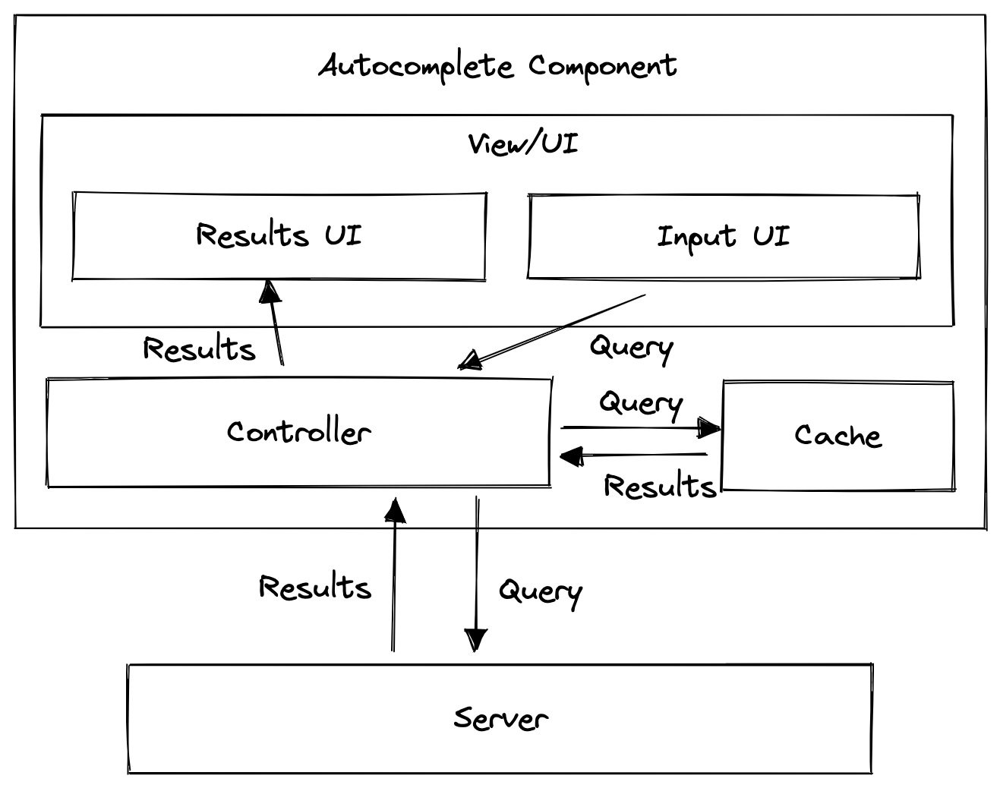
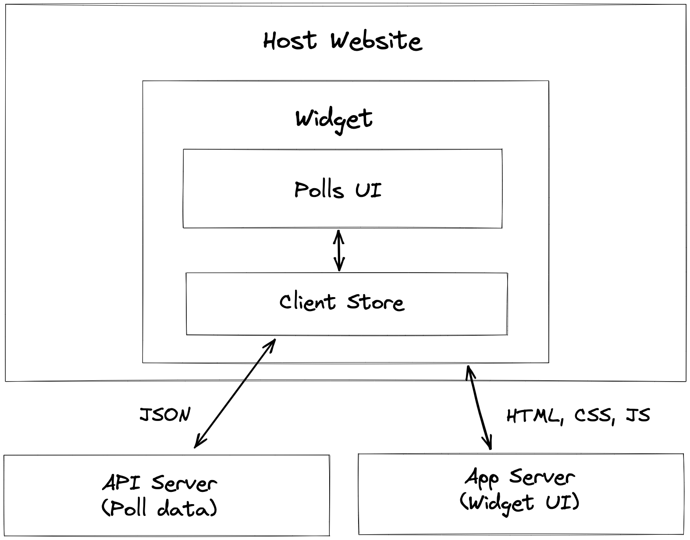
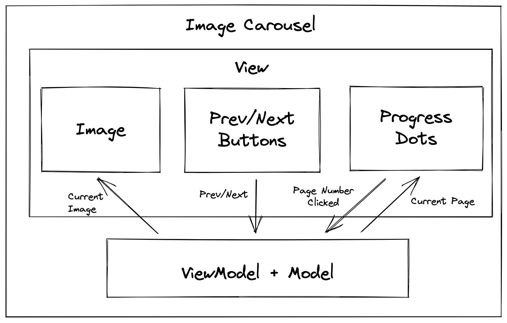

### How to approach any system design problems


- Clarify requirements
    - functional 
    - nonfunctional 
        - performance
        - scalability
        - security
        - browser compability
        - latency
        - accessiblity
    - constraints
- HLD
    - Break down in modules
        - UI/ client store/ server/ cache/ API
    - separation of concern
        - client vs server resposnbility
- LLD
    - UI level components in molecular level and design patterns
- State management
    - client store detection like Redux/ mobx etc
    - API contract / UI state or schema discussion
    - Network/ API design patterns
        - short polling
        - long polling
        - WS
        - SSE
        - HTTP2
- Performance
    - DOM performance
        - documentFragment
        - requestAnimationFrame
        - lazy loading
        - batching updates
        - Thrashing
    - Network performance
        - gZip/ brotli
        - GraphQl 
        - Http2
    - Image optimisation
        - lazy loading
        - sprite
        - CDN
        - srcset
    - Optimistic update
    - Caching
    - Code splitting/Modularity
    - PWA
- Security
    - XSS
    - CSRF
    - Mime sniffing
    - Clickjacking
    - SQL injection
    - Https/SSL
    - jwt
- Browser compatibility
    - Babel
    - RWD
- Accessbility
    - Aria roles
    - semantic html
    - tabindex for focus
- Maintainability
    - modular code
    - tests
    - documentation
- Design pattern
    - Singleton
    - Observer
    - Decorator
    - CSR/SSR/SSG

--------------------------------------------------------------------------------------------------------------------------------

## System design problems (Only additional/important points )

### News Feed (Only additions to above points)

- Functional requirements
    - Users can see their feeds
    - users can create new post
    - New posts come on top
    - Users can scroll and older feed will be appended
    - Users can react on posts
    - Users can comment on posts
    - Users can view comments
    - Users can react on comments
    - `Scroll threshold` Users should be seeing the post upto which they had scrolled earlier if they navigate and come back to the screen
    - `Stale feed` Users should be given a nudge if the feed is stale
- Non functionali requiremenet
- HLD

- LLD  
    - Main screen
        - CSR + SSR. SSR will load some initial data and then we can use CSR to add more data upon scroll
        - loading states. react placeholder or shimmer like design 
        - Error state 
        - `Inifinite scroll with debounce and throttle`
        - `Virtualised list`
    - Card layout
        - Image with CDN, sprite, lazy loading
        - Content with sanitised html (rich text)
        - loading shimmer
        - react button: optimistic update
        - comments : pagination again with Infinite scroll
        - Add comment: Rich view 
        - React on comment: optimistic update
        - timestamp: Intl
        - Live comments: WS with debounce and throttle
- State mgmt
    - API - WS with debounce and throttle for live comments.
- Performance
- Securty 
- Browser compatiblity
- Accessiliby
- Maintainibility
- Design pattern
    - Observer pattern

--------------------------------------------------------------------------------------------------------------------------------

### Autocomplete

- Functional requirements
    - Users can search in the input field UI
    - Show trending search on focus upfront if user does not have any recent searches (10 max)
    - Show recent searches of the user if he has any (10 max) on focus
    - once user types ahead, auto complete result upto 10 max would be prepopulated in the search resulkt UI
    - search results can be of different type (simple suggestion, trending search, rich result with image etc)
    - Reusable UI for different site
    - Customisable UI for input and search result
    - key board short cuts
    - URL based search
    - cross icon for reset state
    - loading and error state
    - highlight the search string in all the search results. 
- Non functional requirements
- HLD
    
- LLD
    - Initial UI can be loaded with SSR to have faster load time
    - Image for search engine can be loaded from CDN based on srcset
    - Post the UI is lodaed, event listeners should be attached for keyboard events and focus, blur, etc. 
    - on focus, get the previous searches / trending searches from cache/server and show.
    - When user is typing implement debounced API call 
    - render components based on the search result type
        - Suggestion type component
        - Trneding search type component
        - Component with image and rich text and subtitle
    - highlight the search text within the search result. Can be done in client side as it will be O(10) always
    - loading shimmer if net connection is slow
    - Error state and retry UX to hit the api again
    - Cursor based paginated result once user clicks on any search result to initiate the actual page search
    - Customised UI component with theme or classnames or render props
- State management
    - Redux + Redux persist for storing the search result in a cache client store
        - Cache can be implemented inspired by `normalizr` `{1: {content: ''}, 2: {content: ''}, 3: {content: ''}}` and then`cache = {f: [1,2], fa: [1,2,3]}` if it's `long lived website like facebook search` where the search operation is likely to continue for sometime.
        - For `short lived website like google search` it is better to have `fa: [{content: ''},{content: ''}], faa: [{content: ''}]` cache sturcture
    - Server apis
        - /search to search a string should return Result[] which should have a structure like {id, requestedAt, requestedBy, resultType, imageUrl, heading, subheading}
        - search api can be powered by http2 or graphQl
- Performance
- Securty
- Browser compatiblity
- Accessiliby
- Maintainibility
- Design pattern

--------------------------------------------------------------------------------------------------------------------------------

### Polling widget

- Functional requirements
    - The widget can be embedded in any UI
    - It displays list of options
    - Once user submits the vote the result should be shown to him
    - users can also remove their vote
- Non functional requirements
- HLD
    
- LLD
    - UI to load initially has to be done inside an` iframe, so we need an node server to host it`
    - Initial load can be SSR with the question and options
    - the UI elements can have images which should be lazy loaded + CDN + srcset + sprite
    - question answer can be rich text and they can also have raw html synctax. so better to sanitise it with some library
    - there can be multiple choices for the poll as well
    - Once poll is submitted, the result UI will render with initial result which will be fetched from the node server to reduce chance of ddos attack on api server
    - next time on, there can be SSE to live update the results
    - component design can be like 
    ```javascript
        <Poll submitUrl="https://greatpollwidget.com/submit/{poll_id}">
            <PollOptionList>
                {options.map((option) => (
                <PollOptionItem
                    key={option.id}
                    label={option.label}
                    count={option.count}
                    isSelected={option.userVotedForOption}
                    onVote={() => {
                    submitVote(option.id);
                    }}
                    onUnvote={() => {
                    removeVote(option.id);
                    }}
                />
                ))}
            </PollOptionList>
        </Poll>
    ```
- State mgmt / Data model
    - data model can be like 
    ```typescript
        {
            lastUpdated,
            user,
            question: {
                id,
                content
            },
            answers: [
                {
                    answerId,
                    content,
                    image_url,
                    votes
                },
                {
                    answerId,
                    content,
                    image_url,
                    votes
                }
            ]
            selectedByUser: ['ansId1', 'ansId2']
        }
    ```
    - API contract design
        - /create-poll {user, questionId, answers}
        - /result above JSON
    - `Persisting votes across sessions` using cookies because users might not be authenticated
    - 
- Performance
- Security
    - `implement CSP on frames`
- Browser compatibility
- Accessbility
- Maintainibility 
- design pattern

--------------------------------------------------------------------------------------------------------------------------------

### Modal Dialog

- Functional requirements
    - reusable modal to show blocking popup
    - should sport a header
    - should have a customisable layout / theme
    - should have action buttons or not
    - should be blocking or cancellable 
    - should be a confirm / alert / presentational modal
    - RWD - it should be supported in tablet / mobile/ desktop
- Non functional requirements
- HLD / LLD
    - we can create a semantic design as well like `<Modal><Modal.hedaer>` and use it everywhere. But a HOC makes more sense because individual component doesn't need to render it in the actual DOM content. 
    - `HOC (withDialog)`
    - showConfirm / showDialog/ showAlert / hideModal passdown props
    - these props can take entire modal content. Modal will be a React portal 
    - showConfirm etc will also pass some configs - 
        - easyClose(escape closes the modal)
        - onClose
        - showCross (show cross btn)
        - renderActionBtns (render props)
        - containerClassName
        - headerClassName
        - bodyClassName
        - footerClassName
        - overlayClassName
    - media query for RWD
- Performance
    - Dom Performance
    - Image lazy loading
    - module splitting
    - PWA
- accessbility
    - role="dialog"
    - aria labels (a11y)
    - tabindex
- browser compatibility
    - Intl (i18n)

--------------------------------------------------------------------------------------------------------------------------------

### Image carousel

- Functional requirement
    - slideshow of images / videos
    - show/hide steps
    - show/ hide arrows
    - swipe/ scroll gesture
    - dynamic content (height dynamic)
    - RWD (mobile, web)
    - animation between slides
    - how the cards/ images should be provided
- Non functional requirement
- HLD/LLD
    
    - No ssr is required
    - API required (good to have)
        - metadata - {maxHeight, maxWidth, showArrows, showPages, autoPlay, hide, animationSpeed}
        - List of items and CDN links - [{id, url, autoPlay}]
    - UI Arch
        - Carousal compoennt: ViewModel + model
        - Carousal.Slide: render the image/ media
        - Carousal.GoLeft / GoRight: to change page
        - Carousal.Pages: progress dots
    - UI semantics model
        ```jsx
        <Caruousal show={!meta.hide}>
            // consume autoPlay and animationSpeed and change activeIndex accordingly
            <Carousal.GoLeft show={activeIndex > 0 && meta.showArrows}/>
            {slides.map((slide, index) => (
                <Carousal.Slide 
                    maxHeight={meta.maxHeight}
                    maxWidth={meta.maxWidth}
                    isActive={activeIndex == index}
                    key={side.id}
                    url={slide.url}
                    autoPlay={side.autoPlay} // for videos
                />
            ))}
            <Carousal.GoRight show={activeIndex < slides.length && meta.showArrows}/>
            <Carousal.Pages show={meta.showPages} noOfPages={slides.length} activeIndex={activeIndex} onPageChange={index => setActiveInde(index)}/>
        </Carousal>
        ```
    - So basically the container needs to be `display: flex; width: 600; height :400; overflow-x: scroll`
        - then the Slide also will be `width: 600, height: 400; flex: 0 0 600;`
        - we can do `parentEl.scrollTo({left: activeIndex * 600, behaviour: 'smooth'})`
    - Images / videos should be fit in slide
        - use `image` and `video` on `object-fit: contain/cover`
- Performance
    - DOM Performance
        - we should also do `scroll-snap-type: x mandatory` 
        - `Virtualised list`
    - Image performance
        - Image and video should be lazy loaded `<image loading="lazy">`
        - For video we need to use `IntersectionObserver`
- Accessbility
- Browser compatibility
    - Intl

```css

.container {
  display: flex;
  width: 600px;
  height: 400px;
  overflow-x: scroll;
  background: #fff;
  scroll-snap-type: x mandatory;
}

.carousal {
  object-fit: cover;
  display: flex;
  flex: 0 0 550px;
  width: 550px;
  height: 400px;
  margin-left: 10px;
  margin-right: 10px;
  border-radius: 10px;
  scroll-snap-align: start;
  &:nth-child(odd) {
    background: yellow;
  }
  &:nth-child(even) {
    background : green;
  } 
}
```

--------------------------------------------------------------------------------------------------------------------------------