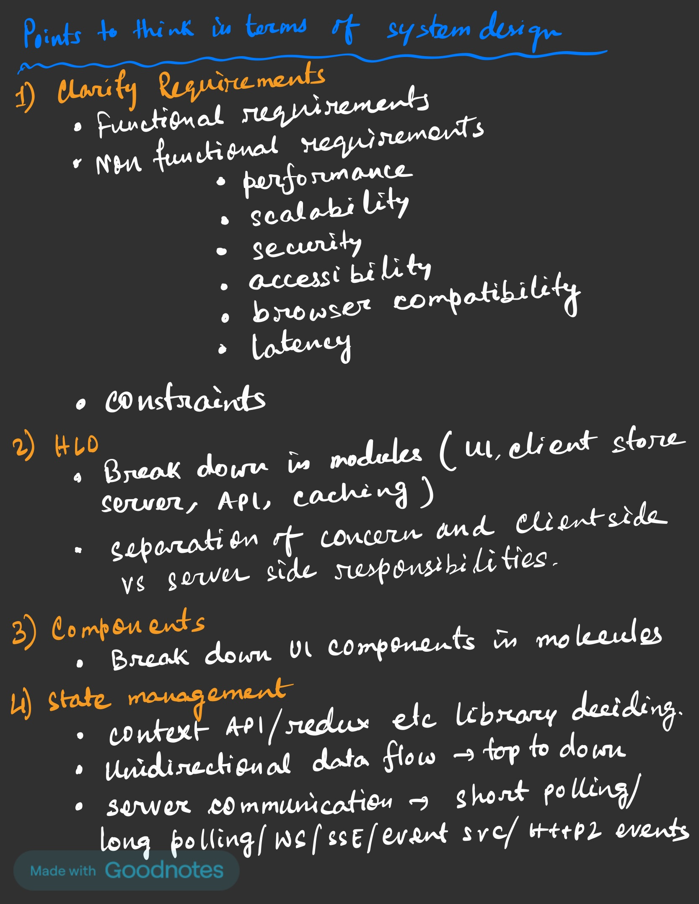
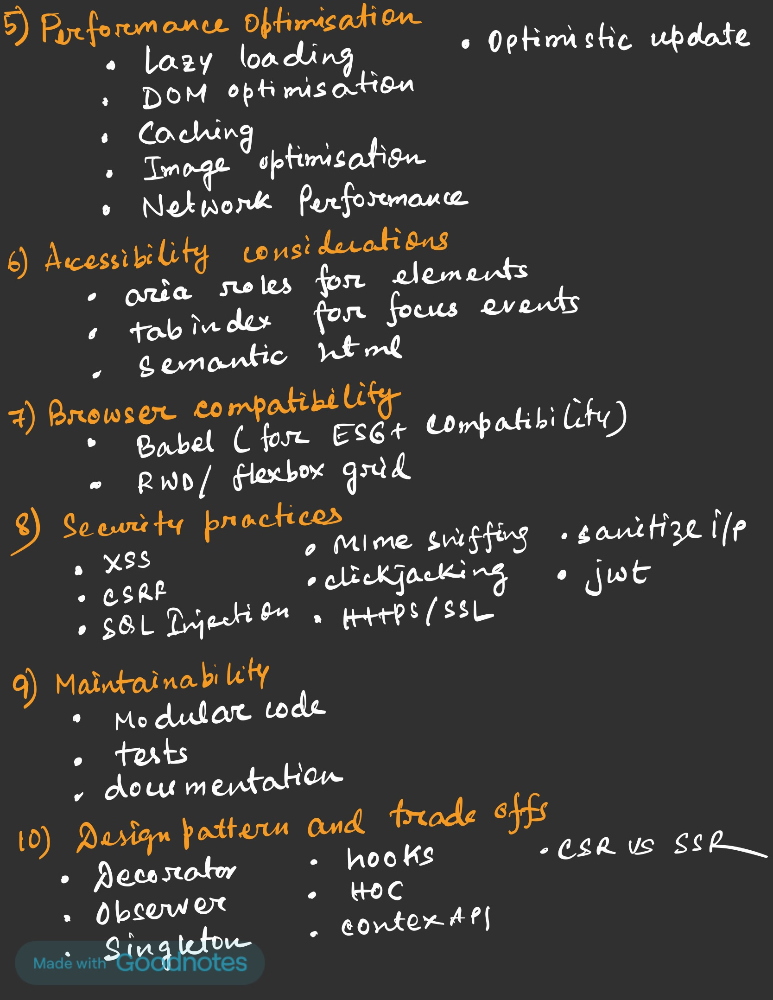
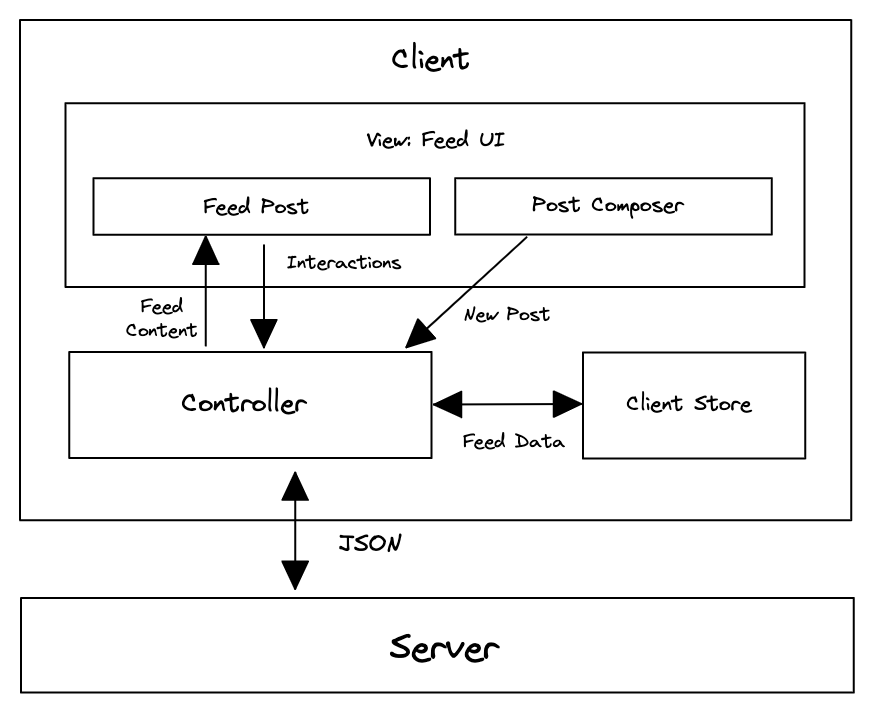

### How to approach any system design problems

- Clarify requirements
    - functional 
    - nonfunctional 
        - performance
        - scalability
        - security
        - browser compability
        - latency
        - accessiblity
    - constraints
- HLD
    - Break down in modules
        - UI/ client store/ server/ cache/ API
    - separation of concern
        - client vs server resposnbility
- LLD
    - UI level components in molecular level and design patterns
- State management
    - client store detection like Redux/ mobx etc
    - API contract / UI state or schema discussion
    - Network/ API design patterns
        - short polling
        - long polling
        - WS
        - SSE
        - HTTP2
- Performance
    - DOM performance
        - documentFragment
        - requestAnimationFrame
        - lazy loading
        - batching updates
        - Thrashing
    - Network performance
        - gZip/ brotli
        - GraphQl 
        - Http2
    - Image optimisation
        - lazy loading
        - sprite
        - CDN
        - srcset
    - Optimistic update
    - Caching
    - Code splitting/Modularity
    - PWA
- Security
    - XSS
    - CSRF
    - Mime sniffing
    - Clickjacking
    - SQL injection
    - Https/SSL
    - jwt
- Browser compatibility
    - Babel
    - RWD
- Accessbility
    - Aria roles
    - semantic html
    - tabindex for focus
- Maintainability
    - modular code
    - tests
    - documentation
- Design pattern
    - Singleton
    - Observer
    - Decorator
    - CSR/SSR/SSG

--------------------------------------------------------------------------------------------------------------------------------

### News Feed

- Functional requirements
    - Users can see their feeds
    - users can create new post
    - New posts come on top
    - Users can scroll and older feed will be appended
    - Users can react on posts
    - Users can comment on posts
    - Users can view comments
    - Users can react on comments
    - Users should be seeing the post upto which they had scrolled earlier if they navigate and come back to the screen
    - Users should be given a nudge if the feed is stale
- Non functionali requiremenet
    - Performance
    - scalability
    - Security
    - Browser compatibility
    - Accesbility
    - latency
- HLD

- LLD  
    - Main screen
        - CSR + SSR. SSR will load some initial data and then we can use CSR to add more data upon scroll
        - loading states. react placeholder or shimmer like design 
        - Error state 
        - Inifinite scroll with debounce and throttle
        - Virtualised list
    - Card layout
        - Image with CDN, sprite, lazy loading
        - Content with sanitised html (rich text)
        - loading shimmer
        - react button: optimistic update
        - comments : pagination again with Infinite scroll
        - Add comment: Rich view 
        - React on comment: optimistic update
        - timestamp: Intl
        - Live comments: WS with debounce and throttle
- State mgmt
    - Redux + Redux persist
    - API - WS with debounce and throttle for live comments. 
- Performance
    - DOM optimsation (documentFragment, requestAnimationFrame, lazy loading, optimisitc update, code splitting/ modularity)
    - Network optimisation (GraphQl + Relay + Http2)
    - Image optimisation (CDN + lazy load + srcset + sprite)
    - Cache
    - Optimisic update
- Securty
    - XSS
    - Mime sniffing
    - CSRF
    - SQL injection
    - HTTPS/SSL
    - jwt
- Browser compatiblity
    - RWD
    - Babel
- Accessiliby
    - aria-lablledby
    - role="feed"
    - role="content"
    - tabindex
- Maintainibility
    - doc, test, modularity
- Design pattern
    - Observer pattern
    - CSR + SSR
--------------------------------------------------------------------------------------------------------------------------------